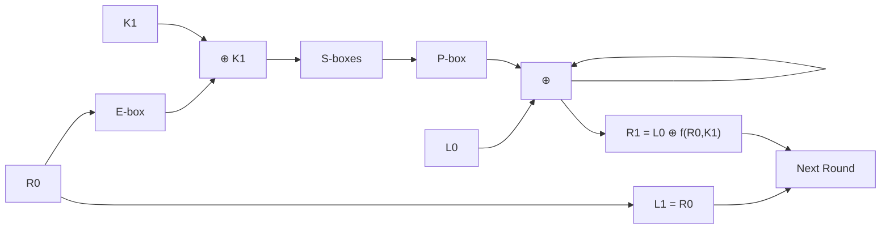

# DES — Data Encryption Standard

## What It Is

**DES** is a symmetric block cipher that encrypts 64-bit blocks using a 64-bit key (56 bits effective + 8 parity bits). It was the standard encryption algorithm from 1977 to 2001 (replaced by AES).

```
Plaintext:   64 bits
Key:         64 bits (56 effective + 8 parity)
Ciphertext:  64 bits

16 rounds of Feistel network:
  L(i) = R(i-1)
  R(i) = L(i-1) ⊕ f(R(i-1), K(i))
```

DES uses a **Feistel structure** — the same round function is repeated 16 times with different subkeys.

---

## The Big Picture

```
Plaintext (64 bits)
    ↓
Initial Permutation (IP)
    ↓
Split into L0 (32 bits) and R0 (32 bits)
    ↓
┌─────────────────────────────────┐
│  16 rounds:                      │
│    L(i) = R(i-1)                │
│    R(i) = L(i-1) ⊕ f(R(i-1),Ki)│
└─────────────────────────────────┘
    ↓
Swap L16 and R16
    ↓
Final Permutation (FP = IP⁻¹)
    ↓
Ciphertext (64 bits)
```

---

## The 8 Steps of One Round

This file walks through a **single Feistel round** (round 1 of 16).

### Step 1 — Initial Permutation (IP)

Rearranges all 64 bits according to a fixed table.

```
Input:  01 23 45 67 89 AB CD EF
After IP: CC 00 FF FF CC 00 FF FF
```

The IP table reorders bits — position 58 becomes bit 1, position 50 becomes bit 2, etc.

---

### Step 2 — Split into L0 and R0

```
After IP: [L0 (32 bits)] [R0 (32 bits)]

L0 = first 4 bytes (left half)
R0 = last 4 bytes (right half)
```

The Feistel structure operates on the right half and XORs it into the left half.

---

### Step 3 — Expansion (E) — 32 → 48 bits

The 32-bit R0 is expanded to 48 bits using the E-box.

```
R0:      32 bits
E(R0):   48 bits

Expansion duplicates 16 bits — each 4-bit group gets
the last bit from the previous group and the first bit
from the next group.
```

**Why expand?** The S-boxes need 48 bits of input (8 S-boxes × 6 bits each). The expansion also creates **diffusion** — each input bit affects two S-boxes.

---

### Step 4 — XOR with Round Key

```
E(R0) ⊕ K1 → 48-bit result

K1 is the first round subkey, derived from the main key
via PC-1, shifts, and PC-2 (key schedule — not shown here).
```

The round key is **mixed into the expanded right half** before S-box substitution.

---

### Step 5 — S-box Substitution (48 → 32 bits)

The 48-bit result is split into **8 groups of 6 bits**. Each group goes through a different S-box (S1 through S8).

```
Each 6-bit group → S-box → 4-bit output

How to read a 6-bit group:
  bit₀ bit₅ = row number (2 bits, 0-3)
  bits₁₂₃₄ = column number (4 bits, 0-15)

Example: group = 110101
  row = (1, 1) = 3
  col = (1, 0, 1, 0) = 10
  S-box output = S[3][10] = value from table
```

**S1 example:**

```
S1 row 3: 15, 12,  8,  2,  4,  9,  1,  7,  5, 11,  3, 14, 10,  0,  6, 13

Input: 110101 → row=3, col=10 → S1[3][10] = 3 (0011 in binary)
```

**The 8 S-boxes:**

| S-box | Input | Output | Purpose |
|---|---|---|---|
| S1 | 6 bits | 4 bits | Non-linear confusion |
| S2 | 6 bits | 4 bits | Non-linear confusion |
| S3 | 6 bits | 4 bits | Non-linear confusion |
| S4 | 6 bits | 4 bits | Non-linear confusion |
| S5 | 6 bits | 4 bits | Non-linear confusion |
| S6 | 6 bits | 4 bits | Non-linear confusion |
| S7 | 6 bits | 4 bits | Non-linear confusion |
| S8 | 6 bits | 4 bits | Non-linear confusion |

**Total: 8 × 4 = 32 bits** (48 compressed to 32)

S-boxes are the **only non-linear component** of DES. Without them, DES would be a simple linear transformation and trivially breakable.

---

### Step 6 — P-box Permutation

The 32-bit S-box output is permuted by a fixed P-box.

```
P-box: rearranges the 32 bits

Purpose: diffusion — spreads each S-box output across
multiple positions for the next round.
```

---

### Step 7 — XOR with L0

```
f(R0, K1) = P(S-boxes(E(R0) ⊕ K1))

New right half = L0 ⊕ f(R0, K1)
```

The Feistel function `f` combines everything: expansion, key mixing, S-box substitution, and permutation. The result is XORed with the left half.

---

### Step 8 — Swap (output of one round)

```
L1 = R0
R1 = L0 ⊕ f(R0, K1)
```

The swap ensures the next round operates on the other half. After 16 rounds, the halves are swapped back and combined with the Final Permutation.

---

## The Feistel Structure



**Key insight:** The Feistel structure is **invertible regardless of the round function**. To decrypt, apply the same algorithm with subkeys in reverse order. No need for a separate decryption function.

---

## The Code Walkthrough

```c
// Step 1: Initial Permutation (IP)
unsigned char ip_out[8];
apply_permutation(plaintext, ip_out, initial_permutation, 64);

// Step 2: Split into L0 and R0
unsigned char L[4], R[4];
memcpy(L, ip_out, 4);      // left 32 bits
memcpy(R, ip_out + 4, 4);  // right 32 bits

// Step 3: Expansion (E) — 32 to 48 bits
unsigned char E_out[6];
apply_permutation(R, E_out, message_expansion, 48);

// Step 4: XOR with round key
unsigned char xored[6];
for (int i = 0; i < 6; i++)
    xored[i] = E_out[i] ^ round_key[i];

// Step 5: S-box substitution (48 → 32 bits)
for (int i = 0; i < 8; i++) {
    // Each 6-bit chunk: bit₀|bit₅ = row, bits₁₂₃₄ = column
    int byte_idx = i / 2;
    int bit_offset = (i % 2) * 3;
    unsigned char chunk = (xored[byte_idx] >> (4 - bit_offset)) & 0x3F;

    int row = ((chunk >> 5) & 1) << 1 | (chunk & 1);
    int col = (chunk >> 1) & 0x0F;

    unsigned char val = S_boxes[i][row * 16 + col];

    if (i % 2 == 0)
        S_out[i / 2] |= val << 4;
    else
        S_out[i / 2] |= val;
}

// Step 6: P-box permutation
unsigned char P_out[4];
apply_permutation(S_out, P_out, right_sub_message_permutation, 32);

// Step 7: XOR with L0
unsigned char new_R[4];
for (int i = 0; i < 4; i++)
    new_R[i] = L[i] ^ P_out[i];

// Step 8: Swap (L1 = R0, R1 = L0 ^ f(R0,K1))
unsigned char output[8];
memcpy(output, R, 4);
memcpy(output + 4, new_R, 4);
```

**Walkthrough table:**

| Step | Operation | Input → Output | Bits |
|---|---|---|---|
| IP | Initial Permutation | 64 → 64 | Same size, reordered |
| Split | L0, R0 | 64 → 32 + 32 | Halved |
| E | Expansion | 32 → 48 | 16 bits duplicated |
| XOR | Key mixing | 48 ⊕ 48 → 48 | Round key mixed in |
| S-box | Substitution | 48 → 32 | Non-linear compression |
| P-box | Permutation | 32 → 32 | Reordered for diffusion |
| XOR | Feistel | 32 ⊕ 32 → 32 | L0 ⊕ f(R0, K1) |
| Swap | Output | 32 + 32 → 64 | L1=R0, R1=L0⊕f |

---

## S-box Lookup — The Critical Step

```c
// Extracting a 6-bit chunk from the 48-bit XOR result
int byte_idx = i / 2;           // which byte (0-5)
int bit_offset = (i % 2) * 3;   // 0 for even, 3 for odd
unsigned char chunk = (xored[byte_idx] >> (4 - bit_offset)) & 0x3F;

// Row: outer two bits (bit 0 and bit 5)
int row = ((chunk >> 5) & 1) << 1 | (chunk & 1);

// Column: middle four bits (bits 1-4)
int col = (chunk >> 1) & 0x0F;

// Lookup
unsigned char val = S_boxes[i][row * 16 + col];
```

**Visual:**

```
6-bit chunk:  b₅ b₄ b₃ b₂ b₁ b₀
              ──── col (4 bits) ────
              ↑ row (2 bits) ↑

Row = b₅b₀ → 0, 1, 2, or 3
Col = b₄b₃b₂b₁ → 0 to 15
```

**Why this works:**

```
Each S-box is a 4×16 lookup table (64 entries).
  - Row is determined by the outer bits (S-box selection based on key bit positions)
  - Column is determined by the inner bits
  - Output is a 4-bit value

8 S-boxes × 4 bits = 32 bits output
```

---

## Final Permutation (FP)

The Final Permutation is the **exact inverse** of the Initial Permutation.

```
After 16 rounds: [L16] [R16]
Swap: [R16] [L16]
FP: inverse of IP → plaintext if key is correct
```

```
Why FP = IP⁻¹?
  After 16 rounds, if you undo the IP, you get the original bits.
  But the Feistel structure swaps halves, so you swap first,
  then apply FP to reverse the IP.

  Combined: the entire cipher is invertible with the same algorithm.
```

---

## Security

| Property | Value |
|---|---|
| Block size | 64 bits |
| Key size | 64 bits (56 effective) |
| Rounds | 16 |
| Key space | 2⁵⁶ ≈ 7.2 × 10¹⁶ |
| Broken? | Yes — brute force feasible (EFF DES cracker, 1998: 56 hours) |
| Status | **Deprecated** — use AES instead |

**Why DES is broken:**

```
56-bit key = 2⁵⁶ possible keys
  Modern hardware: billions per second
  2⁵⁶ / 10⁹ ≈ 7.2 × 10⁷ seconds ≈ 2.3 years
  Distributed systems: hours

Triple DES (3DES) was a temporary fix:
  Encrypt → Decrypt → Encrypt (three passes)
  Effective key: 112 bits (two independent keys)
  Still slow, being phased out for AES
```

---

## Programming Analogy

```
DES = a fixed pipeline with 16 identical stages

Feistel structure = a map-reduce pattern:
  Split → Process right half (map) → XOR into left (combine) → Swap

S-boxes = non-linear lookup table
  Like a hash map: 6-bit key → 4-bit value
  The ONLY source of confusion (non-linearity)

E-box = expansion / duplication
  Like padding in hashing: duplicate bits to create
  diffusion (each input affects multiple outputs)

P-box = permutation / shuffle
  Like a Fisher-Yates shuffle on the output bits
  Ensures each S-box output affects different positions

IP and FP = inverse of each other
  Like encode/decode in a codec pipeline
  Apply IP, then 16 rounds, then IP⁻¹ = reversible

Round key derivation = key schedule
  Like deriving sub-keys in a KDF (key derivation function)
  Main key → 16 different 48-bit subkeys via PC-1, shifts, PC-2
```

---

## Key Terms

| Term | Definition |
|---|---|
| **Feistel structure** | Split-block design where one half is encrypted and XORed into the other |
| **Round function f** | The function applied to the right half: E → XOR key → S-boxes → P-box |
| **S-box** | Substitution box — non-linear lookup table (6 bits → 4 bits) |
| **P-box** | Permutation box — reorders bits for diffusion |
| **E-box** | Expansion box — expands 32 bits to 48 bits |
| **IP / FP** | Initial and Final Permutations (FP = IP⁻¹) |
| **Key schedule** | Derives 16 round subkeys from the main 56-bit key |
| **Diffusion** | Each input bit affects multiple output bits across rounds |
| **Confusion** | Relationship between key and ciphertext is complex (S-boxes) |

---

## Common Mistakes

- **Thinking DES is still secure.** It's not. 56-bit keys are brute-forceable. Use AES.
- **Confusing S-box order.** The 6-bit chunks are extracted sequentially from the 48-bit block, NOT by byte boundaries. Chunk 0 uses bits 0-5 of the 48-bit block.
- **Forgetting the round key is 48 bits, not 64.** The key schedule reduces 64 bits to 56, then splits into two 28-bit halves, shifts them, and selects 48 bits via PC-2.
- **Mixing up row/column extraction.** Row = outer two bits (bit 5 and bit 0). Column = middle four bits (bits 1-4). Common off-by-one error.
- **Not understanding FP = IP⁻¹.** FP is not arbitrary — it exactly undoes IP. The entire cipher is invertible with the same algorithm and reversed subkeys.

---

## Revision Summary

| Concept | Value |
|---|---|
| Block size | 64 bits |
| Key size | 56 bits (effective) |
| Rounds | 16 |
| Structure | Feistel network |
| S-boxes | 8 (6-bit → 4-bit each) |
| f(R, K) | P(S-boxes(E(R) ⊕ K)) |
| IP and FP | Inverse permutations |
| Security | Broken (use AES) |

- DES is a 16-round Feistel cipher on 64-bit blocks
- The round function: expand → XOR key → S-boxes → permute → XOR left half
- S-boxes are the only non-linear component (provide confusion)
- Feistel structure makes decryption identical to encryption with reversed subkeys
- 56-bit key is too small for modern hardware — AES replaced DES in 2001
