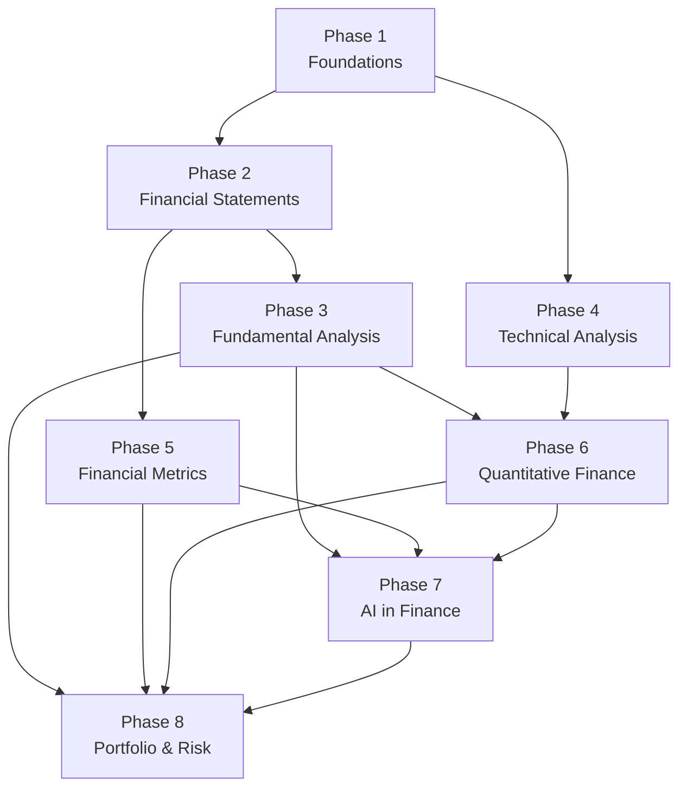
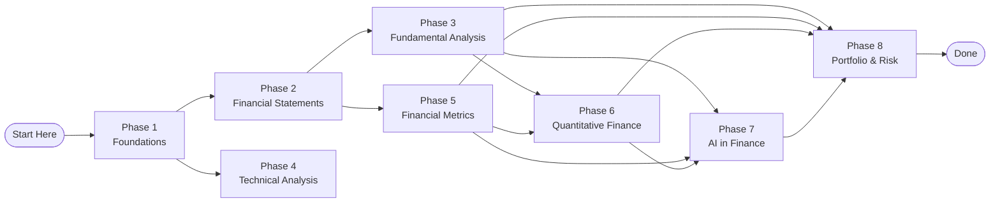
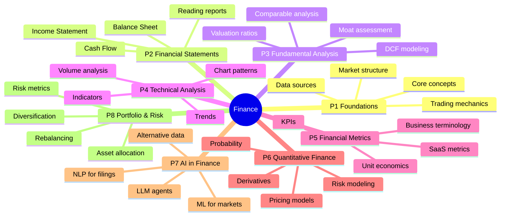

# Learning Roadmap

> How the phases connect. Use this to plan your learning path.

## Phase Dependency Graph



## Reading Flow



## Recommended Paths

### Full Track (everything)

```
P1 → P2 → P3 → P4 → P5 → P6 → P7 → P8
```

### Fundamental Analysis Track

```
P1 → P2 → P3 → P5 → P8
```

### Technical / Quant Track

```
P1 → P2 → P4 → P6 → P8
```

### AI / ML Track

```
P1 → P2 → P3 → P5 → P7
```

## Phase Descriptions



## Phase Details

| # | Phase | Prerequisites | Outcome |
|---|---|---|---|
| 1 | Foundations | None | Mental model of markets |
| 2 | Financial Statements | Phase 1 | Read financial reports |
| 3 | Fundamental Analysis | Phase 2 | Value a company |
| 4 | Technical Analysis | Phase 1 | Read charts and trends |
| 5 | Financial Metrics | Phase 2 | Understand business KPIs |
| 6 | Quantitative Finance | Phase 3 or 4 | Build pricing models |
| 7 | AI in Finance | Phase 3, 5 | Build financial AI systems |
| 8 | Portfolio & Risk | Phase 3, 5, 6 | Manage investment portfolios |

## How to Use This

1. Start with **Phase 1** regardless of your goal
2. Use the dependency graph to decide what to study next
3. Follow a track that matches your interest (fundamentals, quant, AI)
4. Each phase builds on previous knowledge — don't skip prerequisites
