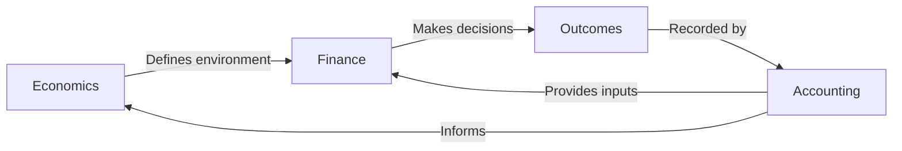

# Finance vs Economics vs Accounting

## Core Distinction

Three fields that answer three different questions.

| Field | Question | Perspective |
|---|---|---|
| **Finance** | What should we do with money? | Forward-looking, decision-making |
| **Economics** | How do markets and incentives work? | System dynamics, environment |
| **Accounting** | What happened to the money? | Backward-looking, record-keeping |

---

## Finance

The study of capital allocation under uncertainty.

**Core problems:**
- Where to invest money for maximum return
- How much risk is acceptable
- How to price uncertainty
- How to structure deals and contracts

**Key areas:** Corporate finance, investments, risk management, derivatives, portfolio theory.

---

## Economics

The study of how people, firms, and governments make decisions about resources.

**Core problems:**
- How supply and demand determine prices
- What causes inflation, unemployment, growth
- How incentives shape behavior
- How markets fail and what to do about it

**Key areas:** Microeconomics (individual markets), Macroeconomics (whole economy), Behavioral economics.

---

## Accounting

The systematic recording and reporting of financial transactions.

**Core problems:**
- Tracking where money comes from and goes
- Ensuring accuracy and compliance
- Producing financial statements (balance sheet, income statement, cash flow)
- Detecting fraud

**Key areas:** Financial accounting, managerial accounting, auditing, tax accounting.

---

## How They Interact



**Example flow:**
1. Economics shows that rising interest rates slow the economy (environment)
2. Accounting shows that Company X has high debt (input data)
3. Finance decides: "Sell Company X stock, buy bonds instead" (decision)
4. Accounting records the trade and resulting profit/loss

---

## Why Engineers Often Confuse Them

**Common mistake:** Treating accounting data as if it's finance.

Accounting is **past tense**. It tells you what a company earned last quarter.

Finance is **future tense**. It asks whether that trend will continue and what to do about it.

Economics is **about the system**. It explains WHY interest rates affect stock prices.

---

## Programming Analogy

```
Finance  = ML prediction model (forward-looking, probabilistic)
Economics = Dataset distribution / environment (the rules of the data)
Accounting = Database audit log (immutable, historical, verifiable)

You need all three:
  - Economics tells you the data distribution is shifting
  - Accounting tells you what happened in the last N epochs
  - Finance decides which action to take next
```

---

## Interview Notes

- **FinTech interviews often test**: "Is this a finance, economics, or accounting question?"
- **System design for trading systems**: Understanding all three is necessary
- **Data engineering for financial data**: Most data sources are accounting data. Most business questions are finance questions.

---

## Revision Summary

| Field | Time Direction | Core Question |
|---|---|---|
| Finance | Future | What should we do? |
| Economics | Always | How does the system work? |
| Accounting | Past | What happened? |

- Finance makes decisions under uncertainty
- Economics models the system rules
- Accounting records what happened
- You need all three to build financial software

---

← [↑ Phase 1](README.md) • [↑ Finance](../README.md) • [01-business-fundamentals](01-business-fundamentals.md) →
