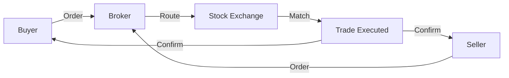

# Stock Market Basics

## Stock

A **stock** (also called a **share** or **equity**) represents a tiny piece of ownership in a company.

```
Company A divides itself into 10 million equal pieces.
You own 1 piece → You own 1/10,000,000 of Company A.

If Company A is worth $1 billion, your piece is worth $100.
```

**Properties:**
- Price fluctuates based on supply and demand
- Value changes with company performance
- Can be traded on exchanges
- May pay dividends (share of profits)

---

## Share

Interchangeable with **stock**. A single unit of ownership.

**Usage difference:**
- "I own stock in Apple" = general ownership
- "I own 100 shares of Apple" = specific quantity

---

## Equity

Same as **stock**. Often used in different contexts:
- **Equity financing**: Raising money by selling ownership (vs. debt financing)
- **Equity stake**: Percentage of a company owned
- **Sweat equity**: Ownership earned through work, not cash

**Debt vs. Equity**

| | Debt (Loan) | Equity (Stock) |
|---|---|---|
| Repayment required? | Yes, with interest | No |
| Ownership? | No | Yes |
| Voting rights? | No | Yes |
| Bankruptcy priority | Paid first | Paid last |
| Tax treatment | Interest tax-deductible | Dividends not deductible |

---

## IPO (Initial Public Offering)

The first time a private company sells shares to the public. The company transitions from private to public.

**Process:**

```
1. Company hires investment banks (underwriters)
2. Company files prospectus with regulator (SEC/SEBI)
3. Roadshow: management pitches to institutional investors
4. Underwriters set IPO price based on demand
5. Shares are listed on exchange
6. Public can buy shares
```

**What happens:**
- Company raises capital (primary market)
- Early investors (founders, VCs) can sell some shares
- Stock starts trading in the secondary market

**Famous IPOs:**

| Company | Year | IPO Price | First Day Close | Today (approx) |
|---|---|---|---|---|
| Google | 2004 | $85 | $100 | $4,000+ (split-adjusted) |
| Facebook | 2012 | $38 | $38.23 | $500+ |
| Alibaba | 2014 | $68 | $93.89 | $100+ |
| Robinhood | 2021 | $38 | $34.82 | (below IPO) |

---

## Primary Market

Where securities are created and sold for the **first time**.

- Company sells shares directly to investors
- Company receives the proceeds
- Includes IPOs and follow-on offerings (FPOs)

---

## Secondary Market

Where already-issued securities are traded between investors.

- Company does NOT receive any money
- 99%+ of daily trading volume
- Price discovery happens here
- This is what people mean by "the stock market"

**Analogy:**

```
Primary market = Ticketmaster selling new concert tickets (artist gets money)
Secondary market = You selling your ticket to another fan (artist gets $0)
```

---

## Stock Exchange

A regulated marketplace where buyers and sellers trade listed securities.

**Responsibilities:**
- Maintain an order book of buy/sell orders
- Match orders and execute trades
- Publish real-time price and volume data
- Ensure fair and orderly trading
- Enforce listing standards



**Major Exchanges:**

| Exchange | Country | Founded | Listed Companies | Known For |
|---|---|---|---|---|
| NSE | India | 1992 | ~2,000 | NIFTY 50, most liquid Indian exchange |
| BSE | India | 1875 | ~5,000 | Sensex, Asia's oldest |
| NASDAQ | USA | 1971 | ~3,300 | Tech stocks, fully electronic |
| NYSE | USA | 1792 | ~2,400 | Blue chips, hybrid floor+trading |

---

## NSE (National Stock Exchange of India)

- Founded 1992
- Fully electronic from day one
- ~2,000 listed companies
- NIFTY 50 index
- Higher trading volume than BSE
- Most Indian stock trading happens here

---

## BSE (Bombay Stock Exchange)

- Founded 1875 — Asia's oldest stock exchange
- ~5,000 listed companies (more than NSE)
- Sensex index (30 stocks)
- Lower volume than NSE, but more companies listed

**NSE vs. BSE:**

| Attribute | NSE | BSE |
|---|---|---|
| Founded | 1992 | 1875 |
| Listed | ~2,000 | ~5,000 |
| Daily volume | Higher | Lower |
| Index | NIFTY 50 | Sensex |
| Primary market share | ~70% | ~30% |

Most Indian companies list on **both** exchanges. Prices are nearly identical (arbitrage keeps them aligned).

---

## NASDAQ

- Founded 1971 — first fully electronic exchange
- ~3,300 listed companies
- Heavy tech focus
- Home to: Apple, Microsoft, Google, Amazon, NVIDIA, Meta, Tesla
- Higher volatility, more growth companies

---

## NYSE (New York Stock Exchange)

- Founded 1792 — oldest US exchange
- ~2,400 listed companies
- Hybrid system: electronic + physical trading floor
- Blue chip focus
- Home to: Berkshire Hathaway, JPMorgan, Walmart, Coca-Cola, Johnson & Johnson
- Lower volatility, more established companies

**NASDAQ vs. NYSE:**

| Attribute | NASDAQ | NYSE |
|---|---|---|
| Type | Fully electronic | Hybrid (floor + electronic) |
| Tech focus | Heavy | Moderate |
| Listing fees | Lower | Higher |
| Volatility | Higher | Lower |
| Famous for | Growth stocks | Blue chips |

---

## Programming Analogy

```
Stock Exchange = Distributed Database

Order Book = Priority Queue (two heaps)
  - Bids = Max-Heap (highest price has priority)
  - Asks = Min-Heap (lowest price has priority)

Trade = Atomic transaction
  - Update order book
  - Record trade
  - Publish event

Price Feed = CDC (Change Data Capture) event stream
  - Every trade produces an event
  - Consumers (traders, analysts) subscribe

Settlement = Eventual consistency
  - Trade commits instantly (strong consistency)
  - Ownership transfer takes T+1 days (eventual)

Symbol Resolution = DNS for stocks
  - AAPL → NASDAQ
  - RELIANCE → NSE
  - Need a mapping layer to resolve across exchanges
```

---

## Common Mistakes

- **Thinking the company gets money every time its stock trades.** It only gets money at IPO (or secondary offerings). The vast majority of trading is investors trading among themselves.
- **Confusing stock price with company health.** A high stock price doesn't mean a company is doing well (could be overvalued). A low stock price doesn't mean it's failing (could be undervalued).
- **Assuming one exchange per company.** Companies can list on multiple exchanges. Most Indian companies list on both NSE and BSE.
- **Thinking all exchanges are the same.** Different exchanges have different rules, fees, listing requirements, and trading hours.

---

## Interview Notes

- **System Design: "Design a stock exchange"** — classic problem testing distributed systems skills (order matching, fault tolerance, latency)
- **System Design: "Design a trading platform"** — requires understanding market structure, order types, settlement
- **Backend: Symbol resolution service** — mapping tickers to exchanges, handling duplicates
- **Data Engineering: Market data ingestion** — handling data from multiple exchanges with different formats

---

## Revision Summary

- **Stock** = ownership slice of a company
- **IPO** = first public sale of shares (company gets money)
- **Primary market** = company sells new shares
- **Secondary market** = investors trade existing shares (company gets $0)
- **NSE/BSE** = India's exchanges
- **NASDAQ/NYSE** = US exchanges (NASDAQ: tech, electronic. NYSE: blue chips, hybrid)
- **Exchanges** = distributed databases matching buyers and sellers

---

← [01-business-fundamentals](01-business-fundamentals.md) • [↑ Phase 1](README.md) • [↑ Finance](../README.md) • [03-market-participants](03-market-participants.md) →
