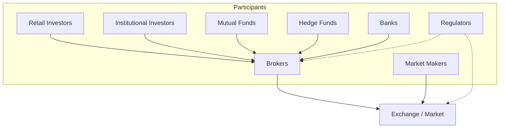

# Market Participants

## Overview

A market is a collection of participants with different goals, capital, and strategies. Each participant generates different data and affects prices differently.



---

## Retail Investors

Individual people trading their own money.

**Characteristics:**
- Small order sizes (10–1,000 shares)
- Emotional, influenced by news and social media
- Often buy high and sell low (behavioral bias)
- Long-term (buy-and-hold) or speculative (day trading)
- Access markets through brokers

**Examples:** Someone buying 10 shares of Apple through Robinhood or Zerodha.

**Data they generate:** Order flow, social media sentiment, search trends.

---

## Institutional Investors

Large organizations managing billions of dollars.

**Characteristics:**
- Very large order sizes (can move markets)
- Professional research teams
- Long investment horizon (years to decades)
- Lower turnover (trade less frequently)
- Examples: BlackRock ($10T+ AUM), Vanguard, Fidelity, State Street

**Why they matter:**
- Their trades are monitored by everyone (13F filings show what they own)
- Their research reports influence other investors
- They can demand meetings with company management

**Data they generate:** SEC 13F filings (quarterly holdings), research reports.

---

## Mutual Funds

Pooled investment vehicles where many people put money together, managed by a professional.

**How it works:**
1. Thousands of investors pool money into the fund
2. Fund manager buys a portfolio of stocks/bonds
3. Each investor owns a proportional share
4. Value updates daily (NAV = Net Asset Value)
5. Manager charges a fee (expense ratio)

**Types:**

| Type | What They Buy | Risk |
|---|---|---|
| Equity fund | Stocks | High |
| Debt fund | Bonds | Low |
| Hybrid fund | Stocks + Bonds | Medium |
| Index fund | Tracks an index (e.g., NIFTY 50) | Market-level |
| Liquid fund | Short-term debt | Very low |

**Notable examples:** Vanguard S&P 500 Index Fund, HDFC Mid-Cap Opportunities Fund.

---

## Hedge Funds

Private investment partnerships for wealthy/accredited investors. Lightly regulated.

**Key differences from Mutual Funds:**

| Attribute | Mutual Fund | Hedge Fund |
|---|---|---|
| Investors | Anyone | Accredited only |
| Strategy | Long-only mostly | Long, short, leverage, derivatives |
| Regulation | High | Low |
| Fees | ~1% expense ratio | "2 and 20" (2% + 20% of profits) |
| Liquidity | Daily redemption | Lock-up periods (months/years) |
| Transparency | Quarterly holdings | Secret |

**Famous examples:**
- **Renaissance Technologies** — Medallion Fund (66% annual returns 1988–2018)
- **Bridgewater Associates** — Ray Dalio's macro fund
- **Citadel** — Multi-strategy hedge fund
- **D.E. Shaw** — Quantitative trading pioneer

**Interesting fact:** Renaissance's Medallion Fund is staffed by mathematicians, physicists, and computer scientists — not traditional finance people.

---

## Banks

Financial institutions with multiple market roles.

**Investment Banking:**
- Help companies go public (IPOs)
- Advise on mergers and acquisitions (M&A)
- Raise debt and equity capital
- Examples: Goldman Sachs, Morgan Stanley

**Commercial Banking:**
- Take deposits, make loans
- Provide credit cards, mortgages
- Examples: JPMorgan Chase, HDFC Bank

**Proprietary Trading:**
- Trade the bank's own capital
- Seek profit from market movements
- Highly regulated post-2008 (Volcker Rule limits this in US)

---

## Brokers

Intermediaries that connect traders to exchanges.

**They handle:**
- Order execution (sending your trade to the exchange)
- Account management (KYC, deposits, withdrawals)
- Margin lending (borrowing money to trade)
- Research and data

**Types:**

| Type | Example | Commission |
|---|---|---|
| Discount broker | Zerodha, Robinhood, ETrade | Low or free |
| Full-service broker | HDFC Securities, Morgan Stanley | Higher, includes research |

**Tech stack of a broker:**
```
Client Dashboard (web/mobile app)
  → Order Management System (OMS)
  → Risk Management (check balance, limits)
  → Exchange Connectivity (FIX protocol)
  → Clearing & Settlement
  → Compliance (KYC/AML)
```

---

## Market Makers

Firms that continuously quote buy AND sell prices to provide liquidity.

**How they make money:**

```
Market Maker quotes:
  Buy (Bid): $99.90
  Sell (Ask): $100.10
  Spread: $0.20

If you sell → Market maker buys at $99.90
If you buy → Market maker sells at $100.10

Market maker profits the spread on every trade.
```

**Key insight:** Market makers do NOT predict price direction. They profit from volume and spread. They are indifferent to whether price goes up or down.

**Why they exist:**
- Without market makers, you might wait hours to find a buyer
- Market makers guarantee immediate execution
- They provide **liquidity** to the market

**Examples:** Citadel Securities, Virtu Financial, Optiver.

**Programming Analogy:**

```
Market Maker = Load Balancer

Without load balancer:
  Request (trade) waits for an available server (counterparty)

With load balancer:
  Request is always routed to a ready server (market maker)

Market maker is always available to take the other side.
They profit from the "connection fee" (spread), not from data (price).
```

---

## Regulators

Government bodies that oversee markets to prevent fraud and protect investors.

| Regulator | Jurisdiction |
|---|---|
| SEC | United States |
| SEBI | India |
| FCA | United Kingdom |
| ESMA | European Union |

**What they do:**
- Approve IPOs (review prospectus)
- Mandate disclosures (quarterly reports, material events)
- Investigate and prosecute insider trading
- Set exchange rules and listing standards
- Protect retail investors from fraud
- Oversee brokers and market makers

**Programming Analogy:**

```
Regulator = Access Control + Audit Log

- Set permissions: what companies must disclose
- Monitor access: who is trading and how much
- Audit everything: investigate suspicious activity
- Enforce compliance: fine or ban violators
```

---

## Comparison Table

| Participant | Capital | Regulation | Data Generated | Impact on Prices |
|---|---|---|---|---|
| Retail Investor | Low | Low | Order flow, sentiment | Low (individually) |
| Institutional | Very High | High | 13F filings | High |
| Mutual Fund | High | High | Portfolio holdings | Medium |
| Hedge Fund | High | Low | Minimal (secret) | High |
| Market Maker | High | Medium | Bid/ask quotes | Sets spread |
| Broker | Medium | High | Client data | Indirect |
| Regulator | N/A | Self | Filings, cases | Regulatory impact |

---

## Common Mistakes

- **Thinking market makers predict price direction.** They don't. They profit from the spread, not from being right about price.
- **Confusing mutual funds with hedge funds.** Different regulation, different strategies, different fee structures.
- **Assuming all participants have the same information.** Institutions have research teams. Retail has Twitter. Information asymmetry is real.
- **Forgetting regulators exist.** Markets don't self-regulate. Regulators enforce rules.

---

## Interview Notes

- **System Design: "Design a brokerage platform"** — classic FinTech system design problem
- **System Design: "Design a market making system"** — tests understanding of spread, risk management, inventory
- **Data Engineering: "Ingest and normalize data from multiple market participants"** — different data formats, rate limits, latency requirements
- **Security: "Market maker front-running clients"** — conflicts of interest, regulation

---

## Revision Summary

| Participant | Role |
|---|---|
| Retail Investor | Individual trading personal money |
| Institutional Investor | Large org managing billions |
| Mutual Fund | Pooled money, managed professionally |
| Hedge Fund | Private fund, aggressive strategies |
| Bank | Investment banking, lending, trading |
| Broker | Interface between trader and exchange |
| Market Maker | Provides liquidity, profits on spread |
| Regulator | Government body enforcing rules |

---

← [02-stock-market-basics](02-stock-market-basics.md) • [↑ Phase 1](README.md) • [↑ Finance](../README.md) • [04-how-trading-works](04-how-trading-works.md) →
