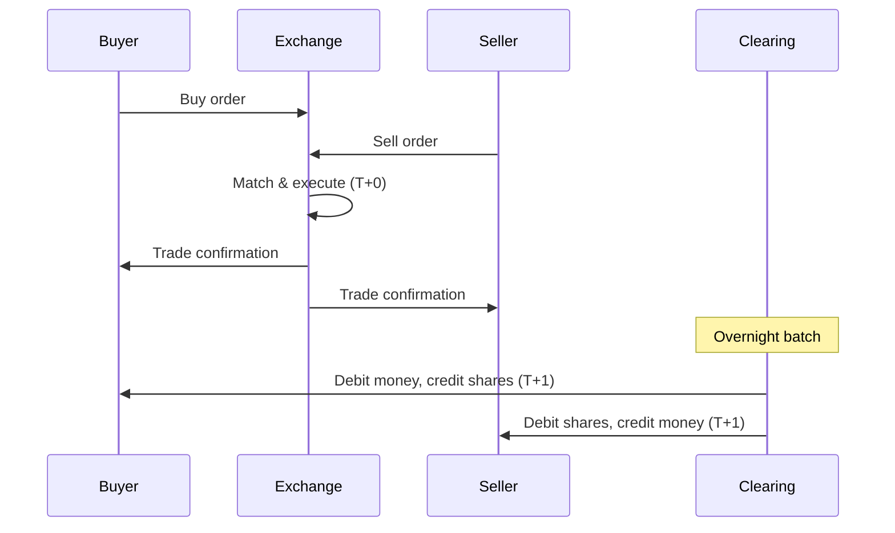

# How Trading Works

## The Trade

Every trade involves a **buyer** and a **seller** agreeing to exchange a security at a price.

```
Buyer: "I want to buy 100 shares of Apple"
Seller: "I want to sell 100 shares of Apple"
Price agreed: $150.00
Trade executes: $15,000 changes hands
```

---

## Bid and Ask

| Term | Definition | Engineering View |
|---|---|---|
| **Bid** | Highest price a buyer will pay | `max(buy_prices)` |
| **Ask** | Lowest price a seller will accept | `min(sell_prices)` |
| **Best Bid** | Highest bid currently in the market | `peek(bid_max_heap)` |
| **Best Ask** | Lowest ask currently in the market | `peek(ask_min_heap)` |

---

## Spread

The difference between the best ask and the best bid.

```
Spread = Ask - Bid

Example:
  Best Bid: $150.00
  Best Ask: $150.05
  Spread: $0.05
```

**Why spreads exist:**
- Market makers need to earn (they capture the spread)
- Low liquidity = higher spread (hard to find counterparty)
- High volatility = wider spread (uncertainty premium)
- Time of day (wider after hours, tight during peak hours)

**Typical spreads:**

| Stock | Typical Spread | Liquidity |
|---|---|---|
| AAPL | $0.01 – $0.05 | Very high |
| MSFT | $0.01 – $0.03 | Very high |
| Small cap | $0.10 – $0.50 | Low |

---

## Order Book

A real-time list of all active buy and sell orders.

```
BIDS (want to buy)       ASKS (want to sell)
Price   Qty              Price   Qty
─────────────────        ─────────────────
150.00   100  ← Best     150.05   200  ← Best
149.90   300              150.10   500
149.80   500              150.20   300
149.70   200              150.30   100

Spread = 150.05 - 150.00 = $0.05
```

**Matching logic:**
- Compare highest bid vs. lowest ask
- If Bid >= Ask → trade executes
- Trade happens at the price of the order that arrived first

**Data structure view:**

```
Bids = Max-Heap (process highest price first)
Asks = Min-Heap (process lowest price first)

When heap_top(bids) >= heap_top(asks):
  execute_trade()
```

---

## Liquidity

How easily a stock can be bought or sold without moving its price.

| Level | Meaning | Example |
|---|---|---|
| **High** | Large orders execute without price impact | Apple (millions of shares/day) |
| **Medium** | Some price impact on large orders | Regional banks |
| **Low** | Even small orders move the price | Penny stocks |

**Measurements:**
- **Bid-Ask Spread**: Narrower = more liquid
- **Trading Volume**: Higher = more liquid
- **Order Book Depth**: More orders at each level = more liquid

**Programming Analogy:**

```
Liquidity = Available bandwidth

High liquidity = 10 Gbps link (your order goes through instantly, no congestion)
Low liquidity = 56 Kbps dial-up (your order congest the link, price moves)

Spread = Packet loss rate (higher spread = more "loss" to cost)
```

---

## Volume

The total number of shares traded in a given period.

```
Daily Volume = total shares traded today
Average Volume = 30-day average of daily volume
```

**Why volume matters:**
- **High volume** = confirms price moves are meaningful
- **Low volume** = price moves may be noise (easy to manipulate)
- **Volume spike** = something significant happened (news, earnings, insider activity)
- **Volume divergence** = price moving up but volume declining = weak trend

**Example:**

```
Stock jumps 5% with 10× normal volume → significant event
Stock jumps 5% with 0.5× normal volume → could be manipulation
```

---

## Execution Types

| Order Type | Behavior | Executes? | Price Guarantee |
|---|---|---|---|
| **Market** | Buy/sell immediately at current best price | Always | No |
| **Limit** | Buy/sell only at specified price or better | When price hits | Yes |
| **Stop-Loss** | Sell when price drops to trigger | After trigger | No (becomes market) |

**Market Order:**
```
You say: "Buy 100 shares NOW"
You get: Best available price (could be worse than expected in volatile markets)
Risk: Slippage (paying more than expected)
```

**Limit Order:**
```
You say: "Buy 100 shares at $150 or less"
You get: Your price, but only if someone is willing to sell at $150
Risk: Order may never fill
```

**Stop-Loss Order:**
```
You say: "If price drops to $145, sell my shares"
When price hits $145, it becomes a market order
You sell at whatever price is available (could be below $145)
```

**Programming Analogy:**
```
Market Order = `await promise` (resolves immediately, value uncertain)
Limit Order = `Promise.withResolvers()` (value known, may never resolve)
Stop-Loss = Circuit breaker (triggered at threshold, then market order)
```

---

## Settlement

After a trade executes, the actual transfer of ownership and money takes time.

**Settlement cycles:**

| Market | Settlement | Meaning |
|---|---|---|
| US Stocks | T+1 | Trade day + 1 business day |
| Indian Stocks | T+1 | Trade day + 1 business day |
| Bonds | T+2 | Trade day + 2 business days |
| Forex | T+2 | Trade day + 2 business days |
| Crypto | Instant | No clearinghouse needed |

**The settlement process:**



**Why settlement takes time:**
- Clearinghouse nets all trades (reduces actual transfers)
- Regulatory checks (AML, KYC, fraud detection)
- Legacy infrastructure (much of it is old)
- Risk management (ensure both sides can pay/deliver)

**India T+1 settlement:** India moved to T+1 in 2023, faster than most global markets.

---

## Short Selling

Betting that a stock will go down.

```
1. Borrow shares from someone who owns them
2. Sell those shares at current price ($100)
3. Wait for price to drop
4. Buy back shares at lower price ($80)
5. Return borrowed shares
6. Profit = $100 - $80 = $20 per share
```

**Risk:** Unlimited loss potential (price can rise infinitely).

---

## Margin Trading

Borrowing money from your broker to buy stocks.

```
You have: $10,000
Broker lends: $10,000
You buy: $20,000 worth of stock

If stock goes up 10% → You gain 20% (double the return)
If stock goes down 50% → You lose 100% (wiped out)
```

**Risk:** Broker can force-sell your holdings (margin call) if price drops too much.

---

## Common Mistakes

- **Using market orders for illiquid stocks.** You can pay a huge spread. Use limit orders for low-volume stocks.
- **Confusing volume with liquidity.** They're related but not identical. A stock can have high volume but wide spread (volatile).
- **Forgetting settlement exists.** You can't withdraw money from a stock sale until T+1.
- **Ignoring order types.** Market orders are convenient but can be expensive in volatile conditions.
- **Thinking short selling is only for professionals.** But brokers restrict it for small accounts.

---

## Interview Notes

- **System Design: "Design an order matching engine"** — classic interview problem. Two priority queues (max-heap for bids, min-heap for asks).
- **System Design: "Design a real-time stock trading platform"** — latency requirements, event-driven architecture, data consistency.
- **Distributed Systems: "How do you handle settlement across time zones?"** — T+1 means different calendar days for different regions.
- **Data Engineering: "Stream processing of trade data"** — millions of trades per day, real-time aggregation.

---

## Revision Summary

| Concept | Definition |
|---|---|
| Bid | Highest price a buyer will pay |
| Ask | Lowest price a seller will accept |
| Spread | Ask - Bid (cost of immediate execution) |
| Liquidity | Ease of trading without moving price |
| Volume | Number of shares traded |
| Order Book | Priority queues of active orders |
| Market Order | Execute immediately, no price guarantee |
| Limit Order | Execute at specified price, may not fill |
| Settlement | Final ownership transfer (T+1) |

---

← [03-market-participants](03-market-participants.md) • [↑ Phase 1](README.md) • [↑ Finance](../README.md) • [05-market-capitalization](05-market-capitalization.md) →
