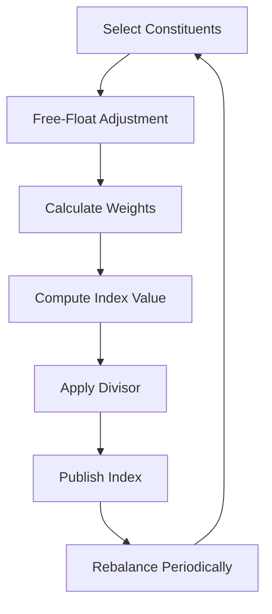

# Market Indices

## Definition

A **market index** is a statistical measure tracking the performance of a group of stocks representing a market, sector, or strategy.

> Engineering view: An index is an **aggregated query** over a filtered set of stocks, with a defined weighting function and rebalancing schedule.

---

## Why Indices Exist

| Purpose | Explanation |
|---|---|
| **Benchmark** | Measure portfolio performance against the market |
| **Sentiment gauge** | Is the overall market up or down? |
| **Passive investing** | Buy the index (via ETF) instead of picking stocks |
| **Derivatives** | Futures and options on indices |
| **Economic indicator** | Index trends correlate with economic health |

---

## Major Indices

| Index | Country | Stocks | Weighting | Known For |
|---|---|---|---|---|
| **NIFTY 50** | India | 50 | Free-float market cap | Top NSE companies |
| **Sensex** | India | 30 | Free-float market cap | Oldest Indian index |
| **S&P 500** | USA | 500 | Market cap | Broad US market |
| **NASDAQ 100** | USA | 100 | Modified market cap | Tech-heavy |
| **Dow Jones** | USA | 30 | **Price-weighted** | Oldest US index |

---

## NIFTY 50

- Managed by NSE Indices (subsidiary of National Stock Exchange)
- 50 largest and most liquid companies listed on NSE
- Represents ~60% of total market cap of NSE
- Free-float market cap weighted
- Rebalanced semi-annually (June and December)
- Sector caps: max 20% from any single sector

**Top constituents (approximate):** Reliance, HDFC Bank, ICICI Bank, Infosys, TCS, Bharti Airtel, ITC, SBI, L&T, HCL Tech.

---

## Sensex (S&P BSE Sensex)

- Managed by BSE (Bombay Stock Exchange)
- 30 largest and most liquid companies on BSE
- Free-float market cap weighted
- Established 1986 (historical data available back to 1979)
- Rebalanced semi-annually

**Key fact:** Sensex is older and more famous as a brand, but NIFTY 50 is more widely used for trading and derivatives.

**NIFTY 50 vs. Sensex:**

| Attribute | NIFTY 50 | Sensex |
|---|---|---|
| Exchange | NSE | BSE |
| Number of stocks | 50 | 30 |
| Base year | 1995 | 1978-79 |
| Used for derivatives | Yes (primary index) | Limited |
| Liquidity | Higher | Lower |

---

## S&P 500

- Managed by S&P Dow Jones Indices
- 500 largest publicly traded US companies
- Market cap weighted
- Represents ~80% of total US market cap
- Requirements: >$15.8B market cap, 4 consecutive profitable quarters, sufficient liquidity

**Top constituents (2024):** AAPL, MSFT, NVDA, AMZN, GOOGL, META, BRK.B, JPM, JNJ, V.

**Why it's the most followed index:**
- Broad coverage (500 companies across all sectors)
- Historical data since 1957
- Underlying for SPY (largest ETF in the world)
- Considered proxy for "the US stock market"

---

## NASDAQ 100

- Managed by NASDAQ
- 100 largest non-financial companies listed on NASDAQ
- Modified market cap weighted (caps individual stock influence)
- Heavily tech-focused
- Does NOT include banks or financial services

**Top constituents:** AAPL, MSFT, GOOGL, AMZN, NVDA, META, TSLA, COST, PEP, ASML.

**Characteristics:**
- Higher growth than S&P 500
- Higher volatility
- Stronger performance in bull markets
- Deeper drawdowns in bear markets

---

## Dow Jones Industrial Average (DJIA)

- Managed by S&P Dow Jones Indices
- 30 large, publicly-owned US companies
- **Price-weighted** (unique among major indices)

**How price-weighting works:**

```
Stock A: price $500 → contributes 500/divisor
Stock B: price $50  → contributes 50/divisor

Stock A has 10× more influence than Stock B
Even if Stock B is a larger company (more shares, bigger market cap)
```

**Why this matters:**
- A $1 move in a $500 stock affects the Dow the same as a $1 move in a $50 stock
- This is widely considered mathematically inferior to market-cap weighting
- The Dow persists for historical/tradition reasons

**Top constituents:** UNH, GS, HD, AMGN, CRM, CAT, MCD, V, MSFT, JPM.

---

## Weighting Methods

**Market Cap Weighted (most indices):**

```
Index Weight = Company Market Cap / Total Market Cap of Index
```

**Price Weighted (Dow Jones):**

```
Index Weight = Stock Price / Sum of All Stock Prices
```

**Equal Weighted (some specialized indices):**

```
All stocks have equal weight regardless of size
Rebalanced periodically
```

**Comparison:**

| Method | Pros | Cons | Example |
|---|---|---|---|
| Market cap | Reflects actual economy weight | Overweights overvalued stocks | S&P 500, NIFTY 50 |
| Price weighted | Simple | Irrational (price ≠ size) | Dow Jones |
| Equal weighted | No concentration risk | Frequent rebalancing cost | S&P 500 Equal Weight |

---

## How Indices Are Calculated

**Step by step (market cap weighted):**

```
1. Select constituent stocks (e.g., top 50 by market cap)
2. Apply free-float adjustment (only count tradable shares)
3. Calculate each stock's weight = free-float MCap / total free-float MCap
4. Index value = Σ(weight × price) × divisor
5. Divisor adjusts for stock splits, dividends, corporate actions
```



**Divisor:** A constant that keeps the index value continuous despite corporate actions (splits, spin-offs, etc.). Without a divisor, a stock split would artificially cut the index value in half.

---

## Programming Analogy

```
Index = Materialized View

CREATE MATERIALIZED VIEW sp500 AS
SELECT 
    ticker,
    free_float_market_cap / SUM(free_float_market_cap) OVER() AS weight
FROM companies
WHERE 
    market_cap > $15.8B 
    AND listed_on = 'NYSE or NASDAQ'
    AND profitable_last_4_quarters
ORDER BY free_float_market_cap DESC
LIMIT 500;

-- Refresh every quarter (rebalance)
REFRESH MATERIALIZED VIEW sp500;
```

---

## Common Mistakes

- **Thinking the Dow Jones represents the whole US market.** It's only 30 stocks, price-weighted, and mathematically inferior.
- **Confusing NIFTY 50 with Sensex.** Both track India but different exchanges, different number of stocks, different index methodologies.
- **Assuming all indices are market-cap weighted.** Dow Jones is price-weighted. Some are equal-weighted.
- **Ignoring rebalancing effects.** When stocks enter/leave an index, there's predictable price movement as passive funds adjust.
- **Thinking index level (e.g., 20,000) means anything.** Index levels are arbitrary. The percentage change is what matters.

---

## Interview Notes

- **System Design: "Design a real-time index calculator"** — must handle streaming prices, corporate actions, divisor adjustments
- **Data Engineering: "Calculate index values from streaming stock prices"** — high-frequency calculation, accuracy requirements
- **Quant: "Explain why price-weighting is mathematically inferior"** — price does not reflect company size; $1 move in a $500 stock shouldn't equal $1 move in a $50 stock
- **ETF Design: "How does an index fund track an index?"** — portfolio optimization, tracking error, rebalancing costs

---

## Revision Summary

| Index | Country | Constituents | Weighting |
|---|---|---|---|
| NIFTY 50 | India | 50 | Free-float market cap |
| Sensex | India | 30 | Free-float market cap |
| S&P 500 | USA | 500 | Market cap |
| NASDAQ 100 | USA | 100 | Modified market cap |
| Dow Jones | USA | 30 | Price |

- Indices are **aggregated queries** over filtered stock sets
- Most use **market-cap weighting** (larger company = more influence)
- Dow Jones is the exception: **price-weighted** (higher price = more influence)
- Indices serve as benchmarks, sentiment gauges, and ETF underlyings
- Free-float adjustment ensures only tradable shares count toward index weight

---

← [05-market-capitalization](05-market-capitalization.md) • [↑ Phase 1](README.md) • [↑ Finance](../README.md) • [07-market-cycles](07-market-cycles.md) →
