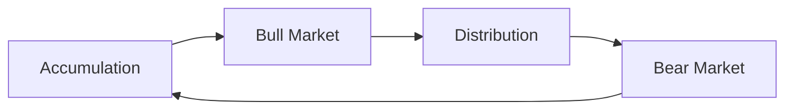
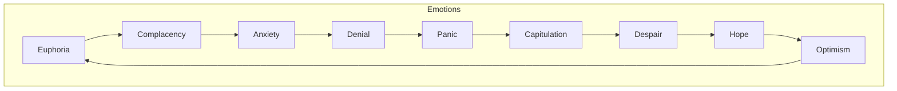

# Market Cycles

## Definitions

| Term | Threshold | Duration |
|---|---|---|
| **Bull Market** | +20% or more from recent lows | Months to years |
| **Bear Market** | -20% or more from recent highs | Months to years |
| **Correction** | -10% to -19% from recent highs | Weeks to months |
| **Crash** | -20%+ in days or weeks | Days to weeks |
| **Rally** | Short-term bounce during a decline | Days to weeks |
| **Recovery** | Sustained rise after a bear market | Months to years |

---

## The Market Cycle



**Four phases:**

| Phase | Smart Money | General Public | Price Action | Volume |
|---|---|---|---|---|
| **Accumulation** | Buying quietly | Bearish, still selling | Sideways, stabilizing | Low |
| **Bull Market** | Holding | Bullish, buying | Steady uptrend | Increasing |
| **Distribution** | Selling quietly | Still bullish, buying | Sideways, high volatility | High |
| **Bear Market** | Short or in cash | Panic selling | Steady decline | High (panic) then low (despair) |

---

## Bull Market

A prolonged period of rising prices.

**Characteristics:**
- Investor psychology: optimism, confidence, greed
- Media coverage: positive, celebratory
- "Buy the dip" works repeatedly
- Valuation multiples expand (P/E ratios increase)
- IPO market is active

**Typical duration:** 2–9 years (average ~5 years)

**Examples:**
- 2009–2020 (COVID crash ended this): S&P 500 went from 666 to 3,386
- 2020–2021 (post-COVID): S&P 500 from 2,237 to 4,796
- India 2003–2008: NIFTY 50 from 1,000 to 6,200

---

## Bear Market

A prolonged period of declining prices.

**Characteristics:**
- Investor psychology: fear, panic, despair
- Media coverage: negative, doom-laden
- "Buy the dip" leads to losses (it keeps going down)
- Valuation multiples contract (P/E ratios decrease)
- IPO market dries up
- Unemployment often rises

**Typical duration:** 1–2 years (average ~1.3 years)

**Examples:**

| Event | Decline | Duration | Recovery Time |
|---|---|---|---|
| 2008 Financial Crisis | -57% | 1.5 years | ~4 years |
| COVID Crash (2020) | -34% | 1 month | ~6 months |
| Dot-com Bust (2000-2002) | -49% | 2.5 years | ~7 years |
| 2022 Bear Market | -27% | ~10 months | ~1.5 years |
| 1996 Indian bear market | -57% (BSE) | ~2 years | ~3 years |

---

## Correction

A short-term decline of 10-19%.

**Key facts:**
- Happens every 1-2 years on average
- Considered **healthy** — shakes out weak holders
- Within a bull market, corrections are buying opportunities
- Within a bear market, corrections are selling opportunities (they fail and go lower)

**Programming Analogy:**

```
Correction = Normal GC pause
  - Happens periodically
  - Healthy for system (frees up memory)
  - If you panic and sell (force quit), you miss the recovery

Crash = OOM kill
  - Severe, sudden
  - System goes down hard
  - Takes time to restart (recovery)
```

---

## Crash

A rapid, severe market decline.

**Characteristics:**
- 20%+ decline in days or weeks
- Often triggered by a sudden event (financial crisis, pandemic, war)
- High volatility (5-10% daily moves)
- Circuit breakers may halt trading
- Panic selling, forced liquidations

**Famous crashes:**

| Crash | Cause | Decline | Time |
|---|---|---|---|
| 1929 Crash | Speculation, margin debt | -89% (peak to trough) | 3 years |
| 1987 Black Monday | Program trading | -22.6% in one day | 1 day |
| 2008 Financial Crisis | Subprime mortgages, leverage | -57% | 1.5 years |
| 2020 COVID Crash | Pandemic lockdown | -34% | 1 month |

---

## Rally

A temporary bounce in prices during an overall downtrend.

**Also called:** Dead cat bounce (colloquial), bear market rally.

**Characteristics:**
- Short duration (days to weeks)
- Higher volume (short covering, dip buyers)
- Often retraces to a resistance level
- Fails and resumes the downtrend

**Why they happen:**
- Short sellers buy back to lock in profits
- Value investors think "it's cheap enough"
- News-driven optimism
- Technical factors (support levels, oversold bounces)

---

## Recovery

The period after a bear market when prices begin rising again.

**How to identify:**
- Market makes higher lows
- Volume increases on up days
- Breadth improves (more stocks participating)
- Economic data starts improving

**Recovery shapes:**

| Shape | Description | Examples |
|---|---|---|
| **V-shaped** | Sharp drop, sharp recovery | 2020 COVID crash |
| **U-shaped** | Gradual drop, flat bottom, gradual recovery | 2008 Financial Crisis |
| **L-shaped** | Sharp drop, no recovery (lost decade) | Japan 1990s |
| **W-shaped** | Double dip (recover, then drop again) | 1980-82 US |

---

## Psychology of Market Cycles



**The cycle of investor emotion:**
- **Euphoria** → Top of bull market (everyone bullish)
- **Anxiety** → First decline (maybe it's just a dip?)
- **Denial** → "It'll come back" (it doesn't)
- **Panic** → Crash mode (sell everything)
- **Despair** → Bear market bottom (hate the market)
- **Hope** → Early recovery (cautiously optimistic)
- **Optimism** → Mid-bull (feels safe again)
- **Euphoria** → Back to the top (cycle repeats)

---

## Programming Analogy

```
Market Cycles = Software hype cycles

Accumulation = Early developers adopt a new technology
  - Quiet, unfashionable
  - Most people don't know about it

Bull Market = Mainstream adoption
  - Tech media covers it
  - "Everyone should learn this"
  - Conferences sell out

Distribution = Early exits by insiders
  - Founders sell shares
  - Late adopters pile in

Bear Market = Trough of disillusionment
  - "This technology was overhyped"
  - Projects get canceled
  - Only the truly useful survives

Recovery = Plateau of productivity
  - The technology finds its real use case
  - Sustainable growth
```

---

## Common Mistakes

- **Calling every 5% drop a crash.** Crashes are 20%+ in days/weeks. Most drops are just normal volatility.
- **Buying the dip in a bear market thinking it's a correction.** Corrections happen in bull markets. In bear markets, dips get lower.
- **Letting emotions drive decisions.** The best time to buy feels terrible (bear market bottom). The best time to sell feels great (bull market top).
- **Assuming "this time it's different."** The cycle always repeats. The details change, the pattern doesn't.
- **Ignoring recovery times.** A 50% crash needs a 100% gain to recover. Recovery takes years, not months.

---

## Interview Notes

- **ML/Finance: "Build a market regime classifier"** — classify market state as bull/bear/correction using price, volume, and breadth data
- **System Design: "Design a market crash early warning system"** — volatility indices, yield curve, credit spreads as features
- **Behavioral Finance: "Why do retail investors buy at tops and sell at bottoms?"** — emotional cycle, FOMO, loss aversion
- **Risk Management: "How do you protect a portfolio during a bear market?"** — hedging, diversification, stop-losses, asset allocation

---

## Revision Summary

| Term | Threshold |
|---|---|
| Bull Market | +20% from lows |
| Bear Market | -20% from highs |
| Correction | -10% to -19% |
| Crash | -20%+ rapidly |

- Markets move in cycles: **Accumulation → Bull → Distribution → Bear**
- **Corrections** are normal (every 1-2 years)
- **Bear markets** are structural (every 5-7 years)
- **Emotions** drive the cycle (greed at top, fear at bottom)
- The cycle always repeats. Nobody rings a bell at the top.

---

← [06-market-indices](06-market-indices.md) • [↑ Phase 1](README.md) • [↑ Finance](../README.md) • [08-investment-types](08-investment-types.md) →
