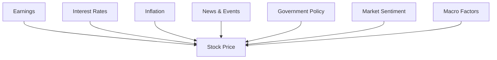
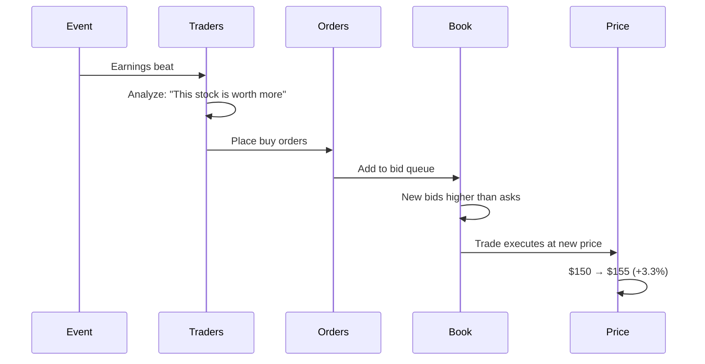

# Price Movement

## Core Mechanism

Stock prices move because of changes in **supply and demand**.

```
Demand > Supply → Price UP
Supply > Demand → Price DOWN
Demand ≈ Supply → Price STABLE / SIDEWAYS
```

Everything that affects price does so by changing either demand or supply.

---

## The Seven Drivers



---

## 1. Earnings

Company profits reported every quarter. The single most important scheduled event for a stock.

**How the market reacts:**

| Scenario | Stock Reaction |
|---|---|
| Earnings beat expectations | UP (often 2-10%) |
| Earnings miss expectations | DOWN (often 2-10%) |
| Earnings in line | Modest or flat |
| Guidance raised (future outlook) | UP |
| Guidance lowered | DOWN |

**Key insight:** The market reacts to **surprise** (actual vs. expected), not absolute numbers. A company can report record profits but fall if expectations were even higher.

**Examples:**

| Company | Quarter | Result | Stock Reaction |
|---|---|---|---|
| NVIDIA | Q4 2024 | Revenue +265% YoY | +16% |
| Meta | Q2 2022 | First revenue decline ever | -26% |
| Tesla | Various | Profit beats but margin concerns | Mixed |

---

## 2. Interest Rates

Set by central banks (Federal Reserve in US, RBI in India). The "cost of money."

**Mechanism:**

```
Rates UP →
  Companies pay more to borrow → lower profits → DOWN
  Consumers pay more on loans → less spending → DOWN
  Bonds become more attractive vs. stocks → DOWN
  Future profits worth less today (higher discount rate) → DOWN

Rates DOWN →
  Opposite effects → UP
```

**Sectors affected differently:**

| Sector | Rate Hike Effect | Why |
|---|---|---|
| Banks | Positive | Charge more for loans, deposit rates don't keep up |
| Tech | Negative | Future profits discounted more heavily |
| Real Estate | Negative | Higher mortgages reduce demand |
| Utilities | Negative | High debt, bonds more competitive |

---

## 3. Inflation

General increase in prices of goods and services.

**Effect chain:**

```
High Inflation →
  Central bank raises rates (to fight inflation)
  → Stocks DOWN (see interest rate effect)
  → Input costs rise → margins shrink
  → Consumer spending may drop
```

**Which stocks survive inflation:**
- Companies with **pricing power** (can pass costs to customers): Coca-Cola, P&G, HDFC Bank
- Companies with **low debt** (less affected by rate hikes)
- **Commodity producers** (gold, oil, metals benefit from rising prices)

---

## 4. News & Events

Any information that changes perception of a company's value.

**Types and impact:**

| Event Type | Direction | Example |
|---|---|---|
| Product launch | Usually positive | Apple iPhone, NVIDIA new GPU |
| Regulatory action | Usually negative | Google antitrust fines |
| Geopolitical event | Market-wide negative | War, sanctions, trade disputes |
| Management change | Mixed | New CEO can be good or bad |
| Analyst upgrade | Mild positive | Goldman upgrades Tesla |
| Stock buyback | Positive | Signal company thinks shares are cheap |
| Insider selling | Negative | Leadership cashing out |

---

## 5. Government Policy

Taxes, regulations, tariffs, subsidies.

**Examples:**

| Policy | Effect |
|---|---|
| Corporate tax cut | More profit → stocks UP |
| Trade tariffs | Import costs up → profit DOWN |
| Industry subsidies | Targeted sector UP |
| Deregulation | Lower compliance costs → UP |
| Price controls | Profit caps → DOWN |

**India example:** 2019 corporate tax cut from 30% to 22% → NIFTY 50 jumped 5% in a single day.

---

## 6. Market Sentiment

The collective mood of investors. Creates self-reinforcing feedback loops.

| State | Behavior | Market Position |
|---|---|---|
| **Euphoria** | Everyone buying, FOMO, no caution | Near top |
| **Complacency** | Low volatility, "stocks only go up" | Late bull |
| **Anxiety** | First signs of trouble | Early correction |
| **Panic** | Selling everything, no discrimination | Crash |
| **Despair** | "I'll never invest again" | Near bottom |
| **Hope** | Cautious buying | Early recovery |

**Programming Analogy:**

```
Sentiment = System load metrics

Euphoria = CPU at 99%, all queues full → WARN (about to crash)
Complacency = CPU at 60%, steady → INFO (normal)
Anxiety = CPU spiking, latency increasing → WARN
Panic = Multiple services failing → CRITICAL
Despair = System down → ALERT (time to restart)
```

---

## 7. Macro Factors

Broader economic conditions.

| Factor | Good for Stocks | Bad for Stocks |
|---|---|---|
| GDP growth | Growing | Shrinking |
| Unemployment | Low (more spending) | High (less spending) |
| Consumer confidence | High | Low |
| Manufacturing PMI | > 50 (expansion) | < 50 (contraction) |
| Oil prices | Stable or low | High (costs up) |
| Currency strength | Strong = cheap imports | Weak = inflation |

---

## How Price Discovery Works



---

## Programming Analogy

```
Price Movement = Event-Driven Architecture

Events → Event Queue → Consumers (traders/algorithms) → Actions → State Change

Earnings = Scheduled cron job (predictable, high traffic)
News = Webhook (unpredictable, burst traffic)
Rate Decision = Configuration change (affects all services)
Sentiment = Log levels (context-dependent interpretation)

"Priced in" = Event already consumed and processed
  - The market is a stream processor
  - Known information is already in the current state (price)
  - Only NEW information (surprise) moves the price
```

---

## Common Mistakes

- **Thinking past price movement predicts future price movement.** It doesn't. Past performance ≠ future results.
- **Ignoring interest rates.** They are the single biggest macro factor affecting ALL stocks.
- **Assuming good news → price up.** If the good news was already expected, price may not move ("priced in").
- **Treating all news as equally important.** Earnings and interest rates matter more than analyst upgrades.
- **Letting sentiment drive decisions.** Buy when there's blood in the streets (despair). Sell when everyone is euphoric.
- **Confusing correlation with causation.** Just because a stock went up after news X doesn't mean X caused it.

---

## Interview Notes

- **ML: "Build a model to predict stock movement from earnings data"** — features: actual vs. expected, guidance, historical reaction
- **Data Engineering: "Build a real-time news processing pipeline for market impact"** — NLP, sentiment scoring, event classification
- **System Design: "Design a market sentiment dashboard"** — real-time aggregation of news, social media, price data
- **Quant: "What drives stock prices?"** — fundamental question in quantitative finance

---

## Revision Summary

| Driver | Direction | When It Matters Most |
|---|---|---|
| Earnings | Beat → UP, Miss → DOWN | Quarterly (scheduled) |
| Interest Rates | Up → DOWN, Down → UP | Continuous |
| Inflation | High → DOWN, Low → UP | Continuous |
| News | Good → UP, Bad → DOWN | Continuous (unpredictable) |
| Government Policy | Varies | Event-driven |
| Sentiment | Greed → UP (unsustainable), Fear → DOWN | Continuous |
| Macro | Growing → UP, Shrinking → DOWN | Continuous |

- Price = f(Demand, Supply) — everything operates through this equation
- Earnings surprise is the biggest scheduled mover
- Interest rates are the biggest persistent macro factor
- Sentiment creates feedback loops (greed → buying → more greed)
- The market only reacts to NEW information (surprises)

---

← [08-investment-types](08-investment-types.md) • [↑ Phase 1](README.md) • [↑ Finance](../README.md) • [10-company-performance](10-company-performance.md) →
