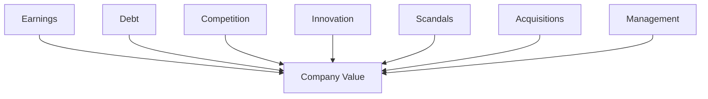

# Company Performance

## Overview

Stock prices follow company performance over time. Understanding why companies rise or fall is the core of **fundamental analysis**.

**Seven factors that drive company performance:**



---

## 1. Earnings

A company's profit after all expenses. The single most important driver of long-term stock price.

**Earnings growth = stock growth (over time):**

```
Revenue - Cost of Goods Sold - Operating Expenses - Interest - Taxes = Net Income (Earnings)
```

**What the market watches:**
- **Revenue growth**: Is the top line growing?
- **Margin trends**: Is profit per dollar of revenue stable?
- **Earnings per share (EPS)**: Profit divided by shares outstanding
- **Growth rate**: How fast is earnings growing year-over-year?

**Patterns:**

| Pattern | Signal | Example |
|---|---|---|
| Revenue growing, earnings growing | Healthy company | Apple 2010s |
| Revenue growing, earnings shrinking | Margin pressure | Many SaaS companies |
| Revenue flat, earnings growing | Cost cutting, not growth | Mature companies |
| Both shrinking | Decline | Struggling businesses |

**Real world examples:**

| Company | Period | Earnings Trend | Stock Result |
|---|---|---|---|
| NVIDIA | 2023-2024 | +265% revenue growth | +200%+ |
| Meta | 2022 | First revenue decline | -64% |
| Apple | Long-term | Consistent growth | Consistent growth |

---

## 2. Debt

Money a company has borrowed. Amplifies returns in good times, amplifies losses in bad times.

**How debt affects a company:**

```
Low Debt (0-20% of capital) →
  Less risk, more stable
  Less vulnerable to rate hikes
  Example: Apple (net cash: more cash than debt)

Moderate Debt (20-50%) →
  Leverage boosts returns
  Manageable interest costs
  Example: Microsoft

High Debt (50%+) →
  Large interest payments eat profits
  Vulnerable to rate hikes
  Vulnerable to downturns (fixed costs must be paid)
  Example: Telecom companies, real estate firms

Distressed (can't pay) →
  Bankruptcy risk
  Example: Enron, Lehman Brothers
```

**Debt metrics the market watches:**
- **Debt-to-Equity**: Total debt / shareholder equity (higher = riskier)
- **Interest Coverage Ratio**: Operating income / interest expense (higher = safer)
- **Net Debt**: Total debt - cash (negative net debt = net cash = very safe)

---

## 3. Competition

The company's ability to defend its market position.

**Competitive Advantage (Moat):**

| Type | Description | Example |
|---|---|---|
| Brand | Customers prefer the brand | Apple, Coca-Cola |
| Network effects | More users = more value | Google (search), Meta (social) |
| Switching costs | Hard to leave | Microsoft Office, AWS |
| Cost advantage | Cheaper to produce | Walmart, Reliance Jio |
| Scale | Economies of scale | Amazon |
| IP / Patents | Protected technology | NVIDIA, Pfizer |

**When competition intensifies:**

```
Strong moat → Company can maintain prices → Stable profits
Weak moat → Price wars, margin compression → Declining profits
```

**Examples of competitive disruption:**

| Company | Disrupted By | Impact |
|---|---|---|
| Nokia | Apple (iPhone) | Destroyed |
| Blockbuster | Netflix | Bankrupt |
| Google Search | ChatGPT / Bing AI | First real threat in 20 years |
| Tesla | BYD, legacy EVs | Market share pressure in China |

---

## 4. Innovation

New products, technologies, or business models that create value.

**Innovation types:**

| Type | Risk | Reward | Example |
|---|---|---|---|
| Incremental | Low | Steady growth | iPhone yearly upgrades |
| Breakthrough | High | Massive upside | iPhone launch, ChatGPT |
| Disruptive | High | Industry change | Netflix killing Blockbuster |
| Failed | Capital wasted | Zero | Google Glass, Metaverse |

**The innovation cycle:**

```
R&D Investment → Innovation → New Product → Revenue Growth → More R&D
```

**Real world examples:**

| Company | Innovation | Result |
|---|---|---|
| Apple | iPhone (2007) | World's most valuable company |
| NVIDIA | CUDA + AI GPUs | +5000% over a decade |
| Microsoft | Azure cloud | Turnaround under Nadella |
| Tesla | Mass-market EVs | $1T+ valuation (at peak) |

---

## 5. Scandals

Events that destroy trust and value, often suddenly.

**Scandal types and impact:**

| Type | Typical Impact | Example |
|---|---|---|
| Accounting fraud | -80% to -100% | Enron (went to $0), Wirecard |
| CEO misconduct | -20% to -50% | Uber 2017 (sexual harassment) |
| Data breach | -5% to -35% | Equifax (-35%), Facebook/Cambridge Analytica |
| Regulatory violation | -10% to -30% | Google EU fines (billions) |
| Insider trading | Severe | Multiple cases |

**The Enron story:**
- Once a $70B market cap company
- Massive accounting fraud (fake profits, hidden debt)
- Stock went to $0
- Employees lost pensions and jobs
- Led to Sarbanes-Oxley Act (major financial regulation)

---

## 6. Acquisitions (M&A)

Companies buying other companies.

**Types:**

| Type | Description | Success Rate |
|---|---|---|
| Strategic | Buy technology, talent, market access | Moderate |
| Horizontal | Buy competitor (same industry) | Mixed |
| Vertical | Buy supplier or customer | Mixed |
| Conglomerate | Buy unrelated business | Low |

**Why most M&A fails:**
- Integration is harder than expected (merging codebases × 100)
- Overpaying (winner's curse)
- Cultural clash
- Management distraction

**Real world examples:**

| Deal | Value | Outcome |
|---|---|---|
| Microsoft + LinkedIn | $26B | Positive (integrated well) |
| Microsoft + Activision | $69B | Positive (gaming expansion) |
| Facebook + Instagram | $1B | Extremely positive (best deal ever?) |
| AOL + Time Warner | $165B | Worst merger in history |
| HP + Autonomy | $11B | Disaster ($8.8B write-down) |

---

## 7. Management

The quality of leadership. Underrated but critical.

**Good vs. Bad Management:**

| Attribute | Good Management | Bad Management |
|---|---|---|
| Capital allocation | Invests wisely, buys back shares | Wastes on bad acquisitions |
| Strategy | Clear vision, executes well | No direction, constant pivots |
| Culture | Attracts talent | Drives away talent |
| Transparency | Honest with shareholders | Hides problems |
| Long-term thinking | Builds for years | Chases quarterly numbers |

**Famous examples:**

| CEO | Company | What They Did |
|---|---|---|
| Tim Cook | Apple | Supply chain mastery, capital returns (trillions in buybacks) |
| Satya Nadella | Microsoft | Turned around culture, bet on cloud + AI |
| Jensen Huang | NVIDIA | Bet everything on AI compute (decade-long vision) |
| Steve Ballmer | Microsoft (early) | Missed mobile, search, social |
| Elon Musk | Tesla | Visionary but volatile |

---

## Programming Analogy

```
Company = Software Project

Earnings = Revenue - Operating Costs (SaaS: MRR - infra cost)
Debt = Technical debt
  - Strategic tech debt = OK (enables speed)
  - Reckless tech debt = Crushes velocity (interest payments = maintenance cost)
Competition = Competing open-source / commercial projects
  - Microsoft Office = Enterprise SaaS with lock-in
  - Google Docs = Free competitor eating market share
Innovation = New features / architecture
  - iPhone = Complete rewrite of the mobile OS (v1.0 → v2.0)
  - Google Glass = Failed feature nobody wanted
Scandals = Security breach
  - Trust destroyed, users leave, revenue drops
Acquisitions = Acquihires / codebase mergers
  - Can be synergy (great API integration)
  - Can be disaster (merge two incompatible monoliths)
Management = Engineering leadership
  - Good CTO: ships fast, attracts talent, manages technical debt
  - Bad CTO: micromanages, demos instead of shipping, churn
```

---

## Common Mistakes

- **Focusing only on earnings, ignoring debt.** A company with growing earnings but crushing debt is fragile. One rate hike can break it.
- **Assuming past innovation guarantees future success.** Nokia dominated mobile phones → destroyed by iPhone. Innovation must continue.
- **Thinking all M&A is good.** 70% of acquisitions destroy value. Integration is hard.
- **Ignoring management quality.** Same business + different CEO = completely different outcome.
- **Loving a company as a customer ≠ loving it as an investment.** Great products don't always mean great stocks.

---

## Interview Notes

- **LLM Agents: "Build an agent that reads SEC filings and summarizes company health"** — needs to analyze all seven factors
- **Data Engineering: "Pipeline for structuring earnings call transcripts"** — NLP for sentiment, key metric extraction
- **ML: "Predict bankruptcy using financial data"** — debt ratios, earnings trends, industry position as features
- **Fundamental Analysis: "What factors matter most for long-term stock performance?"** — earnings growth, competitive moat, management quality

---

## Revision Summary

| Factor | Good | Bad |
|---|---|---|
| Earnings | Growing | Declining |
| Debt | Low / manageable | High / distressed |
| Competition | Strong moat | Weak position |
| Innovation | New products | R&D stagnation |
| Scandal | None | Fraud, misconduct |
| Acquisitions | Strategic | Overpriced, poor integration |
| Management | Competent | Weak / self-dealing |

- **Earnings growth** is the #1 long-term driver of stock price
- **Debt** amplifies risk (good when rates are low, dangerous when rates rise)
- **Moat** (competitive advantage) protects profit from competition
- **Innovation** creates value; **scandals** destroy trust
- **Management quality** is underrated but critical to outcomes

---

← [09-price-movement](09-price-movement.md) • [↑ Phase 1](README.md) • [↑ Finance](../README.md) • [11-financial-data-sources](11-financial-data-sources.md) →
