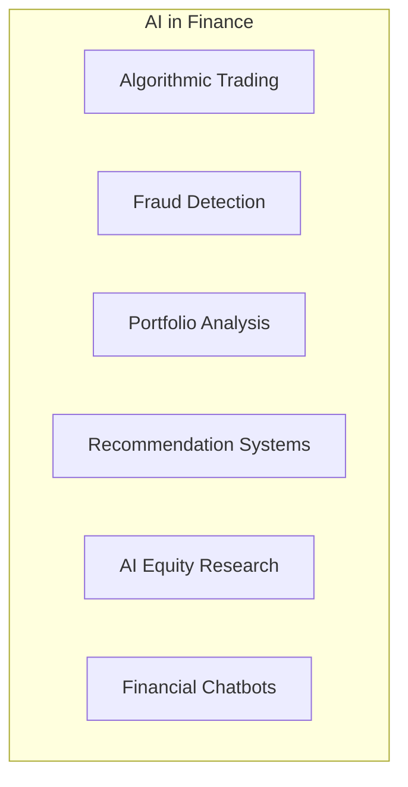
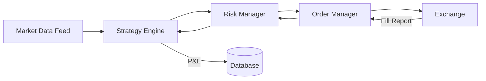

# AI in Finance

## Overview

Artificial intelligence is transforming finance across multiple domains — from high-frequency trading to fraud detection to research platforms.



---

## Algorithmic Trading

Computer programs that execute trades automatically based on predefined rules or ML models.

**Types by strategy:**

| Type | Timeframe | Strategy | AI/ML Role |
|---|---|---|---|
| **Market Making** | Milliseconds | Capture bid-ask spread | Predict short-term order flow |
| **Momentum** | Minutes–Days | Ride trends | Trend detection (time-series) |
| **Mean Reversion** | Days–Weeks | Buy low, sell high | Identify overbought/oversold |
| **Statistical Arbitrage** | Hours–Days | Trade correlated pairs | Cointegration modeling |
| **High Frequency** | Microseconds | Ultra-fast execution | Latency optimization |
| **Sentiment-based** | Minutes–Hours | Trade on news | NLP for news/social media |

**How an algorithmic trading system works:**



**Key engineering challenges:**
- **Latency**: Microseconds matter. Co-location, FPGA, kernel bypass.
- **Data volume**: Millions of ticks per day per instrument.
- **Backtesting**: Simulating trades on historical data without look-ahead bias.
- **Risk management**: Preventing runaway losses (circuit breakers, position limits).
- **Infrastructure**: 24/7 reliability, disaster recovery.

**Famous quant funds:**
- **Renaissance Technologies**: Medallion Fund (66% annual returns 1988-2018)
- **Two Sigma**: Systematic, ML-driven
- **D.E. Shaw**: Quantitative pioneer
- **Citadel**: Multi-strategy, one of the most successful hedge funds ever

---

## Fraud Detection

Using ML to identify suspicious financial activity.

**Applications:**

| Type | What It Detects | Techniques Used |
|---|---|---|
| Credit card fraud | Unauthorized transactions | Anomaly detection, random forests |
| Insider trading | Trading on non-public info | Network analysis, pattern matching |
| Money laundering | Layering, structuring | Graph neural networks, clustering |
| Market manipulation | Wash trading, spoofing | Time-series analysis, order book ML |
| Account takeover | Unauthorized access | Behavioral biometrics, ML |

**How it works:**

```
Transaction flows into system
  → Feature extraction (amount, location, time, device, history)
  → ML model scores for fraud probability
  → Threshold check:
      Low risk → auto-approve
      Medium risk → additional verification
      High risk → block, flag for review
  → Result fed back to model (continuous learning)
```

**Programming Analogy:**

```
Fraud Detection = Intrusion Detection System (IDS) for financial transactions

Network IDS:
  Features: packet size, source IP, destination port, protocol
  Model: anomaly detection on network flows

Fraud Detection:
  Features: transaction amount, merchant, location, user history
  Model: anomaly detection on transaction flows

Same techniques, different domain.
```

---

## Portfolio Analysis

Using software and AI to manage and optimize investment portfolios.

**Core functions:**

| Function | What It Does | AI/ML Role |
|---|---|---|
| **Asset Allocation** | Decide % in stocks vs. bonds vs. other | Mean-variance optimization |
| **Rebalancing** | Restore target weights | Rules engine + scheduled jobs |
| **Risk Assessment** | Measure portfolio volatility, drawdown | Monte Carlo simulation, VaR models |
| **Tax-Loss Harvesting** | Sell losers to offset gains | Optimization algorithm |
| **Performance Attribution** | Explain returns by sector/stock | Factor decomposition |
| **Factor Analysis** | Identify return sources (value, momentum, size) | Multi-factor regression |

**Robo-advisors:**
- Betterment, Wealthfront, Groww, Vanguard Digital Advisor
- Automated portfolio management based on user goals and risk tolerance
- Rule-based + optimization, increasingly incorporating ML

**Programming Analogy:**

```
Portfolio = Observable state in a reactive system

class Portfolio:
    def __init__(self, risk_profile, goals):
        self.holdings = []  # list of positions
        self.target_allocation = optimize(risk_profile)  # optimizer
        self.cash = 0

    def rebalance(self):
        # Scheduled job: restore target weights
        current = calculate_allocation(self.holdings)
        target = self.target_allocation
        trades = generate_trades(current, target)
        execute_trades(trades)

    def risk_check(self):
        # Continuous monitoring
        var = calculate_var(self.holdings)
        if var > self.risk_limit:
            alert("Risk limit exceeded")
            reduce_risk(self.holdings)
```

---

## Recommendation Systems

Suggesting stocks, ETFs, or funds to investors.

**Techniques used:**

| Technique | How It Works | Example |
|---|---|---|
| Collaborative filtering | "Users similar to you bought X" | Robinhood trending stocks |
| Content-based | "You liked Apple → try Microsoft" | Portfolio similarity |
| Hybrid | Both combined | Betterment recommendations |
| Rule-based | Age, income, goals → allocation | Target-date funds |

**Constraints that make financial recommendations hard:**
- **Suitability**: Must match user's risk tolerance, age, financial goals
- **Regulation**: Recommendations may be regulated (fiduciary duty)
- **Diversification**: Shouldn't recommend too much of one sector
- **Tax implications**: Selling triggers capital gains
- **Time horizon**: Long-term vs. short-term goals

---

## AI Equity Research

Using AI to analyze companies at scale.

**What AI can do:**
- Read earnings call transcripts and extract key metrics
- Parse SEC filings and summarize financial health
- Monitor news for relevant company events
- Analyze competitive positioning from multiple sources
- Track insider trading patterns
- Generate financial models and projections
- Compare companies across metrics and sectors

**Limitations:**
- LLMs hallucinate financial data (need structured data grounding)
- Cannot access real-time data natively (requires integration)
- May miss qualitative factors (management quality, regulatory risk)
- Training data cutoff = no recent events

**How to solve these problems:**
- **Grounding**: Connect LLMs to structured financial databases
- **Tool use**: Give LLMs tools for calculation, API calls, data retrieval
- **Real-time pipelines**: Feed current data into the model context
- **Human oversight**: Use AI as an assistant, not the final decision-maker

---

## Financial Chatbots

LLM-powered assistants that answer financial questions.

**Current capabilities:**
- Answer basic questions about financial concepts
- Look up stock prices (if connected to API)
- Explain terminology
- Summarize news articles

**Current limitations:**
- Cannot perform reliable financial calculations
- Hallucinate numbers and facts
- No portfolio context (don't know what you own)
- Cannot distinguish between opinion and fact
- Training cutoff = stale data

**What's needed for production financial chatbots:**
- Structured financial data integration
- Real-time market data access
- Calculation tools (not relying on model weights)
- User portfolio awareness (with permission)
- Citation of sources for every claim

---

## Programming Analogy

```
AI in Finance = Specialized AI systems for different tasks

Algorithmic Trading = Real-time stream processing
  - Apache Kafka for market data
  - Sub-millisecond latency SLAs
  - Stateful processing (positions, P&L, risk)

Fraud Detection = Anomaly detection in logs
  - Isolation Forest, Autoencoders
  - Feature engineering on transaction data
  - Alerting and case management

Portfolio Management = Reactive state machine
  - State = current holdings
  - Transitions = trades
  - Scheduled jobs = rebalancing
  - Events = deposits, withdrawals, dividends

Equity Research = RAG (Retrieval Augmented Generation)
  - Index: SEC filings, earnings calls, news, analyst reports
  - Retrieve: relevant documents for the query
  - Generate: answer with citations
  - Tools: calculator, comparison engine, data API

Financial Chatbot = Agent with tools
  - LLM orchestrator
  - Tools: price lookup, calculator, SEC filing search, news API
  - Memory: user's portfolio, conversation history
```

---

## Common Mistakes

- **Thinking an LLM alone can do finance.** Without structured data, real-time access, and calculation tools, LLMs are not reliable for financial analysis.
- **Treating all financial AI as the same.** Algorithmic trading and fraud detection are fundamentally different problems requiring different models and infrastructure.
- **Ignoring latency requirements.** A 100ms delay in algorithmic trading can be catastrophic. A 100ms delay in portfolio analysis is irrelevant.
- **Over-relying on backtest results.** Backtests are easy to overfit. In-sample performance does not guarantee out-of-sample success.
- **Forgetting about regulation.** Financial AI is regulated. Models must be explainable, fair, and compliant.

---

## Interview Notes

- **System Design: "Design a real-time algorithmic trading system"** — latency, reliability, risk management
- **ML System Design: "Design a fraud detection pipeline"** — streaming features, model serving, threshold tuning
- **LLM System Design: "Build an AI equity research assistant"** — RAG, tool use, structured data integration, citation
- **Product: "What's the most impactful use of AI in finance?"** — think about scale, accuracy, and unmet needs
- **Data Engineering: "Pipe financial data into an ML pipeline"** — survivorship bias, look-ahead bias, data quality

---

## Revision Summary

| Application | What It Does | Key AI Need |
|---|---|---|
| Algorithmic Trading | Automated trade execution | Low-latency ML, time-series |
| Fraud Detection | Identify suspicious activity | Anomaly detection, graph ML |
| Portfolio Analysis | Manage and optimize investments | Optimization, simulation |
| Recommendation Systems | Suggest investments | Collaborative filtering, constraints |
| AI Equity Research | Analyze companies at scale | RAG, structured data, tool use |
| Financial Chatbots | Answer financial questions | Grounding, real-time data, tools |

- Different financial AI applications need different models and infrastructure
- LLMs alone are insufficient for reliable financial analysis
- Structured data + tool use + real-time access = accurate financial AI
- Latency requirements vary enormously (microseconds for trading, seconds for research)
- Regulation is a major consideration in financial AI

---

← [11-financial-data-sources](11-financial-data-sources.md) • [↑ Phase 1](README.md) • [↑ Finance](../README.md) →
