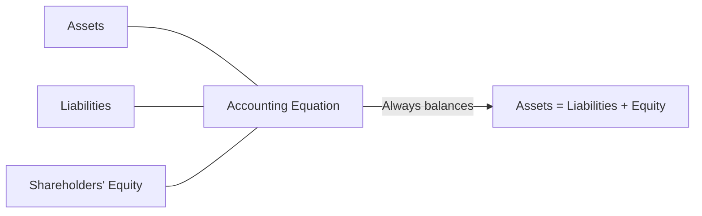

# Balance Sheet

## What It Is

A **balance sheet** is a snapshot of what a company owns and owes at a specific point in time.

| English | Accounting Term | What It Tells You |
|---|---|---|
| What you own | Assets | Resources the company controls |
| What you owe | Liabilities | Obligations to others |
| What's left for owners | Shareholders' Equity | Net worth = Assets − Liabilities |

## The Accounting Equation

```
Assets = Liabilities + Shareholders' Equity
```

This equation **always balances**. Every transaction affects at least two accounts.



**Example:**

```
Company buys a building for $1M using:
  - $300K cash (asset ↓)
  - $700K loan (liability ↑)

After transaction:
  Assets: Building $1M + remaining cash
  Liabilities: Loan $700K
  Equity: Retained earnings (unchanged)
  Check: Assets must equal $700K + Equity
```

---

## Assets

Resources controlled by the company that provide future economic benefit.

### Current Assets

Converted to cash within 12 months.

| Item | What It Is | Example |
|---|---|---|
| Cash & Equivalents | Physical cash, bank deposits, short-term investments | $500M in Treasury bills |
| Accounts Receivable | Money customers owe for goods already delivered | $200M unpaid invoices |
| Inventory | Unsold goods or raw materials | $300M of iPhones in warehouses |
| Prepaid Expenses | Paid in advance (insurance, rent) | $50M prepaid insurance |

### Non-Current Assets

Long-term resources (useful life > 12 months).

| Item | What It Is | Example |
|---|---|---|
| Property, Plant & Equipment (PP&E) | Physical assets used in operations | Factories, machinery, servers |
| Intangible Assets | Non-physical assets with value | Patents, trademarks, goodwill |
| Long-term Investments | Stocks, bonds, or subsidiaries held long-term | 30% stake in another company |
| Deferred Tax Assets | Taxes paid in advance (accounting vs tax timing) | Tax loss carryforwards |

**Depreciation:** Tangible assets lose value over time. That loss is recorded each year.

```
PP&E (original cost): $100M
Less: Accumulated Depreciation: ($30M)
Net PP&E: $70M
```

---

## Liabilities

Obligations the company must settle in the future.

### Current Liabilities

Due within 12 months.

| Item | What It Is | Example |
|---|---|---|
| Accounts Payable | Money owed to suppliers | $150M unpaid invoices to vendors |
| Short-term Debt | Loans due within 1 year | $100M bank overdraft |
| Accrued Expenses | Incurred but not yet billed | $50M employee salaries for this month |
| Deferred Revenue | Cash collected for service not yet delivered | $200M SaaS annual subscriptions |
| Current portion of LT debt | Long-term debt principal due this year | $25M of a 5-year loan due now |

### Non-Current Liabilities

Due after 12 months.

| Item | What It Is | Example |
|---|---|---|
| Long-term Debt | Bonds, term loans | $1B in corporate bonds |
| Deferred Tax Liabilities | Taxes owed in future due to timing differences | Future tax on unrealized gains |
| Lease Obligations | Long-term rental commitments | $500M office lease for 10 years |
| Pension Obligations | Retirement benefits promised to employees | $300M employee pension fund |

---

## Shareholders' Equity

The residual interest after subtracting liabilities from assets. What belongs to the owners.

| Component | What It Is | Example |
|---|---|---|
| Share Capital | Money raised by selling shares | $500M from IPO |
| Retained Earnings | Cumulative profits NOT distributed as dividends | $2B profits reinvested over 10 years |
| Treasury Stock | Shares the company bought back from market | ($200M) — negative, reduces equity |
| Reserves & Surplus | Profits set aside for specific purposes | $100M legal reserve |

**Equity can be negative** (liabilities > assets). That means the company is technically insolvent.

---

## How a Balance Sheet Is Structured

```
═══════════════════════════════════════════════
           ABC CORPORATION
         BALANCE SHEET (Dec 31, 2024)
           ($ in millions)
═══════════════════════════════════════════════
ASSETS
  Current Assets
    Cash & Equivalents              $  500
    Accounts Receivable                200
    Inventory                          300
    Prepaid Expenses                    50
    Total Current Assets            1,050

  Non-Current Assets
    PP&E (net)                        700
    Intangible Assets                 300
    Long-term Investments             200
    Total Non-Current Assets        1,200

TOTAL ASSETS                      $2,250
═══════════════════════════════════════════════
LIABILITIES & EQUITY
  Current Liabilities
    Accounts Payable              $   150
    Short-term Debt                   100
    Accrued Expenses                   50
    Deferred Revenue                  200
    Total Current Liabilities         500

  Non-Current Liabilities
    Long-term Debt                  1,000
    Deferred Tax Liability             50
    Total Non-Current Liabilities   1,050

    Total Liabilities               1,550

  Shareholders' Equity
    Share Capital                     500
    Retained Earnings                 200
    Treasury Stock                   (  0)
    Total Equity                      700

TOTAL LIABILITIES & EQUITY        $2,250
═══════════════════════════════════════════════
```

**Check:** $2,250 = $1,550 + $700 ✓

---

## What the Balance Sheet Tells You

| Question | Look At |
|---|---|
| Can the company pay short-term bills? | Current Assets vs Current Liabilities |
| How much debt does the company carry? | Debt-to-Equity = Total Liabilities / Equity |
| Is the company asset-heavy or asset-light? | PP&E as % of Total Assets |
| How much cash does the company really have? | Cash & Equivalents |
| Are shareholders getting value? | Book Value per Share = Equity / Shares Outstanding |
| Is the company shrinking? | Shrinking equity (negative retained earnings) |

---

## Programming Analogy

```
Balance Sheet = Database Snapshot (point-in-time state)

Assets  = All resources in the system (files, memory, connections)
Liabilities = All debts/obligations (promises to pay, API contracts)
Equity  = Net worth of the system (buffer, headroom)

Accounting Equation = Invariant check:
  assert(assets == liabilities + equity)  // must always pass

Double-entry = Write-Ahead Log (every mutation touches ≥ 2 records)

Current Assets  = Hot storage (SSD) — fast to convert
Non-Current Assets = Cold storage (S3/Glacier) — slow to convert

Depreciation = Amortized cost / useful_lifetime
Goodwill     = premium_paid - fair_value_of_net_assets
  (like overpaying for an acquisition — difference goes to goodwill)
```

---

## Common Mistakes

- **Thinking cash = profit.** A company can have lots of cash but be unprofitable (raised money from investors). Cash is on the balance sheet. Profit is on the income statement.
- **Ignoring off-balance-sheet items.** Operating leases, contingent liabilities, and derivatives may not appear on the balance sheet but still represent risk.
- **Comparing balance sheets across industries.** A bank's balance sheet (mostly loans and deposits) looks nothing like a software company's (mostly cash and intangibles).
- **Forgetting about timing.** Balance sheet is a snapshot at one date. A company might have $1B cash on Dec 31 but $100M on Jan 2 (holiday spending).
- **Equity is not market cap.** Book value (equity on balance sheet) is based on historical cost. Market cap is what investors think the company is worth today.

---

## Interview Notes

- **System Design: "Design a financial reporting system"** — Balance sheet data comes from the general ledger. You need an append-only event log (double-entry journal) that gets aggregated into a snapshot at period end.
- **Data Engineering: "Building a balance sheet pipeline"** — Extract trial balance from ERP → validate accounting equation → transform into standard format → load into reporting DB. Must handle multi-currency, intercompany eliminations.
- **Behavioral: "Tell me about a time you found an error in financial data"** — Balance sheet not balancing is the classic red flag. Understanding this helps in FinTech roles.

---

## Revision Summary

| Term | Definition |
|---|---|
| Balance Sheet | Snapshot of financial position at a point in time |
| Accounting Equation | Assets = Liabilities + Equity |
| Current Assets | Convertible to cash within 12 months |
| Non-Current Assets | Long-term resources (PP&E, intangibles, investments) |
| Current Liabilities | Due within 12 months |
| Non-Current Liabilities | Due after 12 months |
| Shareholders' Equity | Residual value after liabilities = what owners own |
| Book Value | Equity per share (historical cost basis) |
| Double-Entry | Every transaction affects ≥ 2 accounts, keeps equation balanced |

---

← [↑ Phase 2](README.md) • [↑ Finance](../README.md) • [01-income-statement](01-income-statement.md) →
