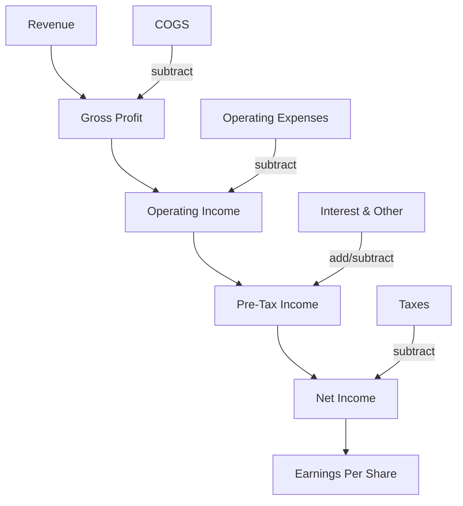
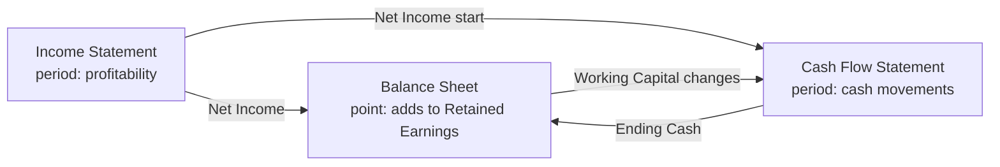

# Income Statement

## What It Is

An **income statement** (also called Profit & Loss / P&L) shows how much money a company earned or lost over a **period of time** (quarter or year).

| Balance Sheet | Income Statement |
|---|---|
| Snapshot at one moment | Video over a period |
| "Where are we now?" | "What happened during this time?" |

```
Revenue
− Expenses
= Net Income (or Net Loss)
```

**Net income feeds the balance sheet:** it gets added to retained earnings (equity). This is how the two statements connect.

---

## Revenue

Money earned from selling goods or services. The top line.

### Types of Revenue

| Type | What It Is | Example |
|---|---|---|
| Product Revenue | Sales of physical goods | Apple selling iPhones |
| Service Revenue | Fees for services rendered | Accenture consulting fees |
| Subscription Revenue | Recurring fees for ongoing access | Netflix monthly subscription |
| Interest Income | Money earned on lending | Bank charging loan interest |
| Advertising Revenue | Money for showing ads | Google AdWords |

**Gross vs Net Revenue:**
```
Gross Revenue = Total sales before any deductions
Net Revenue    = Gross Revenue − Returns − Discounts − Allowances
```

**Revenue vs Cash Received:** Revenue is recognized when the *service is delivered* (accrual basis), not when cash arrives. This is a key difference from the cash flow statement.

---

## Cost of Goods Sold (COGS)

The direct cost of producing the goods/services that were sold.

| Item | What It Is |
|---|---|
| Raw Materials | Cost of physical inputs |
| Direct Labor | Wages of workers who make the product |
| Manufacturing Overhead | Factory rent, utilities, machinery |
| Cost of Delivering Service | Cloud costs, support for subscription |

**What COGS is NOT:**
- Marketing costs (they are operating expenses)
- R&D (operating expense)
- Sales team salaries (operating expense)
- Interest (non-operating)

---

## Gross Profit

```
Gross Profit = Revenue − COGS
Gross Margin  = Gross Profit ÷ Revenue
```

Gross margin measures how efficiently the core product makes money **before** overhead.

```
Apple:      ~42% gross margin (premium hardware)
Walmart:    ~24% gross margin (low-margin retail)
SaaS Cos:   70-85% gross margin (software costs little to deliver)
Airlines:   ~20% gross margin (fuel is expensive)
```

**Programming Analogy:**

```
Gross Margin = Cost per request vs revenue per request

Your API charges $0.01/request but compute costs $0.007/request
→ Gross Margin = (0.01 − 0.007) / 0.01 = 30%

Lower gross margin = higher cloud bill eats your revenue
```

---

## Operating Expenses (OpEx)

Costs to run the business that aren't directly tied to making the product.

| Category | What It Is | Example |
|---|---|---|
| R&D (Research & Development) | Building new products | Engineering salaries |
| S&M (Sales & Marketing) | Acquiring customers | Ad spend, sales team |
| G&A (General & Administrative) | Running the company | HR, legal, finance, office |
| D&A (Depreciation & Amortization) | Spreading cost of assets over life | Server depreciation |

```
Operating Income = Gross Profit − Operating Expenses
Operating Margin = Operating Income ÷ Revenue
```

Operating income shows whether the **core business** is profitable, ignoring financing and taxes.

---

## Beyond Operating

Items outside the core business.

| Line | What It Is |
|---|---|
| Interest Expense | Cost of borrowing (debt) |
| Interest Income | Earnings on cash reserves |
| Other Income/Expenses | FX gains, one-off asset sales, lawsuits |
| Tax Expense | Corporate income tax |

```
Net Income = Operating Income + Other Income − Interest − Taxes
```

---

## Net Income & EPS

**Net Income** — the bottom line. Total profit after everything.

**Earnings Per Share (EPS)** — net income divided by shares outstanding. The per-share profitability.

```
Basic EPS = Net Income ÷ Weighted Avg Shares Outstanding
Diluted EPS = Net Income ÷ Diluted Shares (incl. stock options, convertibles)
```

**Diluted EPS is always ≤ Basic EPS** because it accounts for all potential future shares.

---

## How an Income Statement Is Structured

```
═══════════════════════════════════════════════
           ABC CORPORATION
        INCOME STATEMENT (FY 2024)
           ($ in millions)
═══════════════════════════════════════════════
Revenue                               $1,500
COGS                                   (600)
─────────────────────────────────────────────
Gross Profit                           $900
Gross Margin                            60%

Operating Expenses
  R&D                                  (250)
  S&M                                  (150)
  G&A                                  (100)
  Total Operating Expenses             (500)
─────────────────────────────────────────────
Operating Income                       $400
Operating Margin                        27%

Interest Expense                       (50)
Interest Income                         10
Other Income                            5
─────────────────────────────────────────────
Pre-Tax Income                         $365

Taxes (25%)                            (91)
─────────────────────────────────────────────
NET INCOME                             $274
Net Margin                              18%
─────────────────────────────────────────────
Basic EPS                              $2.74
Diluted EPS                            $2.65
```

---

## The Flow



---

## How the Three Statements Connect



**Key insight:** Net income is *not* cash. It's an accounting measure. The cash flow statement reconciles the difference.

---

## Programming Analogy

```
Income Statement = Metrics over a time window (like Grafana dashboards)

Revenue     = Total requests served
COGS        = Cost of compute to serve those requests
Gross Margin = Revenue per request efficiency
OpEx        = Engineering + Sales + Marketing salaries (team cost)
Net Income  = Profit after all costs (like profit in a billing system)

EPS = profit / shares
  (like per-user revenue = total revenue / MAU)

Accrual accounting = recognizing revenue when DELIVERED, not PAID
  (like counting MAU when user signs up, not when they pay)

Revenue ≠ Cash in bank
  (invoice sent ≠ payment received)
```

---

## Common Mistakes

- **Confusing revenue with profit.** A company can have $1B revenue and still lose money. Profits are what's left after costs.
- **Thinking net income = cash.** Depreciation, receivables, and other non-cash items make net income diverge from actual cash. Check the cash flow statement.
- **Comparing net margins across industries.** Software has high margins, retail has razor-thin margins. Compare against peers, not against an arbitrary number.
- **Forgetting one-time items.** A company selling its HQ inflates net income for one year. Look at "operating income" for the real business health.
- **Ignoring revenue quality.** One big customer = 80% of revenue is a red flag even if revenue is growing.

---

## Interview Notes

- **System Design: "Design a P&L reporting system"** — Input: general ledger transactions (event log). Aggregate by account and period. Needs to handle multi-entity consolidation and currency conversion.
- **Data Engineering: "Building an income statement data pipeline"** — Source: ERP/ledger → classify accounts (revenue, COGS, OpEx) → materialize to period-level metrics → serve to BI dashboards. Slow-changing dimensions for account mappings.
- **Behavioral: "How do you analyze a company's profitability?"** — Walk through revenue, gross margin trend, OpEx as % of revenue, operating margin vs net margin, and why they might diverge.

---

## Revision Summary

| Term | Definition |
|---|---|
| Income Statement | Profitability over a period (quarter/year) |
| Revenue | Money from selling goods/services |
| COGS | Direct cost of producing what's sold |
| Gross Profit | Revenue − COGS |
| OpEx | R&D, S&M, G&A overhead costs |
| Operating Income | Profit from core business, before interest/taxes |
| Net Income | Final profit after all costs & taxes |
| EPS | Net Income ÷ Shares Outstanding |
| Gross Margin | Gross Profit ÷ Revenue |
| Net Margin | Net Income ÷ Revenue |

---

← [00-balance-sheet](00-balance-sheet.md) • [↑ Phase 2](README.md) • [↑ Finance](../README.md) • [02-cash-flow-statement](02-cash-flow-statement.md) →
