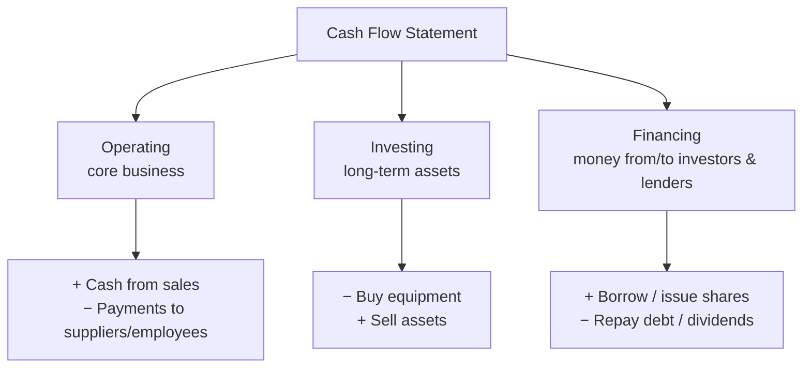
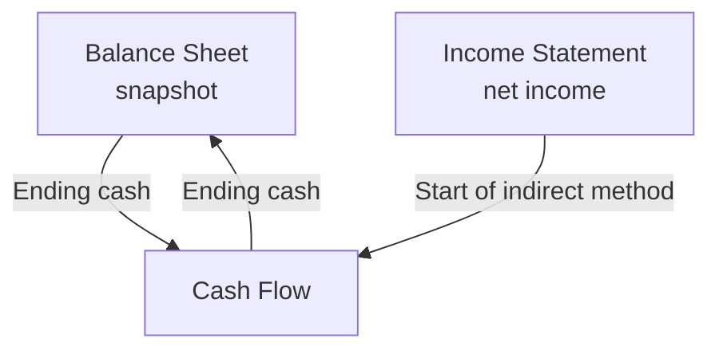

# Cash Flow Statement

## What It Is

A **cash flow statement** shows how much actual cash came in and went out over a period. It answers: "Where did the cash go?"

**Why it exists:** Net income is an accounting measure, not cash. A company can show big profits on paper yet go bankrupt because it runs out of cash.

```
Net Income (accounting profit)  ≠  Cash in the bank
```

The cash flow statement reconciles the two.

---

## The Three Sections

Every cash flow statement is split into three activities.

| Section | What It Covers | Analogy |
|---|---|---|
| Operating | Core business cash flows | Day-to-day income from your job |
| Investing | Buying/selling long-term assets | Buying/selling a house or car |
| Financing | Raising/returning money | Taking a loan, paying it back |



---

## Operating Cash Flow (OCF)

Cash generated or consumed by the **core business** — selling products, paying suppliers, collecting from customers.

**Typical items:**
- Cash collected from customers (+) 
- Cash paid to suppliers (−)
- Salaries and wages (−)
- Taxes paid (−)
- Interest paid (−)

### Two Methods of Presenting OCF

| Method | How It Works | Who Uses It |
|---|---|---|
| **Direct** | Lists actual cash in/out (collected from customers, paid to suppliers) | Simple, but rarely reported |
| **Indirect** | Starts with net income, adjusts for non-cash items | Used by nearly all public companies |

**Indirect method (the standard):**

```
Net Income
+ Depreciation & Amortization (non-cash expense, add back)
− Increase in Accounts Receivable (revenue booked but not yet paid)
+ Increase in Accounts Payable (bills not yet paid)
− Increase in Inventory (cash locked in unsold goods)
= Operating Cash Flow
```


**Programming Analogy:**

```
Indirect method = reconciling from accrual to cash, like
  net_income + non_cash_expenses − Δ_working_capital

Accounts Receivable = "billed but not yet paid" (like unpaid invoices in Stripe)
Accounts Payable    = "services received but not yet billed"
Inventory           = "items queued for processing" (money stuck in a queue)

ΔWorkingCapital = AR + Inventory − AP
```

---

## Investing Cash Flow

Cash used to buy long-term assets, or received from selling them.

**Typical items:**
- Purchasing property, equipment, factories (−)
- Buying securities/investments (−)
- Selling assets or subsidiaries (+)
- Acquisitions of other companies (−)

**What it tells you:**
- **Consistently negative investing cash flow = normal.** A growing company invests in its future.
- **Big spike in selling assets = possible red flag** (selling the crown jewels to fund operations).

---

## Financing Cash Flow

Cash raised from or returned to investors and lenders.

**Typical items:**
- Issuing stock (+)
- Borrowing money (+)
- Repaying debt (−)
- Paying dividends (−)
- Stock buybacks (−)

**What it tells you:**
- **Positive** = company is raising money (growing or struggling)
- **Negative** = company is returning money (mature, generating excess cash)

---

## How a Cash Flow Statement Is Structured

```
═══════════════════════════════════════════════
           ABC CORPORATION
       CASH FLOW STATEMENT (FY 2024)
           ($ in millions)
═══════════════════════════════════════════════
OPERATING ACTIVITIES
  Net Income                            $274
  Depreciation & Amortization             60
  Δ Accounts Receivable                  (20)   [more owed to us]
  Δ Inventory                           (15)   [more unsold stock]
  Δ Accounts Payable                      10    [more unpaid bills]
  Operating Cash Flow                   $309

INVESTING ACTIVITIES
  Purchase of PP&E                       (80)
  Purchase of Investments                (30)
  Sale of Equipment                       10
  Investing Cash Flow                   (100)

FINANCING ACTIVITIES
  Borrowings                             (50)
  Dividends Paid                         (40)
  Share Issuance                          20
  Financing Cash Flow                    (70)

NET CHANGE IN CASH                     $139
  Beginning Cash                         500
  Ending Cash                           $639
═══════════════════════════════════════════════
```

**Check:** Ending cash on the cash flow statement must match Cash on the balance sheet.

---

## The Connection: Why All Three Statements Link



| Statement | Answer | Key Link |
|---|---|---|
| Income Statement | Is the business profitable? | Net Income → added to retained earnings |
| Cash Flow Statement | Does it actually have cash? | Ending cash → balance sheet cash |
| Balance Sheet | What does it own/owe? | Snapshot bookending the period |

**Example of why they differ:**

```
A company sells $1M worth of products on credit (invoice, 60-day terms).

Income Statement:  Revenue +$1M → Net Income +$1M   (profit!)
Cash Flow:        No cash collected yet → OCF unchanged (or −$0 cash)
Balance Sheet:    Accounts Receivable +$1M (asset up, not cash)

Cash arrives 60 days later → OCF goes up then.
```

---

## Cash Flow Patterns by Company Type

| Company | Operating | Investing | Financing | Interpretation |
|---|---|---|---|---|
| Startup | − | − | + | Burning cash, raising money (normal early stage) |
| Growing Saas | + | − | + | Profitable ops, reinvesting, raising to scale |
| Mature Dividend Co | + | − | − | Generates cash, returns it to shareholders |
| Distressed Co | − | + | − | Core is losing money, selling assets to survive |

---

## Common Mistakes

- **Thinking net income = cash.** The single biggest confusion. Profit is an accounting view; cash is reality.
- **Ignoring working capital changes.** Two companies with identical net income can have wildly different cash flows due to receivables and inventory.
- **Positive net income, negative OCF = warning sign.** Could mean the company isn't collecting on its sales.
- **Forgetting investing is normal.** Negative investing cash flow isn't inherently bad — buying factories is good if the company is growing.
- **Comparing cash flow across fiscal years without adjusting for one-offs.** Asset sales and stock issuance distort the picture.

---

## Interview Notes

- **System Design: "Design a cash flow forecasting system"** — Combine open invoices (AR), open bills (AP), subscription schedules, and payroll into a time-phased cash forecast. Similar to budget planning in engineering orgs.
- **Data Engineering: "Reconciling cash across systems"** — Ending cash on the statement must equal bank balance + balance sheet cash. Discrepancies usually come from FX, bank fees, or timing.
- **Behavioral: "A startup shows profit but low cash — why?"** — Growing AR (revenue recognized, not collected), heavy inventory build, or big capex. Walk through the indirect method adjustments.

---

## Revision Summary

| Term | Definition |
|---|---|
| Cash Flow Statement | Actual cash in/out over a period |
| Operating Cash Flow | Cash from core business |
| Investing Cash Flow | Cash from buying/selling long-term assets |
| Financing Cash Flow | Cash from/to investors & lenders |
| Indirect Method | Net Income → adjust for non-cash & working capital |
| Depreciation | Non-cash expense, added back in OCF |
| Working Capital | AR + Inventory − AP |
| Ending Cash | Must match balance sheet cash |
| Profit ≠ Cash | Key insight of the cash flow statement |

---

← [01-income-statement](01-income-statement.md) • [↑ Phase 2](README.md) • [↑ Finance](../README.md) • [03-financial-analysis](03-financial-analysis.md) →
