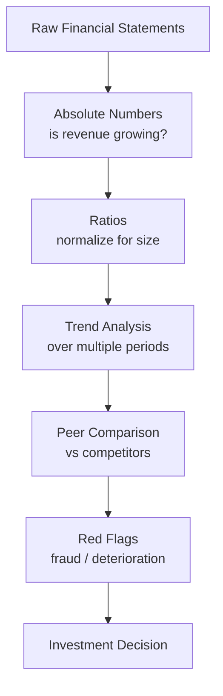
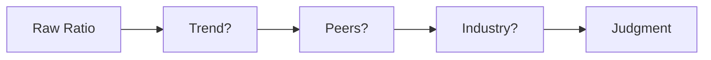
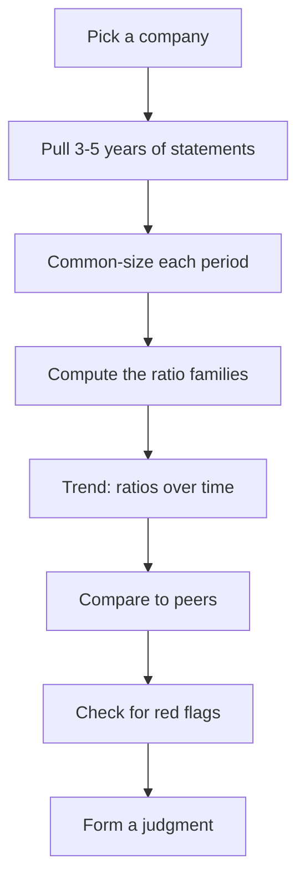

# Financial Analysis

## What It Is

Reading the three statements is step one. **Financial analysis** is comparing numbers across time, across peers, and against each other to judge a company's health.



---

## 1. Common-Size Analysis

Express every line item as a percentage of a base to make companies comparable regardless of size.

| Base | Used For |
|---|---|
| Revenue | Income statement items (% of revenue) |
| Total Assets | Balance sheet items (% of assets) |

**Example — comparing two companies of different sizes:**

```
              Company A    Company B
Revenue       $100M        $10B
Net Income    $25M         $2.5B
Net Margin    25%          25%      ← same efficiency

Common-size analysis reveals they are equally efficient,
even though one is 100× bigger.
```

---

## 2. Trend Analysis

Look at a metric across several periods, not just one.

```
Revenue by year:   2021  $100M → 2022  $150M → 2023  $180M
Growth:                    +50%          +20%
```

**What to look for:**
- **Accelerating** growth (good)
- **Decelerating** growth (watch — why?)
- **Margins expanding** (pricing power, cost efficiency)
- **Margins compressing** (competition, rising costs)

---

## 3. The Ratio Families

### A. Profitability Ratios — How much does the company keep?

| Ratio | Formula | What It Tells You |
|---|---|---|
| Gross Margin | Gross Profit ÷ Revenue | Efficiency of core product |
| Operating Margin | Operating Income ÷ Revenue | Efficiency of the whole business |
| Net Margin | Net Income ÷ Revenue | Final profitability |
| ROE | Net Income ÷ Shareholders' Equity | Return for shareholders |
| ROA | Net Income ÷ Total Assets | How well assets are used |

### B. Liquidity Ratios — Can the company pay short-term bills?

| Ratio | Formula | Healthy Range | What It Tells You |
|---|---|---|---|
| Current Ratio | Current Assets ÷ Current Liabilities | > 1.5 | Covers short-term debts |
| Quick Ratio | (Current Assets − Inventory) ÷ Current Liabilities | > 1.0 | Excludes slow-selling inventory |
| Cash Ratio | Cash ÷ Current Liabilities | > 0.5 | Purest cash coverage |

### C. Solvency Ratios — Can the company survive long-term?

| Ratio | Formula | What It Tells You |
|---|---|---|
| Debt-to-Equity | Total Liabilities ÷ Equity | Leverage level |
| Debt-to-Assets | Total Debt ÷ Total Assets | % funded by debt |
| Interest Coverage | Operating Income ÷ Interest Expense | Can it pay its interest? |

### D. Efficiency Ratios — How well does it use resources?

| Ratio | Formula | What It Tells You |
|---|---|---|
| Asset Turnover | Revenue ÷ Total Assets | Revenue per $ of assets |
| Inventory Turnover | COGS ÷ Average Inventory | How fast inventory sells |
| Receivables Turnover | Revenue ÷ Average Receivables | How fast customers pay |

---

## 4. Ratio Analysis in Context

A ratio is **meaningless alone**. Always interpret with:

1. **Trend** — Is the ratio improving or deteriorating?
2. **Peer comparison** — How does it compare to competitors?
3. **Industry norms** — Retail vs software have very different ratios

```
Example — Interpreting a D/E ratio of 1.5:

  Banks:  Normal (they're designed to be leveraged)
  Software: High (peers typically < 0.5)
  Your view: Depends on the industry and the trend
```



---

## 5. Red Flags

Signs that financial statements may be misleading or deteriorating.

| Red Flag | What It Means |
|---|---|
| Revenue growing but AR growing faster | Revenue booked but cash not collected |
| Net income positive, OCF negative | Profits not turning into cash |
| Frequent one-time items boosting profit | Inflating the bottom line |
| Inventory building while sales flat | Unsold goods piling up |
| Auditor changes repeatedly | Possible hiding of problems |
| Related-party transactions | Conflicts of interest |
| Goodwill ballooning from acquisitions | Overpaying for deals |
| D/E rising while profits fall | Leveraging up to survive |

---

## 6. The Full Analysis Flow



---

## Programming Analogy

```
Financial Analysis = Monitoring & SRE for a company

Absolute numbers   = Raw logs
Common-size        = Normalizing logs to % (relative to RPS / revenue)
Trend analysis     = Time-series dashboards, alerts on degradation
Ratios             = SLIs / SLOs
  Gross Margin    = cost-per-request budget
  Current Ratio   = readiness of failover capacity
  D/E Ratio       = infrastructure debt (tech debt)
  ROE             = returns per unit of capital (like per-engineer output)

Red Flags = Anomaly detection / on-call alerts
  Revenue up + AR up   = metric inflated, like logs growing with errors
  Net income + OCF neg = happy UI but queue backlogged
```

---

## Common Mistakes

- **Looking at one ratio in isolation.** Ratios only make sense with trend + peer + industry context.
- **Comparing ratios across industries.** A bank's leverage is normal; a software company's isn't.
- **Trusting the numbers blindly.** Companies can legally use different accounting policies (revenue recognition, depreciation). Always read the footnotes.
- **Ignoring the cash flow statement.** A profitable-looking company can be cash-starved.
- **Using stale data.** Ratios based on one-year-old filings miss recent deterioration.

---

## Interview Notes

- **System Design: "Design a financial analytics platform"** — Ingest statements from EDGAR/NSE → normalize into a common schema → compute ratios on read or precompute → serve trend & peer comparison APIs.
- **Data Engineering: "Comparing companies at scale"** — Handles fiscal-year differences, currency conversion, and data quality issues. Industry classification (GICS) needed for peer grouping.
- **Behavioral: "Spot a fraudulent company"** — Walk through the red flags: revenue vs AR mismatch, net income vs OCF divergence, unusual goodwill, auditor changes.

---

## Revision Summary

| Concept | Definition |
|---|---|
| Common-Size Analysis | All lines as % of revenue/assets |
| Trend Analysis | Metric behavior across periods |
| Profitability Ratios | Margin, ROE, ROA |
| Liquidity Ratios | Current, Quick, Cash ratios |
| Solvency Ratios | D/E, D/A, Interest Coverage |
| Efficiency Ratios | Asset, Inventory, Receivables turnover |
| Red Flags | Signs of deterioration or fraud |
| Context | Ratio + trend + peers + industry |

---

## Phase 2 Complete

You can now read the three core financial statements and analyze them.

```
Phase 1 → Phase 2 → Phase 3 (Fundamental Analysis)
```

**Next up:** [Phase 3 — Fundamental Analysis](../phase-3-fundamental-analysis/README.md) covers valuation ratios (P/E, P/B, EV/EBITDA), DCF modeling, comparable company analysis, competitive moat, growth vs value.

---

← [02-cash-flow-statement](02-cash-flow-statement.md) • [↑ Phase 2](README.md) • [↑ Finance](../README.md)
