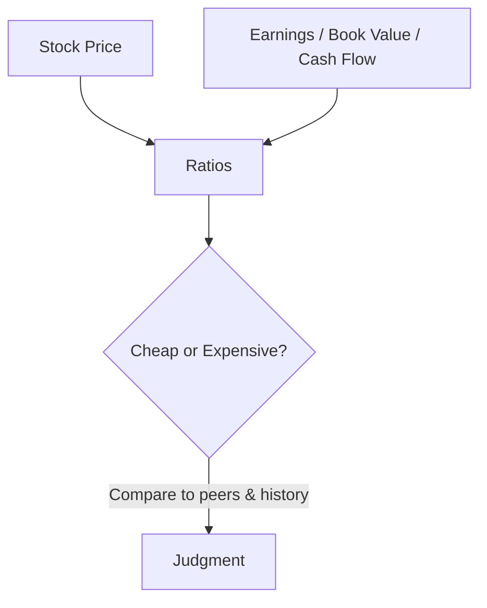
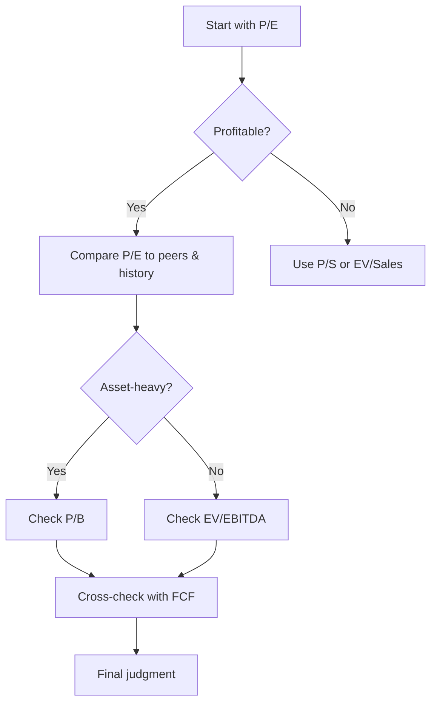

# Valuation Ratios

## What They Are

**Valuation ratios** relate a company's stock price to its financial performance. They answer: "Is this stock cheap or expensive relative to what the company earns, owns, or generates?"



**Key rule:** A ratio is only meaningful when compared to the company's own history and its industry peers.

---

## Price-to-Earnings (P/E)

The most famous valuation ratio.

```
P/E = Price per Share ÷ Earnings per Share (EPS)
```

**What it means:** How many years of current earnings you're paying for.

```
Company trades at $100/share, earns $5/share
P/E = 100 / 5 = 20

You're paying 20× annual earnings.
```

| P/E | Interpretation |
|---|---|
| High (> 25) | Market expects strong future growth, or stock is overvalued |
| Moderate (15–25) | Fairly valued (typical for broad markets) |
| Low (< 12) | Undervalued, struggling company, or low-growth industry |

### Types of P/E

| Type | EPS Used | Use Case |
|---|---|---|
| Trailing P/E | Last 12 months actual EPS | Backward-looking, factual |
| Forward P/E | Next 12 months estimated EPS | Forward-looking, based on analyst estimates |

### P/E is meaningless for:

- **Loss-making companies** (EPS ≤ 0 → negative/undefined P/E)
- **Highly cyclical industries** (earnings swing wildly with commodity prices)

---

## Price-to-Book (P/B)

Compares price to the book value of the company (equity per share).

```
P/B = Price per Share ÷ Book Value per Share
Book Value per Share = Shareholders' Equity ÷ Shares Outstanding
```

**What it means:** How much you pay for each dollar of net assets.

| P/B | Interpretation |
|---|---|
| < 1 | Market values the company below its net assets (possible value trap) |
| 1–3 | Normal for most companies |
| > 3 | Market values assets at a premium (intangible value, growth) |

**Examples:**
```
Bank:    P/B ≈ 1.0 (assets are mostly tangible loans → P/B matters)
Software: P/B ≈ 10+ (assets are mostly intangibles → P/B less relevant)
```

**Why it works better for asset-heavy companies:** Book value is meaningful when assets are physical (banks, real estate, manufacturing).

---

## EV/EBITDA

Enterprise Value relative to Earnings Before Interest, Taxes, Depreciation & Amortization.

```
EV = Market Cap + Debt − Cash
EBITDA = Operating Income + Depreciation + Amortization
```

| Term | Meaning | Engineering Analogy |
|---|---|---|
| Market Cap | Equity value | What shareholders are worth |
| Debt | What the company owes | Loans the service carries |
| Cash | What it holds | Bank balance |
| EV | Full price to buy the whole business | Cost to acquire the whole system, net of what's in the bank |

**EV/EBITDA ignores** capital structure (debt vs equity) and non-cash charges, making it the best cross-company comparison ratio.

```
Two identical companies:
  A: All-equity, no debt
  B: 50% debt, 50% equity

P/E differs (B's earnings are reduced by interest)
EV/EBITDA is roughly equal → fair comparison
```

---

## Comparison Table

| Ratio | Formula | Ignores | Best For |
|---|---|---|---|
| P/E | Price ÷ EPS | Debt, cash | Profitable companies, broad market |
| P/B | Price ÷ Book Value | Earnings, growth | Banks, asset-heavy businesses |
| EV/EBITDA | EV ÷ EBITDA | Capital structure, D&A | Cross-company comparison |
| P/S | Market Cap ÷ Revenue | Costs, profitability | Loss-making growth companies |
| P/FCF | Market Cap ÷ Free Cash Flow | Accounting distortions | Companies with real cash generation |

---

## Using the Ratios Together



---

## Programming Analogy

```
Valuation Ratios = Performance-per-cost metrics in cloud billing

P/E  = annual_cost ÷ annual_profit (years to break even)
P/B  = cost ÷ book value (what you pay vs. net assets)
EV/EBITDA = total cost of ownership ÷ operating income
  (includes debt: like total infra cost, not just EC2 bill)

Ratio interpretation = like judging if an EC2 instance is cheap:
  - Compare to same instance family (peers)
  - Compare to your own past spend (history)
  - A cheap ratio on a broken service is still a bad buy (value trap)
```

---

## Common Mistakes

- **Comparing P/E across industries.** A bank at P/E 12 and a SaaS at P/E 40 aren't in the same league. Compare to peers.
- **Using P/E on loss-making companies.** Negative EPS makes P/E meaningless. Use P/S instead.
- **Ignoring debt in P/E.** Two companies with the same P/E but different debt loads are NOT equally valued. Check EV/EBITDA.
- **Trusting forward P/E blindly.** Estimates are only as good as the analysts making them.
- **Thinking a low ratio always = bargain.** A cheap-looking stock can be cheap for a reason (deteriorating business = value trap).

---

## Interview Notes

- **System Design: "Design a stock screener"** — Ingest fundamentals → compute ratios → filter by industry and thresholds. Key challenge: normalized schemas across data sources and fiscal calendars.
- **Data Engineering: "Computing EV/EBITDA at scale"** — Requires joining market data (live price, market cap) with fundamentals (debt, cash, EBITDA from statements).
- **Behavioral: "Why is a stock's P/E low?"** — Consider: market doubts growth, cyclical peak earnings, one-time charges, or genuine undervaluation. Never conclude "cheap" from the ratio alone.

---

## Revision Summary

| Ratio | Formula | Best For |
|---|---|---|
| P/E | Price ÷ EPS | Profitable companies |
| P/B | Price ÷ Book Value | Asset-heavy businesses |
| EV/EBITDA | EV ÷ EBITDA | Cross-company comparison |
| P/S | Market Cap ÷ Revenue | Loss-making growth companies |
| P/FCF | Market Cap ÷ Free Cash Flow | Cash-rich companies |
| EV | Market Cap + Debt − Cash | Full business price |

- Ratios are only meaningful with peer + history context
- EV/EBITDA removes capital-structure noise
- Low ratio ≠ automatically cheap (watch for value traps)

---

← [↑ Phase 3](README.md) • [↑ Finance](../README.md) • [01-dcf-modeling](01-dcf-modeling.md) →
