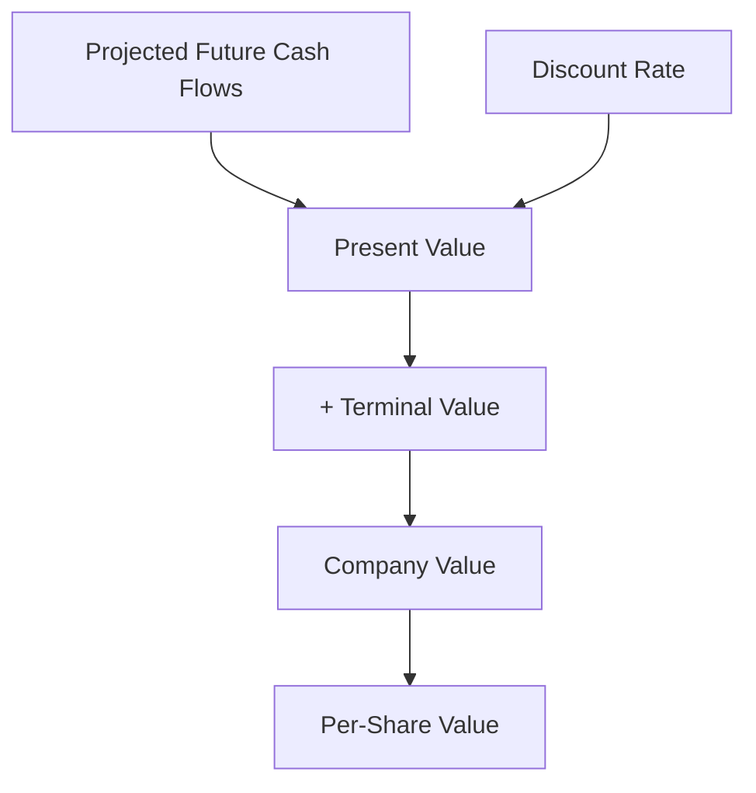
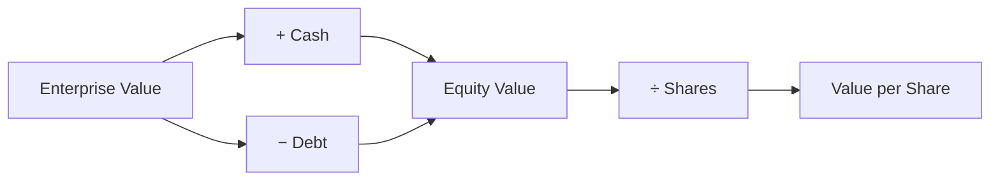

# Discounted Cash Flow (DCF) Modeling

## What It Is

**DCF** values a company by estimating all the cash it will generate in the future and converting that to today's value.

The core idea: **a dollar today is worth more than a dollar tomorrow.**

```
Why? You can invest today's dollar and earn a return.
So future cash must be "discounted" back to present value.
```



---

## The Time Value of Money

```
Present Value = Future Value ÷ (1 + r)^n

r = discount rate (required return, e.g., 10%)
n = number of years

$121 received in 2 years at 10% discount rate:
PV = 121 / (1.10)^2 = $100
```

| If you receive | In | At 10% | Today it's worth |
|---|---|---|---|
| $110 | 1 year | r = 10% | $100 |
| $121 | 2 years | r = 10% | $100 |
| $161 | 5 years | r = 10% | $100 |

**Higher discount rate → lower present value.** Riskier companies get higher discount rates.

---

## The Five Steps

### Step 1: Forecast Free Cash Flow (FCF)

Project future cash the company can generate, usually 5–10 years.

```
FCF = Operating Cash Flow − Capital Expenditures
```

```
Year:          2025    2026    2027    2028    2029
Revenue:       $100M   $115M   $130M   $145M   $160M
Growth:        --      +15%    +13%    +12%    +10%
Operating CF:  $25M    $29M    $33M    $37M    $41M
Capex:         ($10M)  ($11M)  ($12M)  ($13M)  ($14M)
FCF:           $15M    $18M    $21M    $24M    $27M
```

### Step 2: Choose a Discount Rate (WACC)

**Weighted Average Cost of Capital** — the blended return investors expect.

```
WACC = (Equity% × Cost of Equity) + (Debt% × Cost of Debt × (1 − Tax))
```

| Input | What It Represents | Typical Range |
|---|---|---|
| Cost of Equity | Return shareholders demand | 8–15% |
| Cost of Debt | Interest rate on borrowings | 4–8% |
| Equity/Debt weights | Capital structure | Varies by company |
| Tax rate | Corporate tax shield on debt | 20–30% |

**Higher risk → higher WACC → lower valuation.**

### Step 3: Discount Each FCF to Present Value

```
Year:              2025      2026      2027      2028      2029
FCF:               $15M      $18M      $21M      $24M      $27M
Discount factor:   1/1.1    1/1.21    1/1.33    1/1.46    1/1.61
PV of FCF:         $13.6M    $14.9M    $15.8M    $16.4M    $16.8M
                     (at 10% WACC)

Sum of PV of FCF ≈ $77.5M
```

### Step 4: Add Terminal Value

The value of all cash flows **after** the forecast period.

**Perpetuity Growth Method:**
```
Terminal Value = FCF_YearN × (1 + g) ÷ (WACC − g)

FCF 2029 = $27M, growth g = 3%, WACC = 10%
TV = 27 × 1.03 ÷ (0.10 − 0.03) = $397M

PV of TV = 397 ÷ 1.61 = $247M
```

### Step 5: Assemble the Value

```
PV of forecast FCFs:        $77.5M
PV of terminal value:      $247M
─────────────────────────────────
Enterprise Value:          $324.5M
+ Cash:                    $30M
− Debt:                   ($60M)
─────────────────────────────────
Equity Value:              $294.5M
÷ Shares Outstanding:      10M
─────────────────────────────────
Intrinsic Value/share:     $29.45
```



**Compare to current stock price:**
- Intrinsic value > price → undervalued
- Intrinsic value < price → overvalued

---

## Why the Terminal Value Dominates

```
Terminal value is usually 60-80% of the total valuation.
```

```
Example:
  Forecast PV:    $77.5M   (24%)
  Terminal PV:    $247M    (76%)
  Total:          $324.5M

Small changes in the terminal growth rate (g) swing the valuation hugely.
```

**Sensitivity check:** Always test the model across a range of assumptions.

```
             WACC ↓ 9%   WACC 10%   WACC 11%
Growth 2%     $31.20      $28.10     $25.50
Growth 3%     $33.90      $29.45     $26.30
Growth 4%     $37.10      $31.00     $27.20
```

---

## Programming Analogy

```
DCF = Discounted payout of a long-running microservice

FCF forecast  = projected yearly revenue of the service
WACC          = required ROI of the business
Discounting   = present_value(cash, years, rate)
Terminal value = assume the service runs forever at steady state

Time value of money = same as why you don't defer revenue:
  $1 earned today beats $1 earned next year (can reinvest)

DCF ≈ "how much is this SaaS worth if I project MRR growth,
       discount at our hurdle rate, and add its terminal value"

Sensitivity table = testing your model under different
  growth × churn scenarios before trusting it
```

---

## Common Mistakes

- **Over-optimistic growth.** Forecasts that grow 30% forever produce absurd valuations. Growth must converge toward GDP levels.
- **Confusing EV and Equity Value.** Forgetting to subtract debt and add cash overstates the per-share price.
- **Ignoring terminal value assumptions.** Since TV is 60-80% of value, the growth rate (g) must be defensible.
- **Using one WACC for everything.** Riskier companies need higher discount rates.
- **Trusting the output blindly.** DCF is a model built on assumptions. Change an input → change the answer. Always run sensitivity analysis.

---

## Interview Notes

- **System Design: "Design a DCF valuation platform"** — Ingest historical financials → store analyst estimates → run forecast engine → compute DCF → serve per-share valuation with a sensitivity grid.
- **Data Engineering: "Handling forecast revisions"** — Analyst estimates update constantly. Needs an append-only history of estimate revisions to track model drift.
- **Quant: "Why does TV dominate DCF?"** — Companies live a long time. The bulk of value is the far future. This is why small assumption changes create huge valuation swings.

---

## Revision Summary

| Term | Definition |
|---|---|
| Time Value of Money | A dollar today > a dollar tomorrow |
| Discount Rate (WACC) | Required return, risk-adjusted |
| Free Cash Flow | Operating CF − Capex |
| Present Value | FV ÷ (1+r)^n |
| Terminal Value | Value of all cash flows after forecast period |
| Enterprise Value | PV of all future FCFs |
| Equity Value | EV + Cash − Debt |
| Intrinsic Value | What the business is worth, vs. price |
| Sensitivity Analysis | Testing model across assumption ranges |

---

← [00-valuation-ratios](00-valuation-ratios.md) • [↑ Phase 3](README.md) • [↑ Finance](../README.md) • [02-comparable-company-analysis](02-comparable-company-analysis.md) →
