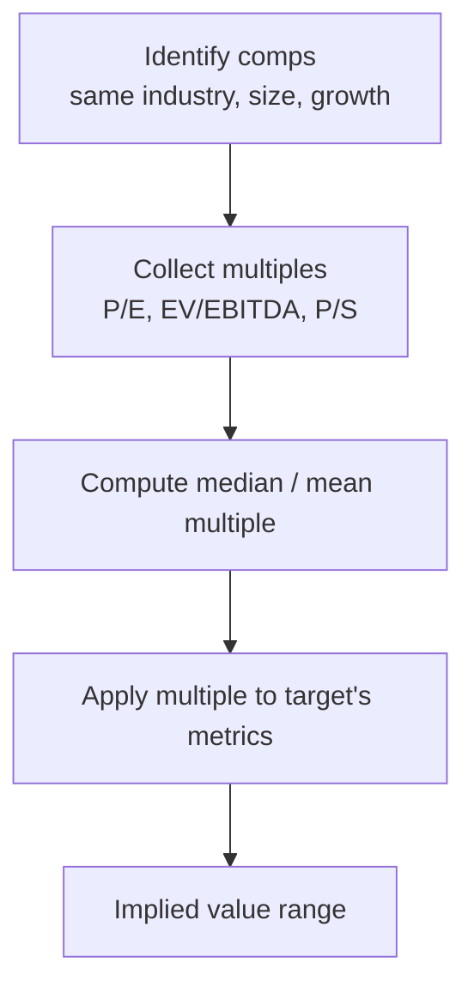
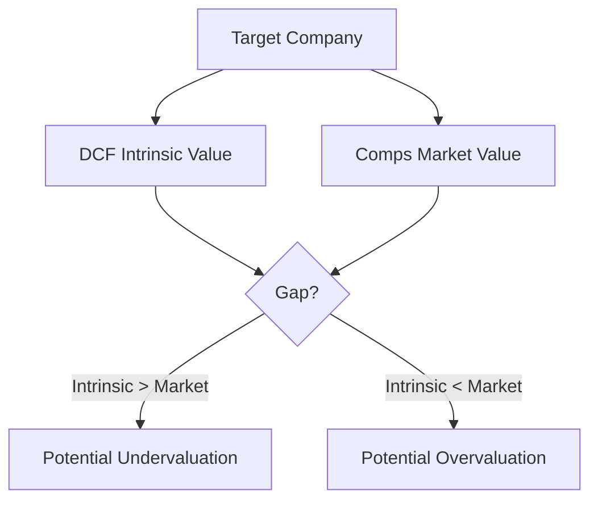

# Comparable Company Analysis

## What It Is

**Comparable Company Analysis (Comps)** values a company by comparing it to similar, publicly-traded companies using common valuation multiples.

```
"Company X is worth what the market pays for its peers."
```



---

## The Process

### Step 1: Find Comparable Companies

Select peers that are similar in:

| Dimension | Why It Matters |
|---|---|
| Industry | Same business model (not just same sector) |
| Size | Similar revenue and market cap |
| Growth | Similar growth trajectory |
| Profitability | Similar margins |
| Geography | Same or similar markets |

```
Target: A mid-size SaaS company growing 25%/yr

Good comps:   Other SaaS cos growing 20-30%
Bad comps:    Banks, oil companies, or 5% growth software

Sometimes better to use smaller/less similar comps
than to force a mismatch (analysts use "proxy" groups)
```

### Step 2: Collect Valuation Multiples

For each comp, pull the key multiples (from Phase 3, file 00).

```
COMPANY      P/E    EV/EBITDA   P/S    Growth
A            22×    15×         6×     25%
B            25×    16×         7×     28%
C            19×    13×         5×     20%
D            30×    18×         8×     32%
─────────────────────────────────────────────
Median       23.5×  15.5×       6.5×   26.5%
```

### Step 3: Compute the Median (not the mean)

**Why median?** Outliers (one comp with a crazy multiple) skew the mean. Median is robust.

```
Multiples: 19, 22, 25, 30
Mean:      24
Median:    23.5   ← less distorted by outliers
```

### Step 4: Apply the Multiple to the Target

```
Target company metrics:
  Revenue:          $100M
  Net Income:       $15M
  EBITDA:           $40M

Using comp medians:
  P/E approach:       15M × 23.5 = $353M
  EV/EBITDA approach: 40M × 15.5 = $620M EV
  P/S approach:       100M × 6.5 = $650M
```

### Step 5: Assemble a Range

```
Approach       Implied Value
P/E            $353M
EV/EBITDA      $620M
P/S            $650M

A reasonable range: $500M – $650M
(the P/E is distorted by margin differences)
```

---

## Comps vs DCF

| | Comps | DCF |
|---|---|---|
| Basis | Market multiples of peers | Projected future cash flows |
| Direction | Relative (what market pays) | Intrinsic (what it's worth) |
| Time horizon | Right now | 5-10 years + terminal |
| Subjectivity | Peer selection, multiple choice | Growth, WACC, terminal value |
| Best when | Many good comps exist | Few/no comps, unique business |
| Weakness | If the whole market is overvalued, comps are too | Garbage in, garbage out on forecasts |

**Use both:** DCF says what a company should be worth; comps say what the market currently pays. The gap between the two is the opportunity (or the warning).



---

## Common Uses

| Use Case | Why Comps |
|---|---|
| IPO pricing | No market price yet; benchmark against listed peers |
| M&A deal pricing | What the market pays for similar businesses |
| Fair-value sanity check | Validate a DCF output |
| Relative cheapness | Spot stocks cheap vs peers in the same industry |

---

## Programming Analogy

```
Comps = Benchmarking your service against competitor metrics

Median comps multiple = p50 benchmark across peer companies

Multiple × target metric = 
  (median industry p50) × (your metric) = implied budget/value

This is like estimating your infra budget by:
  taking peers' cost-per-request × your request volume

Caveat: if every SaaS is burning cash, the "benchmark"
itself is inflated (compares relative, not absolute)
```

---

## Common Mistakes

- **Picking comps that "make the answer look good."** Analyst cherry-picking. Select peers by clear, objective criteria before computing.
- **Using the mean instead of the median.** A single outlier distorts the mean.
- **Comparing different business models.** Same sector ≠ same model. A hardware company and a software company in "technology" are not comps.
- **Ignoring leverage differences.** Companies with very different debt levels need EV-based multiples, not P/E.
- **Forgetting the market can be wrong.** Comps only tell you relative value. If the whole market is overvalued, your "fair value" from comps is inflated too.

---

## Interview Notes

- **System Design: "Design a comps screening tool"** — Classify companies into industry groups (GICS), compute live multiples, find the median, apply to a target. Requires a company taxonomy + fundamentals pipeline.
- **Data Engineering: "Peer group selection"** — Heuristic clustering on size/growth/margin; can be automated with K-means or rules. Critical for any equity research platform.
- **Behavioral: "How would you value a private company?"** — No market price exists, so comps are the primary tool (DCF too speculative without audited forecasts). Walk through peer selection and multiple application.

---

## Revision Summary

| Step | What You Do |
|---|---|
| 1. Select comps | Same industry, size, growth, margins |
| 2. Collect multiples | P/E, EV/EBITDA, P/S per peer |
| 3. Take median | Robust against outliers |
| 4. Apply multiple | Median × target metric |
| 5. Build a range | Across multiple approaches |

| Comps vs DCF | Key Difference |
|---|---|
| Comps | Relative — what the market pays |
| DCF | Intrinsic — what it should be worth |
| Use both | Gap = opportunity or warning |

---

← [01-dcf-modeling](01-dcf-modeling.md) • [↑ Phase 3](README.md) • [↑ Finance](../README.md) • [03-competitive-moat](03-competitive-moat.md) →
