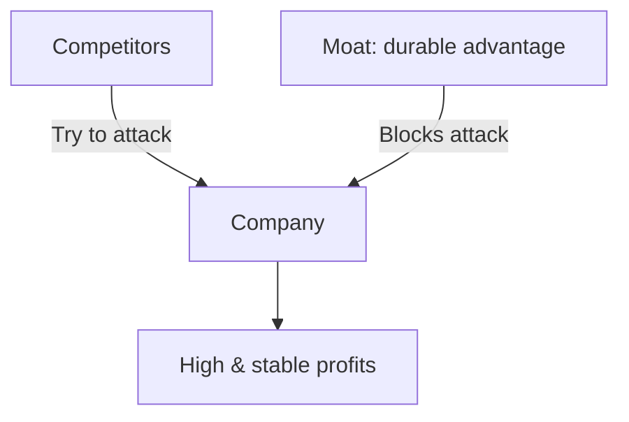
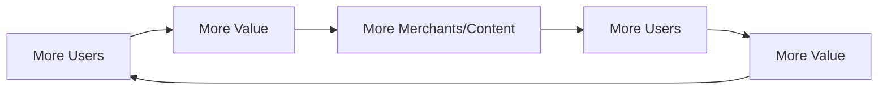
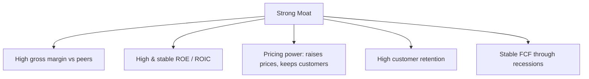

# Competitive Moat

## What It Is

A **competitive moat** is a durable advantage that keeps competitors from eating a company's profits. The word comes from the water-filled ditch around medieval castles — it kept attackers out.



**Why it matters:** A company without a moat eventually competes on price alone, and profits get competed down to zero.

---

## The Five Classic Moats

### 1. Intangible Assets

Brands, patents, and licenses that competitors can't legally copy.

| Type | Example | How It Protects |
|---|---|---|
| Brand | Coca-Cola, Nike, Apple | Customers pay more for the name |
| Patents | Pharmaceutical drugs | Legal monopoly for 20 years |
| Regulatory licenses | Casinos, telecom spectrum | Government-granted exclusivity |
| Network of trust | Auditors, lawyers | Reputation takes decades to build |

### 2. Switching Costs

Customers stay because leaving is expensive, painful, or risky.

| Example | Switching Cost |
|---|---|
| Enterprise ERP software | Retraining, data migration, downtime |
| Bank accounts | New accounts, auto-pay, paperwork |
| Cloud platforms | Re-architecting, vendor lock-in |
| Gaming consoles | Game library, friends on platform |

```
A customer may HATE the product
but stay because leaving costs more than staying.
```

### 3. Network Effects

The product becomes more valuable as more people use it.

| Example | The Effect |
|---|---|
| WhatsApp | More users → more useful for each user |
| Visa/Mastercard | More merchants → more users → more merchants |
| Google Search | More clicks → better results → more users |
| Stock exchanges | More liquidity → better prices → more traders |



### 4. Cost Advantages

Produce at lower cost than competitors → charge less and still profit.

| Type | Example | Advantage |
|---|---|---|
| Scale | Amazon, Walmart | Volume lowers unit costs |
| Proprietary process | Costco's efficiency | Lower overhead than rivals |
| Favorable location | Nearby raw materials | Cheap inputs |
| Unique access to inputs | Exclusive supply deals | Competitors can't match |

### 5. Efficient Scale

A market that only needs one or two players to serve it profitably.

| Example | Why Competitors Don't Enter |
|---|---|
| Small-town airports | Demand too small for a second player |
| Pipeline utilities | Duplicating infrastructure isn't worth it |
| Niche B2B niches | Market too small to justify the fight |

---

## Moat Strength Scale

| Strength | Meaning | Examples |
|---|---|---|
| **Narrow** | Advantage lasts a few years | Features, fads, basic branding |
| **Wide** | Advantage lasts a decade+ | Brand + patents + switching costs |
| **Wide & growing** | Getting stronger over time | Network effect + scale + brand |

**Beware: moats can shrink.** Technology shifts and disruption can fill in the moat.

---

## How Moats Show Up in Financial Statements



**Where to look (from Phase 2 & 3):**
- Gross margin persistently above peers → pricing power (brand/cost advantage)
- ROIC > WACC consistently → earns more than its capital costs
- Steady revenue through downturns → customers don't leave
- High customer retention → switching costs or network effects

---

## Programming Analogy

```
Competitive Moat = Defensibility of your software/service

Brand          = Reputation of your OSS project / community
Patents        = Trademarks, legal protection of your tech
Switching costs = Data & vendor lock-in (the #1 moat in SaaS)
Network effects = Marketplace platforms (Uber, Airbnb model)
Cost advantage  = Cheaper infra than competitors (economies of scale)

A "moat" in startups = Why a competitor with 10× funding
  can't just clone you and win

Red flag: "We're better, cheaper, and faster" is NOT a moat
  (features can be copied). Real moats are structural.
```

---

## Common Mistakes

- **Confusing a feature with a moat.** "Our product is faster" is not a moat — competitors can copy it. Moats are structural and hard to replicate.
- **Calling market share a moat.** Being big isn't the moat. WHY you stay big is the moat (scale, network effects, switching costs).
- **Ignoring moat erosion.** Technology, regulation, and new entrants fill moats over time. A moat must be monitored, not assumed.
- **Assuming a wide moat = a good investment.** A great moat at a terrible price is still a bad investment (valuation matters too).
- **Overlooking moat in the financials.** If margins are collapsing, the moat is likely shrinking — no matter what the brand says.

---

## Interview Notes

- **Behavioral: "Is X defensible?"** — Walk through the five moats in order: intangible assets, switching costs, network effects, cost advantage, efficient scale. Conclude with whether the advantage is structural or just a feature.
- **System Design: "Design a moat-analysis tool"** — Combine qualitative signals (patents, brand surveys) with quantitative signals (margin trends, retention, ROIC vs WACC) into a moat score.
- **Data Engineering: "Measuring switching costs"** — Churn rate, retention cohort analysis, and support-ticket sentiment can proxy how sticky a product is.

---

## Revision Summary

| Moat | Protection | Example |
|---|---|---|
| Intangible Assets | Brand, patents, licenses | Coca-Cola, Pharma |
| Switching Costs | Painful/costly to leave | ERP, banks, cloud |
| Network Effects | More users = more value | WhatsApp, Visa |
| Cost Advantage | Lower cost, charge less | Amazon, Walmart |
| Efficient Scale | Market too small to compete | Local utilities |

| Financial Signal | Moat Evidence |
|---|---|
| High gross margin vs peers | Pricing power |
| ROIC > WACC | Earning above capital cost |
| Stable FCF through downturns | Customer stickiness |
| High retention | Switching costs / network effects |

- Features are NOT moats — structural advantages are
- Moats can shrink — monitor erosion over time

---

← [02-comparable-company-analysis](02-comparable-company-analysis.md) • [↑ Phase 3](README.md) • [↑ Finance](../README.md) • [04-growth-vs-value](04-growth-vs-value.md) →
