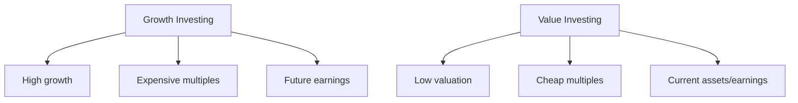
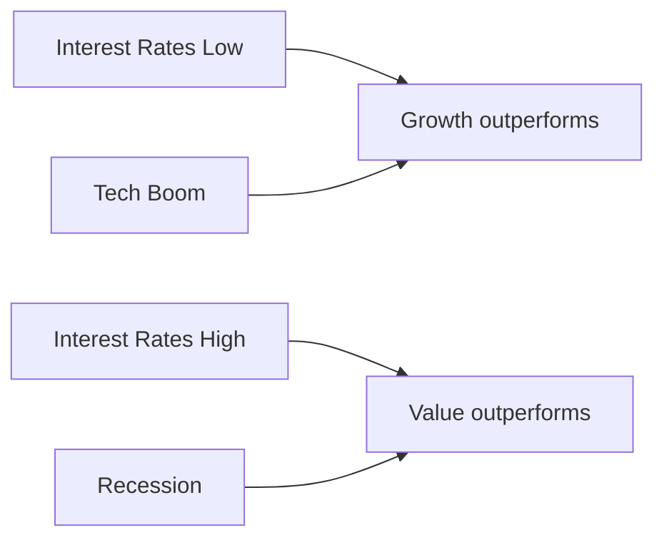

# Growth vs Value Investing

## What It Is

Two fundamental approaches to picking stocks, differing in what they look for and how they expect to make money.

| | Growth Investing | Value Investing |
|---|---|---|
| What it buys | Fast-growing companies | Undervalued companies |
| Core belief | Earnings will grow into the price | Market misprices the true worth |
| How profit comes | Capital appreciation | Buying cheap + waiting for re-rating |
| Typical multiple | High P/E, high P/S | Low P/E, low P/B |
| Risk | Overvaluation if growth stalls | Value trap if business deteriorates |



---

## Growth Investing

Buy companies whose **earnings and revenue are growing fast**, expecting the high growth to eventually justify the high price.

**Characteristics:**
- High revenue / EPS growth (20%+)
- High P/E, P/S, EV/EBITDA multiples
- Low or no dividends (profits reinvested in growth)
- Expanding markets (TAM story)
- Focus on the future, not today's earnings

```
Example profile:
  SaaS company growing 40%/yr
  Trading at 30× forward P/E
  Investors accept the high multiple because
  growth is expected to compound into value
```

**The bet:** Today's expensive stock becomes tomorrow's fair stock once earnings catch up.

---

## Value Investing

Buy companies trading **below what they're worth**, expecting the market to eventually recognize the gap.

**Characteristics:**
- Low P/E, P/B, low EV/EBITDA
- Mature, often boring industries
- High or consistent dividends
- Strong balance sheets, real assets
- Focus on margin of safety

**Margin of safety:** Buy well below intrinsic value so even if estimates are wrong, you don't lose money.

```
Example profile:
  A bank trading at 0.8× book value
  Book value = $10/share, price = $8/share
  Downside protected by assets
  Upside if market re-rates to 1× book ($10)
```

**The bet:** The market is temporarily wrong; price will converge to intrinsic value.

---

## Key Metrics by Style

| Metric | Growth looks for | Value looks for |
|---|---|---|
| Revenue growth | High & accelerating | Stable, modest |
| P/E | High is fine (future justifies) | Low (cheap today) |
| P/B | High (intangibles) | Low (assets underpin price) |
| Dividends | Usually none | Consistent / growing |
| Margins | Improving with scale | Already stable |
| Balance sheet | Cash for expansion | Strong assets, low debt |

---

## When Each Style Wins

| Environment | Growth | Value |
|---|---|---|
| Low interest rates | Thrives (cheap money funds growth) | Lags |
| High interest rates | Lags (future earnings discounted heavily) | Thrives |
| Recession | Volatile (growth slows) | Defensive (steady assets) |
| New technology cycle | Wins big (new winners emerge) | Misses the rally |



---

## The Middle Ground: GARP

**Growth At a Reasonable Price** — growth investing but not at any price.

```
GARP screening rule (PEG ratio):

PEG = P/E ÷ Earnings Growth

PEG < 1   → cheap relative to growth (attractive)
PEG = 1   → fairly priced for its growth
PEG > 2   → paying too much for growth
```

GARP combines the two styles: buy growth, but only when the price is reasonable.

---

## Programming Analogy

```
Growth Investing = Betting on a high-velocity startup
  Metrics: MAU growth, revenue growth, burn rate
  You accept high burn (low profit) because growth compounds

Value Investing = Buying stable infra at a discount
  Metrics: utilization, cost per request, reliability
  You buy when the price falls below replacement value

PEG ratio = growth-adjusted price
  like "cost per unit of feature velocity" — is velocity worth the price?

Growth vs Value = Startups (growth) vs. mature B2B (value).
  Neither is always right — regime and price matter.
```

---

## Common Mistakes

- **Paying any price for growth.** Growth at 40% is worthless if you pay 60× for it and growth slows. PEG helps sanity-check.
- **Buying "cheap" without asking why.** A low P/E can mean the market knows something (value trap). Check red flags from Phase 2.
- **Sticking to one style forever.** Both styles take turns outperforming depending on the interest-rate regime.
- **Judging a growth stock with value metrics.** Expecting a high-growth SaaS to have a bank's P/B misses the point.
- **Ignoring quality within the style.** There are good and bad companies in both camps. Style is not a substitute for analysis.

---

## Interview Notes

- **Behavioral: "Are you a growth or value investor?"** — There's no single right answer. Good answer: explain both, name when each works (interest-rate regimes), and describe your own blend (e.g., GARP with quality filters).
- **System Design: "Design a style-classification engine"** — Score stocks on growth (revenue/EPS CAGR) and value (P/E, P/B) dimensions, then bucket into growth/value/GARP cohorts. Used to build factor indexes.
- **Quant: "How do you test if value still works?"** — HML (high-minus-low) factor backtest: long cheap, short expensive, measure spread over decades.

---

## Revision Summary

| Aspect | Growth | Value |
|---|---|---|
| Buy | Fast-growing companies | Undervalued companies |
| Multiples | High P/E, P/S | Low P/E, P/B |
| Profit source | Earnings compound | Price converges to worth |
| Key risk | Overvaluation | Value trap |
| Wins when | Low rates, tech boom | High rates, recession |
| Classic metric | PEG ratio | Margin of safety |

- Growth pays for the future; value pays for today
- Neither style wins forever — regimes flip
- GARP = growth at a reasonable price (PEG < 1)

---

← [03-competitive-moat](03-competitive-moat.md) • [↑ Phase 3](README.md) • [↑ Finance](../README.md) • [Next phase →](../phase-4-technical-analysis/README.md)
