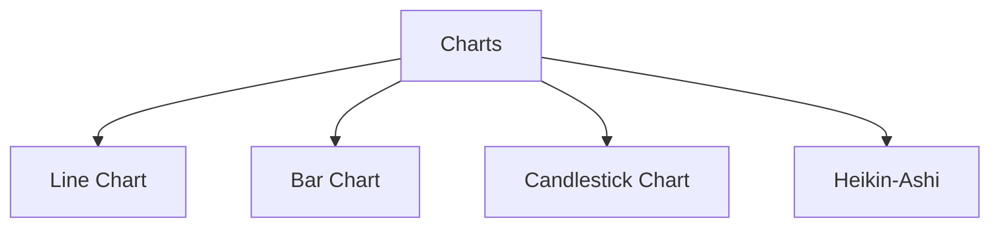
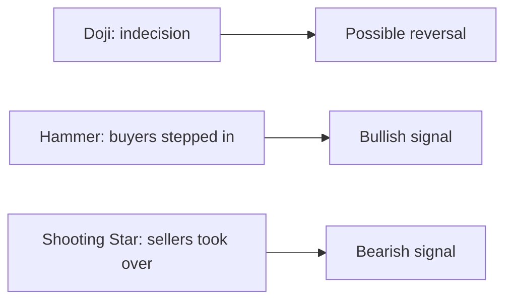

# Chart Types

## What They Are

Charts are the visual language of technical analysis — they compress price history into a view that helps spot patterns and trends.



| Chart | Data Points | Best For | Visual |
|---|---|---|---|
| Line | Close only | Long-term trend | Simple line |
| Bar | OHLC (open, high, low, close) | Day trading detail | Vertical bars |
| Candlestick | OHLC + body/wicks | Pattern recognition | Red/green candles |
| Point & Figure | Price + reversal threshold | Filtering noise | X/O columns |

---

## Line Chart

Plots only the **closing price** over time and connects the dots.

```
    120 ─●──────────●───────
    115 ───●─────●───●───●──
    110 ─────●─●────────────
         J  F  M  A  M  J
```

**Use it when:** You want the big picture — months/years of trend — without day-to-day noise.

---

## Bar Chart

Shows all four price points (OHLC) for each period as a vertical bar.

```
    120 │       ┌─┐
    115 │  ┌─┐  │ │  High = top of bar
    110 │  │ │  │ │  Low   = bottom of bar
    105 │  └─┘  └─┘  Open  = left tick
    100 └───────────────── Close = right tick
```

**Use it when:** You need the full OHLC range (intraday trading) without candlestick color coding.

---

## Candlestick Chart

The most popular chart. Each candle encodes four prices.

```
    BULLISH          BEARISH
    ─────────        ─────────
    │  │  │         │  │  │
    │  │  │         │  │  │
    │█████│         │     │
    │█████│   Close  │     │  Open
    │  │  │         │█████│
    │  │  │         │█████│
    │  │  │         │  │  │
    ─────────        ─────────

  Open < Close (green)   Open > Close (red)
```

| Part | What It Shows |
|---|---|
| Body | Range between open and close |
| Upper wick | Highest price during the period |
| Lower wick | Lowest price during the period |
| Color | Green = price rose, Red = price fell |

**Anatomy:**

```
  ┌──── High
  │
  ││  Upper wick (rejection of highs)
  │██  Body (open → close)
  │
  └──── Low

Long wick = the market tested that level and reversed.
```

---

## Candlestick Single Patterns

One candle can carry meaning.

| Pattern | Appearance | Meaning |
|---|---|---|
| **Doji** | Open ≈ Close, long wicks | Indecision, possible reversal |
| **Hammer** | Small body at top, long lower wick | Bullish after a downtrend |
| **Shooting Star** | Small body at bottom, long upper wick | Bearish after an uptrend |
| **Marubozu** | No wicks, full body | Strong momentum |



---

## Multi-Candle Patterns

| Pattern | Structure | Meaning |
|---|---|---|
| **Bullish Engulfing** | Green candle fully covers prior red | Reversal up |
| **Bearish Engulfing** | Red candle fully covers prior green | Reversal down |
| **Morning Star** | Red → doji → green | Strong bullish reversal |
| **Evening Star** | Green → doji → red | Strong bearish reversal |
| **Three White Soldiers** | 3 rising green candles | Sustained buying |
| **Three Black Crows** | 3 falling red candles | Sustained selling |

---

## Programming Analogy

```
Chart Types = Visualization layers of a time-series DB

Line chart     = aggregate(price) by day, min resolution
Bar chart      = min/max/first/last per bucket (OHLC = rollup)
Candlestick    = OHLC + color-coded delta (open-vs-close sign)
Doji           = open - close ≈ 0 (≈ no net change)
Wick           = outliers / rejection (long tails in a histogram)

Technical analysis = pattern matching on time-series data
Candlesticks      = richer features than just closing prices
```

---

## Common Mistakes

- **Only using line charts for trading.** You lose the open/high/low — which is where reversals and wicks hide.
- **Ignoring timeframes.** A daily chart and a 5-minute chart tell different stories. Match the timeframe to your holding period.
- **Reading candle colors as "good" and "bad."** A green candle in a downtrend is just one candle — context matters.
- **Over-interpreting single candles.** Dojis and hammers signal, they don't guarantee. Confirm with volume and trend.

---

## Interview Notes

- **System Design: "Design a charting service"** — OHLC candles require bucketing ticks by timeframe and rolling up (first, max, min, last). Precompute to serve sub-second rendering.
- **Data Engineering: "Candle aggregation"** — Millions of ticks/day → windowed aggregation (1m, 5m, 1h, 1d). Needs time-partitioned storage and idempotent rollups.
- **Behavioral: "Why do candlesticks beat line charts?"** — Richer data: open/close delta + high/low range encodes volume of information in one visual.

---

## Revision Summary

| Chart | Shows | Use For |
|---|---|---|
| Line | Close only | Long-term trends |
| Bar | OHLC | Full range detail |
| Candlestick | OHLC + body/wick | Pattern recognition |

| Candle Part | Meaning |
|---|---|
| Body | Open → Close range |
| Wick | Tested level, reversed |
| Color | Direction (green up, red down) |
| Doji | Indecision / reversal |

---

← [↑ Phase 4](README.md) • [↑ Finance](../README.md) • [01-trend-analysis](01-trend-analysis.md) →
