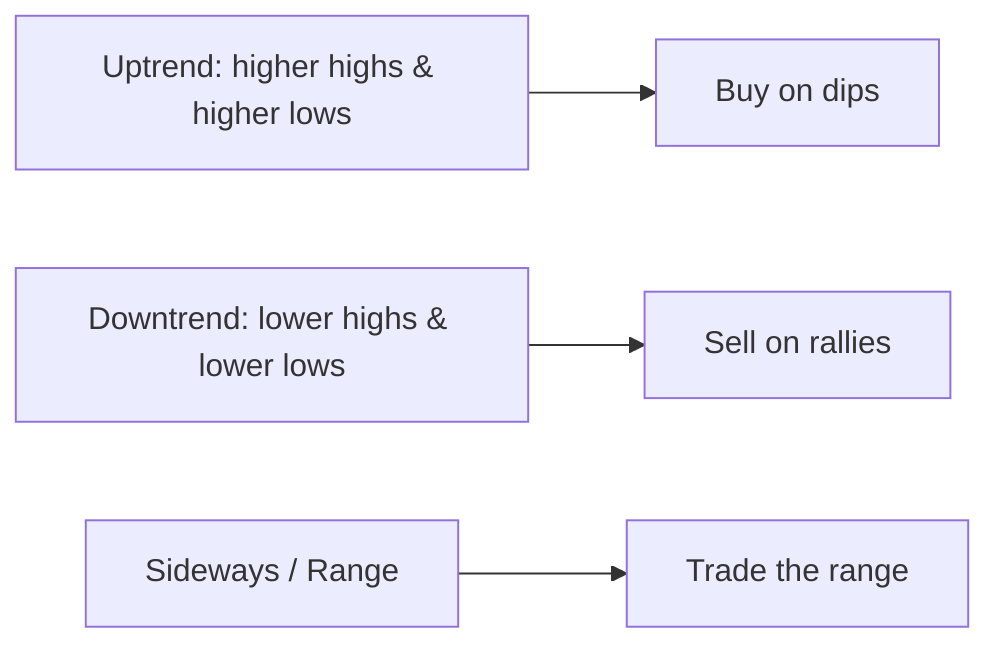
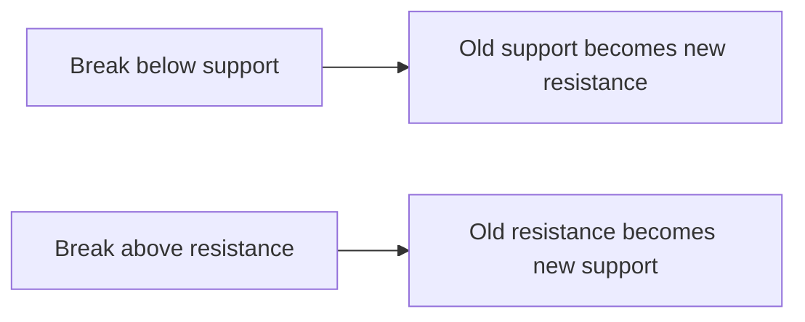
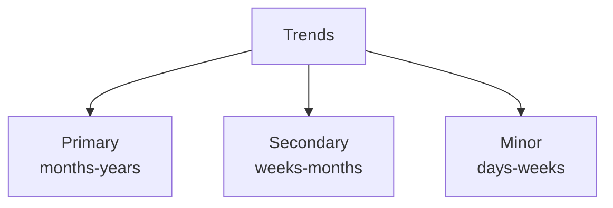

# Trend Analysis

## What It Is

A **trend** is the general direction of prices over time. Trend analysis identifies the direction and the levels where price is likely to find support or resistance.



**Core rule:** "The trend is your friend" — trade with the trend, not against it.

---

## Trend Direction

### Uptrend

```
      /\
     /  \      <-- higher high
    /    \/
   /         <-- higher low
  /
```

Each peak and trough is **higher** than the last.

### Downtrend

```
  \
   \  /\      <-- lower high
    \/  \
         \    <-- lower low
          \
```

Each peak and trough is **lower** than the last.

### Sideways / Range

```
    ────╔═══╗─────   Resistance (top)
    ════╝   ╚═══     Range
    ────╔═══╗─────   Support (bottom)
```

Price oscillates between two horizontal levels.

---

## Support and Resistance

| Level | What It Is | Why It Works |
|---|---|---|
| **Support** | Price floor — buyers step in | Market memory, order flow, perceived value |
| **Resistance** | Price ceiling — sellers step in | Profit-taking, supply of sellers |

```
RESISTANCE ──────── $100  (sellers appear)
             ╱ ╲
            ╱   ╲        price bounces here
     ╱╲    ╱     ╲    ╱╲
    ╱  ╲  ╱       ╲  ╱  ╲
   ╱    ╲╱         ╲╱    ╲
SUPPORT ──────── $90   (buyers appear)
```

**Role reversal:** When price breaks a level, the roles flip.

```
Support breaks → it becomes resistance (selling pressure above)
Resistance breaks → it becomes support (buyers protect the level)
```



---

## Trendlines and Channels

**Trendline** — a line connecting two or more swing points that price keeps respecting.

```
Uptrendline = connects higher lows (buy dips here)
Downtrendline = connects lower highs (sell rallies here)
```

**Channel** — two parallel trendlines containing price.

```
      ──────────────── resistance line
     ╱ ╱ ╱ ╱ ╱ ╱ ╱ ╱
    ╱ ╱ ╱ ╱ ╱ ╱ ╱ ╱
   ──────────────── support line
```

**Trading a channel:** buy near the lower line, sell near the upper line, stop-loss outside the channel.

---

## Trend Duration

| Trend | Duration | Example |
|---|---|---|
| **Primary** | Months – years | The overall bull/bear market |
| **Secondary** | Weeks – months | Corrections within the primary trend |
| **Minor** | Days – weeks | Short-term swings |



A stock can be in a **primary uptrend** while a **secondary downtrend** (correction) pulls it back temporarily.

---

## Programming Analogy

```
Trend Analysis = Time-series forecasting features

Uptrend = monotonically increasing series
Support = floor value the series keeps bouncing off
         (like a hard lower bound / lower confidence band)
Resistance = ceiling the series keeps hitting
         (like an upper cap / rate limit)
Trendline = linear regression / robust fit through pivot points
Channel  = an envelope (like Bollinger-like bounds on the fit)

Support & resistance = price levels where order flow concentrates
  (like thresholds where a load balancer's queue fills up)

Role reversal = when a breakpoint flips, like
  an autoscaling ceiling becoming a new floor
```

---

## Common Mistakes

- **Drawing trendlines to fit your bias.** A trendline must connect at least two (ideally three) meaningful swing points — not whatever makes the story look good.
- **Trading against the primary trend.** Catching a falling knife in a downtrend "because it's cheap" is fighting the tape.
- **Assuming levels are exact.** Support/resistance are zones, not precise prices. Use ranges, not points.
- **Ignoring timeframe mismatch.** Daily support is meaningless to a 5-minute trader.
- **Forgetting a break isn't a reversal.** A support break can be a trap (whipsaw). Confirm with volume and follow-through.

---

## Interview Notes

- **System Design: "Design a trend-detection service"** — Compute higher-high/lower-low logic, fit trendlines (linear regression on pivots), detect support/resistance clusters (KDE of local extrema). Serve as chart overlays.
- **Data Engineering: "Pivot detection"** — Swing high/low detection via local extrema on OHLC with a lookback window. Needs careful handling of noise and gaps.
- **Quant: "Is technical analysis signal or noise?"** — Weak-form market efficiency suggests past prices shouldn't predict. Defensible answer: it captures order-flow and liquidity dynamics even if not "predictive" in the ML sense.

---

## Revision Summary

| Term | Definition |
|---|---|
| Uptrend | Higher highs & higher lows |
| Downtrend | Lower highs & lower lows |
| Support | Floor where buyers appear |
| Resistance | Ceiling where sellers appear |
| Trendline | Line through swing points |
| Channel | Two parallel trendlines |
| Primary trend | Months–years (dominant direction) |
| Role reversal | Broken levels flip roles |

- Trade with the trend
- Support/resistance are zones, not exact prices
- Confirm breaks with volume

---

← [00-chart-types](00-chart-types.md) • [↑ Phase 4](README.md) • [↑ Finance](../README.md) • [02-technical-indicators](02-technical-indicators.md) →
