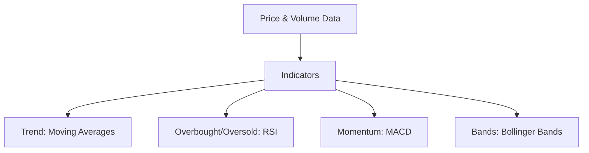
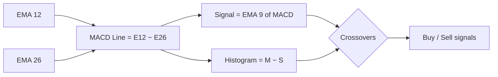
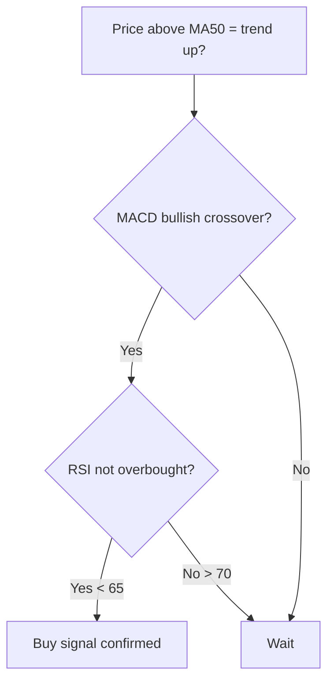

# Technical Indicators

## What They Are

**Indicators** are mathematical transformations of price/volume data that help identify trend, momentum, and overbought/oversold conditions.



| Indicator | Category | Question It Answers |
|---|---|---|
| Moving Average (MA) | Trend | What's the average price over N periods? |
| RSI | Momentum | Is the market overbought or oversold? |
| MACD | Momentum | Is momentum accelerating or fading? |
| Bollinger Bands | Volatility | Is price far from its mean? |

---

## Moving Averages (MA)

The average price over a rolling window. Smooths noise to show the trend.

```
SMA(5) = (P1 + P2 + P3 + P4 + P5) / 5
```

| Type | Formula | Reactivity |
|---|---|---|
| SMA (Simple) | Equal weights | Slow |
| EMA (Exponential) | Recent prices weigh more | Fast |

```
EMA is a weighted average — recent prices get more weight.

EMA(n) = EMA(prev) + k × (price − EMA(prev))
  where k = 2 / (n + 1)
```

### Common Lookbacks

| MA | Use | Signal |
|---|---|---|
| MA 20 | Short-term trend | Price above = bullish |
| MA 50 | Intermediate trend | Golden/death cross |
| MA 200 | Long-term trend | Market's big-picture bias |

**Crossovers:**
```
Golden Cross: MA50 crosses ABOVE MA200  → bullish
Death Cross:  MA50 crosses BELOW MA200  → bearish
```

**MA as dynamic support/resistance:**
- In an uptrend, price often bounces off the rising MA20/MA50
- A break below the MA200 often signals a major regime change

---

## RSI (Relative Strength Index)

Measures the speed and size of recent price changes on a 0–100 scale.

```
RSI = 100 − (100 / (1 + RS))
RS = Average gain over N periods ÷ Average loss over N periods
    (typically N = 14)
```

| Zone | Meaning |
|---|---|
| > 70 | **Overbought** — maybe due for a pullback |
| < 30 | **Oversold** — maybe due for a bounce |
| 30–70 | Neutral — normal trading range |

```
RSI 85 → market is overbought (too many buyers, crowded)
RSI 20 → market is oversold (too many sellers, exhausted)
```

**Divergence:** a powerful signal.

```
Price makes a HIGHER high, but RSI makes a LOWER high
  → bullish momentum weakening → possible reversal down

Price makes a LOWER low, but RSI makes a HIGHER low
  → selling momentum weakening → possible reversal up
```

---

## MACD (Moving Average Convergence Divergence)

Shows the relationship between two EMAs to reveal momentum.

```
MACD Line = EMA(12) − EMA(26)
Signal Line = EMA(9) of the MACD Line
Histogram = MACD Line − Signal Line
```

| Signal | What It Means |
|---|---|
| MACD crosses above signal | Bullish momentum (buy) |
| MACD crosses below signal | Bearish momentum (sell) |
| Histogram grows | Momentum strengthening |
| Histogram shrinks | Momentum fading |
| MACD above/below zero line | Overall trend direction |



---

## Bollinger Bands

A moving average with two volatility-based bands around it.

```
Middle Band = SMA(20)
Upper Band = SMA(20) + 2 × Standard Deviation
Lower Band = SMA(20) − 2 × Standard Deviation
```

```
      ────── Upper band (2σ above mean)
      ────── Middle band (SMA 20)
      ────── Lower band (2σ below mean)

Price touching upper band → overextended
Price touching lower band → oversold
Bands narrowing ("squeeze") → low volatility, breakout coming
Bands widening → volatility rising
```

| Signal | Meaning |
|---|---|
| Squeeze (bands tighten) | Volatility compression → breakout likely |
| Walk up the upper band | Strong trend (not a sell signal) |
| Touch lower band | Oversold, but can stay oversold in a downtrend |

---

## Indicator Combination Strategy

Indicators work best together — a single one gives false signals.



**Rule of thumb:** trend filter (MA) + momentum (MACD) + condition (RSI) before acting.

---

## Programming Analogy

```
Indicators = Feature engineering on time-series data

MA    = rolling_mean(price, window)
EMA   = exponential weighted moving average
RSI   = ratio of gains to losses, normalized to 0-100
MACD  = ema12 - ema26 (a momentum "derivative")
Bollinger = rolling_mean ± 2 × rolling_std (an envelope)

Golden cross = short-term mean crosses long-term mean
  (like detecting a regime shift in streaming data)

Overbought/oversold = z-score style extremeness
Divergence = price vs indicator disagreeing (anomaly detection)

Crossover strategies = simple feature thresholds,
  easy to backtest — and easy to overfit
```

---

## Common Mistakes

- **Using indicators in isolation.** RSI > 70 doesn't mean "sell." In strong trends RSI stays overbought for weeks. Combine with trend context.
- **Overfitting indicator combos.** Too many indicators = analysis paralysis. A simple MA + RSI system often beats a 10-indicator monster.
- **Using lagging indicators for timing.** MA and MACD are lagging (they confirm trends after they start). Fine for trend-following, bad for precision entries.
- **Ignoring the timeframe.** RSI on a daily chart ≠ RSI on a 5-min chart. Pick one timeframe and stay consistent.
- **Backtesting with hindsight.** A golden cross "that would have worked" is easy to spot in hindsight; forward testing is the real test.

---

## Interview Notes

- **System Design: "Design a real-time indicators service"** — Streaming aggregation: EMA, RSI, MACD computed incrementally on each tick. Must handle out-of-order data and produce consistent snapshots.
- **Data Engineering: "Incremental EMA computation"** — EMA is a stateful stream computation (previous value needed). Use keyed state in a stream processor.
- **Quant: "How would you test an indicator strategy?"** — Define entry/exit, compute indicator on a rolling window (no lookahead), backtest with transaction costs, and validate out-of-sample. Watch for overfitting.

---

## Revision Summary

| Indicator | Formula Essence | Key Signal |
|---|---|---|
| MA | Rolling average | Trend / crossover |
| EMA | Weighted average (recent > old) | Faster trend signal |
| RSI | Gain/(Gain+Loss) scaled to 0–100 | >70 overbought, <30 oversold |
| MACD | EMA12 − EMA26, signal = EMA9 | Momentum crossover |
| Bollinger | SMA ± 2σ | Volatility, squeeze → breakout |

- Combine a trend filter + momentum + condition
- Indicators are lagging — confirm, don't predict
- Test before trusting — backtests overfit easily

---

← [01-trend-analysis](01-trend-analysis.md) • [↑ Phase 4](README.md) • [↑ Finance](../README.md) • [03-volume-analysis](03-volume-analysis.md) →
