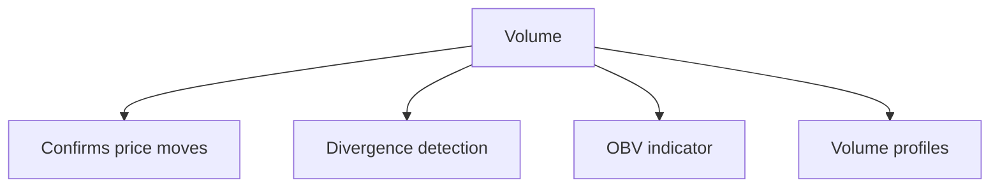
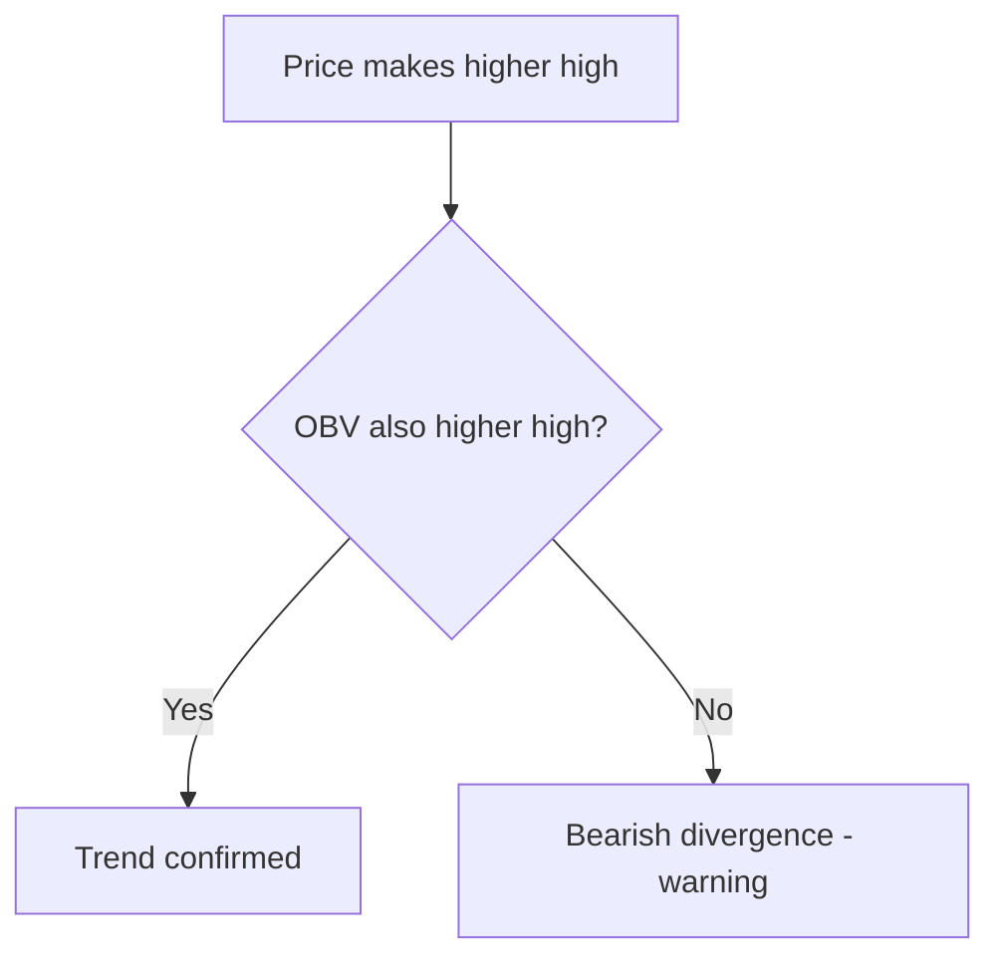
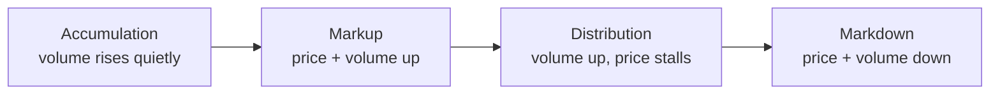

# Volume Analysis

## What It Is

**Volume** is the number of shares/contracts traded in a period. Volume analysis uses volume to confirm whether price moves are real or fake.

**Core principle:** Price tells you *where* the market moved; volume tells you *how much conviction* the move had.

```
Price move + high volume  = strong conviction (trust it)
Price move + low volume   = weak conviction (distrust it)
```



---

## Volume Basics

| Scenario | Meaning |
|---|---|
| Price up + volume up | Strong buying, trend likely continues |
| Price down + volume up | Strong selling, downtrend likely continues |
| Price up + volume down | Weak rally, might reverse |
| Price down + volume down | Weak selloff, selling pressure fading |

### Typical Patterns

| Pattern | What It Signals |
|---|---|
| **Volume spike** | Something significant happened (news, earnings) |
| **Volume dry-up** | Market indecision, consolidation |
| **High volume breakout** | Breakout with conviction (trustworthy) |
| **Low volume breakout** | Likely fake-out / trap |
| **Climax volume** | Massive spike at a top — possible exhaustion |

---

## Volume Confirmation

A breakout must be confirmed by volume to be reliable.

```
BREAKOUT ABOVE RESISTANCE
  ┌────────────── $100 resistance
  │
  │
  ├────────────────────────── price
  │
  │▂▄▆█▇▄▂▄▆█  ← volume expands on breakout = CONFIRMED
```

```
FAKE BREAKOUT (trap)
  ┌────────────── $100 resistance
  │  price pokes above briefly
  │
  ├────────────────────────── price
  │
  │▂▄▂  ← volume stays low = likely fake-out
```

**Rule:** Never trust a breakout without a volume increase to confirm it.

---

## On-Balance Volume (OBV)

Cumulative volume indicator that adds volume on up-days and subtracts it on down-days.

```
OBV(today) = OBV(yesterday)
  + volume   if price closed UP today
  − volume   if price closed DOWN today
  + 0        if close unchanged
```

```
Day   Close   Volume    OBV
1     $100     1M        +1M
2     $102     2M        +3M   (price up, add)
3     $101     1M        +2M   (price down, subtract)
4     $103     3M        +5M   (price up, add)
```

**How to use it:**
- OBV rising while price rises → trend confirmed
- OBV falling while price rises → **divergence** — rally not backed by volume
- OBV trendline breaks before price trendline → early warning



---

## Volume Profile

Shows volume traded at **each price level** (not per time period).

```
Price    Volume traded
─────────────────────────
$120     ██
$118     ████
$116     ████████   ← high-volume node (POC)
$114     ██████
$112     ███
$110     █
```

**Key concepts:**

| Term | Meaning |
|---|---|
| **POC (Point of Control)** | Price with the most traded volume |
| **High Volume Node (HVN)** | Support/resistance zones |
| **Low Volume Node (LVN)** | Price gaps through fast — weak areas |

**How to use:**
- Price gravitates toward the POC
- Price stalls at HVNs (supports/resistance)
- Price moves quickly through LVNs (thin areas)

---

## Volume by Trend Stage



| Stage | Volume Character |
|---|---|
| Accumulation | Volume builds while price is flat (smart money buying) |
| Markup | Price + volume rise together (uptrend) |
| Distribution | Volume spikes but price stops making highs (smart money selling) |
| Markdown | Price falls with heavy volume (selloff) |

---

## Programming Analogy

```
Volume Analysis = Event rate / traffic analytics

Volume  = request rate (throughput) at a price level
OBV     = cumulative signed throughput
         (add on up-moves, subtract on down-moves)
         = like a counter of buy vs sell pressure
Divergence = price trending up but volume not following
         = like revenue growing but traffic flat (unsustainable)
Volume profile = histogram of requests per value bucket
         (hot levels = where most transactions concentrate)

High volume = high confidence (real traffic)
Low volume  = low confidence (idle / synthetic spikes)

OBV = a monotonic accumulator; watch its slope, not its level
```

---

## Common Mistakes

- **Ignoring volume entirely.** Price moves without volume context are unreliable — especially breakouts.
- **Assuming high volume = buy signal.** High volume on a DOWN day means strong selling, not opportunity.
- **Using absolute volume numbers.** Volume must be compared to its own average (relative volume), not judged in absolute terms.
- **Forgetting volume differs by market cap.** Mega-caps have huge volume by default; a small cap's volume spike means far more.
- **Over-trading volume spikes.** A spike can be news-driven noise. Check what caused it before acting.

---

## Interview Notes

- **System Design: "Design a volume analytics service"** — Stream tick data → aggregate volume by symbol/timeframe → compute OBV incrementally → build volume profiles (bucketing by price). Latency-critical for traders.
- **Data Engineering: "Volume profile computation"** — Maintain running totals per price bucket over a window. Needs time-partitioned aggregation and backfills for historical profiles.
- **Behavioral: "Why is volume needed to confirm breakouts?"** — Low-volume moves can be manipulated or noise. High volume means many independent participants agree — that's the conviction that makes a break stick.

---

## Revision Summary

| Concept | Meaning |
|---|---|
| Volume | Shares traded in a period |
| Confirmation | High volume confirms price moves |
| OBV | Cumulative signed volume (up/down days) |
| Volume Profile | Volume by price level |
| POC | Price with most volume |
| Divergence | Price and volume disagree (warning) |
| Climax volume | Exhaustion signal at extremes |

- High volume + price move = conviction
- Never trust a breakout without volume
- OBV: watch the slope, not the level

---

← [02-technical-indicators](02-technical-indicators.md) • [↑ Phase 4](README.md) • [↑ Finance](../README.md) • [04-chart-patterns](04-chart-patterns.md) →
