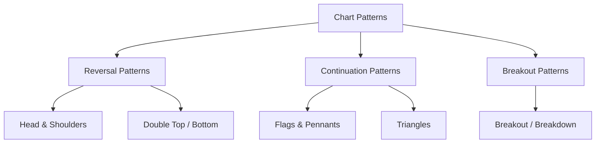
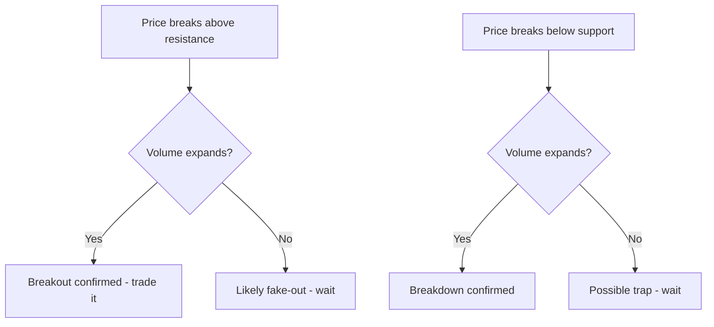

# Chart Patterns

## What They Are

**Chart patterns** are recognizable price shapes that suggest where price is likely to go next. They're the market's visual footprints — patterns of collective buying and selling behavior.



**Two rules for all patterns:**
1. Patterns are probabilistic, not guaranteed
2. Confirm with volume before acting

---

## Reversal Patterns

Signal a change in trend direction.

### Head and Shoulders

A top with a higher middle peak — indicates a reversal from uptrend to downtrend.

```
   HEAD
   ┌───┐
   │   │    ← left shoulder
  ┌┼─┐ │  ┌┼─┐
  │ │ └──┼┘ │
  │ │    │  │
 ─┴─┴────┴──┴── neckline (support)

Break below neckline = confirmed reversal (bearish)
```

| Component | Meaning |
|---|---|
| Left shoulder | First peak |
| Head | Higher peak (buying climax) |
| Right shoulder | Lower peak (buyers weakening) |
| Neckline | Support level — break = confirmation |

**Inverse head and shoulders** = mirror image, bullish (reversal from downtrend to uptrend).

### Double Top / Bottom

Price hits a level twice and fails → reversal.

```
Double Top (bearish):
   ╱╲   ╱╲
  ╱  ╲ ╱  ╲
 ╱    ╲╱    ╲    ← breaks down
────────────────── support

Double Bottom (bullish):
   ╲  ╱╲  ╱
    ╲╱  ╲╱
         ╲    ← breaks up
────────────────── resistance
```

**What matters:** The second failure at the same level shows the trend has run out of steam.

---

## Continuation Patterns

Signal a pause in the trend before it resumes.

### Flags and Pennants

A sharp move (pole) followed by a small consolidation (flag/pennant).

```
Uptrend flag:
      /\      ← pole (sharp rise)
     /  ╱╲
    /  ╱  ╲   ← flag (small pullback / consolidation)
   /  ╱    ╲
  /  ╱      ╲──→ break up = trend resumes
```

| Pattern | Shape | Break Direction |
|---|---|---|
| Bull flag | Slanted down consolidation | Up (trend resumes) |
| Bear flag | Slanted up consolidation | Down |
| Pennant | Symmetric small triangle | Same as prior trend |

### Triangles

Price coils into a narrowing range, then breaks out.

```
Symmetric triangle:
     ╲    ╱
      ╲  ╱
       ╲╱   ← narrowing → breakout (either direction)

Ascending triangle (bullish):
     ──────────── resistance (flat)
      ╱  ╱  ╱
     ╱  ╱  ╱    ← higher lows → break up likely

Descending triangle (bearish):
      ╲  ╲  ╲
       ╲  ╲  ╲
     ──────────── support (flat) → break down likely
```

| Triangle | Signal | Likely Break |
|---|---|---|
| Symmetric | Indecision | Either direction |
| Ascending | Buyers strengthening | Up |
| Descending | Sellers strengthening | Down |

---

## Breakout and Breakdown

A **breakout** = price leaves a pattern above resistance. A **breakdown** = price leaves below support.



**Breakout checklist:**
- Pattern clearly formed (visible in hindsight isn't enough — it must look like one as it forms)
- Volume confirms (above average on the break)
- Retest holds (price pulls back to the broken level and bounces)

---

## Measured Move (Target Calculation)

Patterns imply a price target based on the pattern's height.

```
Head & Shoulders target:
  Height = Head − Neckline
  Target = Neckline − Height

  Head = $120, Neckline = $100
  Target = 100 − 20 = $80

Flags: Target = pole height projected from the break point
```

| Pattern | Target Calculation |
|---|---|
| Head & Shoulders | Neckline − (Head − Neckline) |
| Double Top | Support − (Top − Support) |
| Flag/Pennant | Pole height projected from breakout |
| Triangles | Widest point height projected from break |

---

## Programming Analogy

```
Chart Patterns = Shape-based pattern matching on time series

Head & shoulders = price series with a local max flanked by two smaller maxes
  (detect via pivot points: middle peak > two neighbors)
Double top = two consecutive similar peaks at the same level
  (plateau / repeated level rejection)
Triangle = decreasing variance over time (a squeeze)
  (like rolling volatility compressing before a jump)
Breakout = a threshold crossing with rising volume
  (like a metric breaching an alert with supporting traffic)

Patterns are heuristics — like regex on price data.
They are noisy; always confirm with volume (a second feature)
and beware false positives (overfitting to hindsight).
```

---

## Common Mistakes

- **Seeing patterns everywhere.** In hindsight every chart looks like a pattern. Trade only clearly-formed patterns, and only with confirmation.
- **Ignoring volume confirmation.** A head-and-shoulders break with low volume often fails. Volume is the pattern's authenticity check.
- **Entering before the break.** Buying the "pattern" before the neckline breaks means you're guessing. Wait for the break + retest.
- **Ignoring the trend context.** Continuation patterns work best with the trend; fighting the primary trend with a pattern signal is risky.
- **Forgetting targets are estimates.** Measured moves are projections, not promises. Always manage risk with stops.

---

## Interview Notes

- **System Design: "Design a pattern-detection engine"** — Pipeline: OHLC data → pivot detection → candidate pattern matching (head-shoulders: 3 pivots with height ratios; triangles: converging pivot trendlines) → volume confirmation → alerting.
- **Data Engineering: "Pivot & pattern detection at scale"** — Needs lookback windows and configurable tolerances; false-positive tuning is the core engineering challenge.
- **Quant: "Are chart patterns predictive?"** — Weak evidence at best; they encode liquidity/order-flow dynamics. Honest answer: patterns + volume confirmation is a statistical edge, not a guarantee, and must be backtested.

---

## Revision Summary

| Pattern | Type | Signal |
|---|---|---|
| Head & Shoulders | Reversal | Bearish (after uptrend) |
| Inverse H&S | Reversal | Bullish (after downtrend) |
| Double Top | Reversal | Bearish |
| Double Bottom | Reversal | Bullish |
| Flag / Pennant | Continuation | Trend resumes |
| Ascending Triangle | Continuation | Bullish |
| Descending Triangle | Continuation | Bearish |
| Symmetric Triangle | Continuation | Either direction |

- Patterns are probabilistic — confirm with volume
- Targets come from pattern height (measured move)
- Wait for the break + retest before entering

---

← [03-volume-analysis](03-volume-analysis.md) • [↑ Phase 4](README.md) • [↑ Finance](../README.md) • [Next phase →](../phase-5-financial-metrics/README.md)
