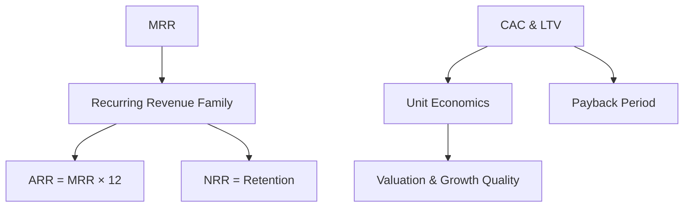
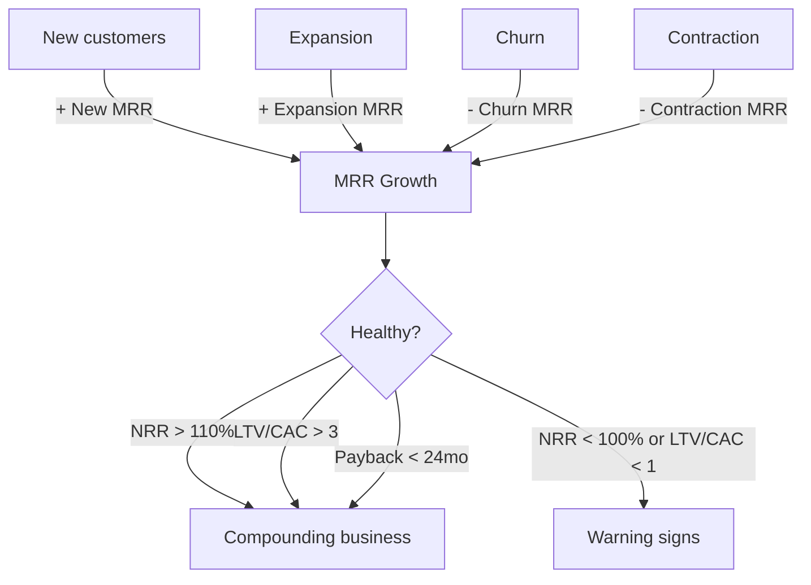

# SaaS Metrics

## What They Are

SaaS (Software-as-a-Service) companies are valued on **recurring revenue** and **growth efficiency** — not traditional GAAP metrics. These metrics tell investors how sticky, scalable, and efficient the business is.



---

## Revenue Metrics

### MRR — Monthly Recurring Revenue

Predictable revenue from active subscriptions in a month.

```
MRR = Σ (subscription price × subscribers)

100 customers × $100/month = $10,000 MRR
```

### ARR — Annual Recurring Revenue

MRR scaled to a yearly number (standardized, not actual billing).

```
ARR = MRR × 12

$10,000 MRR = $120,000 ARR
```

### MRR Components

| Component | What It Is |
|---|---|
| **New MRR** | From new customers |
| **Expansion MRR** | Existing customers upgrading (upsell/cross-sell) |
| **Churn MRR** | Customers cancelling/downgrading |
| **Contraction MRR** | Downgrades (less revenue per customer) |

```
Net MRR change = New + Expansion − Churn − Contraction
```

---

## Churn — The Leak Rate

The rate at which customers or revenue are lost.

| Type | Formula | Measures |
|---|---|---|
| **Customer Churn** | customers lost ÷ total customers | Count of lost accounts |
| **Revenue Churn** | MRR lost ÷ total MRR | Value of lost revenue |

```
Customer Churn = 10 lost / 500 total = 2%/month
Revenue Churn  = $5,000 lost MRR / $100,000 MRR = 5%/month

Revenue churn > customer churn → losing your BIGGEST customers
```

| Annual Churn | Quality | Example |
|---|---|---|
| < 5% | World-class (SMB SaaS) | Slack, Shopify apps |
| 5–10% | Good | Most healthy SaaS |
| 10–20% | Average | Enterprise (allowed, harder retention) |
| > 20% | Poor | Burning through customers |

---

## LTV — Lifetime Value

Total revenue one customer generates before leaving.

```
LTV = ARPU × Gross Margin ÷ Revenue Churn

ARPU = $100/month, churn = 5%/month, margin = 80%
LTV = (100 × 0.80) ÷ 0.05 = $1,600
```

**Key insight:** LTV is inversely proportional to churn. Halve the churn → double the LTV.

---

## CAC — Customer Acquisition Cost

Total cost to acquire one new customer.

```
CAC = Total Sales & Marketing spend ÷ New customers acquired

Spent $300,000 on marketing, acquired 100 new customers
CAC = $3,000
```

**What counts in CAC:** Marketing spend, sales salaries, commissions, tools.

---

## LTV : CAC Ratio

The most important SaaS unit economics ratio.

| Ratio | Meaning |
|---|---|
| LTV/CAC > 3 | Healthy — strong return on acquisition spend |
| LTV/CAC = 1–3 | Questionable — barely making money per customer |
| LTV/CAC < 1 | Broken — losing money on every customer acquired |

```
LTV = $1,600, CAC = $3,000
LTV/CAC = 0.53  →  business is broken (spend > lifetime value)
```

---

## Payback Period

How many months it takes to recover CAC from a customer's gross profit.

```
Payback = CAC ÷ (ARPU × Gross Margin)

CAC = $3,000, ARPU = $200/month, margin = 80%
Payback = 3000 / (200 × 0.8) = ~19 months

Healthy SaaS: payback in 12–24 months
```

---

## Retention — NRR vs GRR

| Metric | Formula | What It Excludes |
|---|---|---|
| **GRR (Gross Revenue Retention)** | Retained revenue ÷ prior revenue | Expansion |
| **NRR (Net Revenue Retention)** | Retained + expansion ÷ prior revenue | Nothing — includes upsells |

```
NRR > 100%  → revenue grows even with ZERO new customers
              (existing customers expand faster than churn)
NRR = 100%  → replacement rate (flat)
NRR < 100%  → shrinking (must keep acquiring to stand still)
```

**NRR > 110% is the golden SaaS signal** — the business compounds without spending on new customers.

---

## The SaaS Metric Stack



---

## Programming Analogy

```
SaaS Metrics = Product analytics for a subscription service

MRR      = current monthly subscription revenue (like monthly plan spend)
ARR      = annualized revenue run-rate
Churn    = cancellation rate (like monthly user deactivation %)
LTV      = total expected revenue per user before they churn
         (like projected lifetime value of an acquired user cohort)
CAC      = cost per acquired install/account
LTV/CAC  = return on acquisition spend (ROAS for subscriptions)
NRR      = expansion vs churn (like existing users growing usage)

All metrics = cohort analytics:
  track a group of users acquired in month X,
  measure how much revenue they generate over time

Churn is the most dangerous metric — fix churn first,
  it multiplies LTV, NRR, and payback all at once.
```

---

## Common Mistakes

- **Confusing MRR with bookings.** Bookings = contract signed (could be annual). MRR = monthly recognition. They differ by timing.
- **Ignoring revenue vs customer churn.** 2% customer churn could hide 10% revenue churn if big accounts leave. Watch both.
- **Forgetting payback period.** High LTV/CAC with a 5-year payback is still a cash-flow problem.
- **Reporting one-off revenue as MRR.** A one-time $120K deal is NOT $10K MRR. It's a lump sum.
- **Judging a seed-stage SaaS with mature benchmarks.** Early stage has high churn by definition — compare to stage, not to Slack.

---

## Interview Notes

- **System Design: "Design a subscription billing & metrics system"** — Track subscriptions as state machines (active/cancelled/upgraded), compute MRR from events, handle proration, upgrades, downgrades. Metrics as event-sourced aggregates.
- **Data Engineering: "NRR computation"** — Needs cohort-based analysis: group customers by acquisition month, sum revenue over time. Requires a customer-cohort fact table.
- **Behavioral: "Why is NRR the most important SaaS metric?"** — It measures whether existing revenue grows without new acquisition — the compounding engine. >110% = growth without increasing CAC.

---

## Revision Summary

| Metric | Formula Essence | Healthy Signal |
|---|---|---|
| MRR | Sub price × subscribers | Growing |
| ARR | MRR × 12 | Standardized annual number |
| Customer Churn | Customers lost ÷ total | < 5%/yr |
| Revenue Churn | MRR lost ÷ MRR | < 5%/yr |
| LTV | ARPU × margin ÷ churn | High |
| CAC | S&M spend ÷ new customers | Low |
| LTV/CAC | LTV ÷ CAC | > 3 |
| Payback | CAC ÷ monthly gross profit | < 24 months |
| NRR | (retained + expansion) ÷ prior | > 110% |

- Churn drives everything (LTV, NRR, payback)
- NRR > 100% = compounding without new customers
- LTV/CAC > 3 is the classic healthy threshold

---

← [↑ Phase 5](README.md) • [↑ Finance](../README.md) • [01-unit-economics](01-unit-economics.md) →
