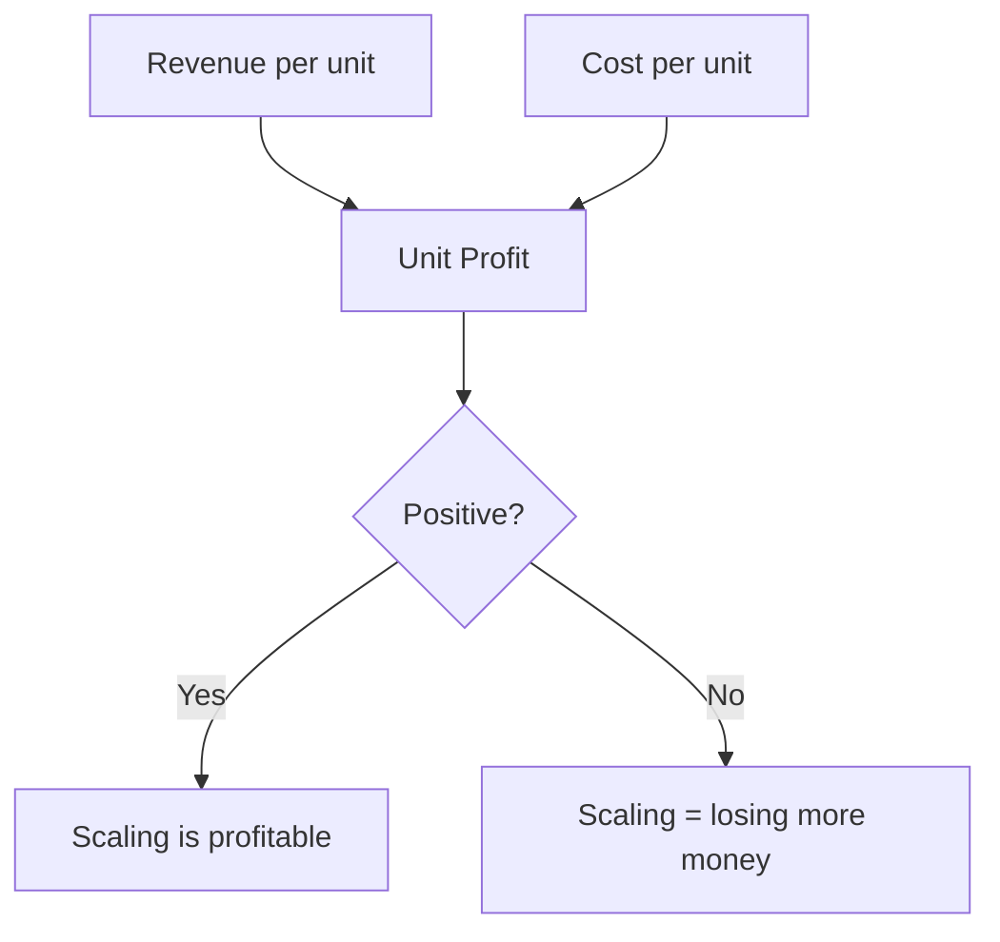
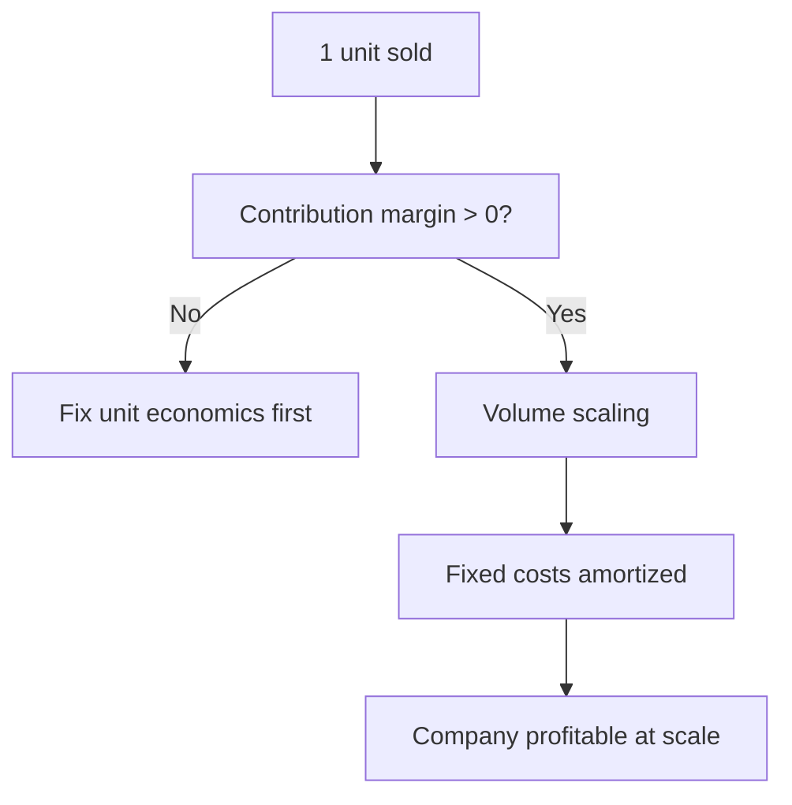

# Unit Economics

## What It Is

**Unit economics** is the profit or loss from ONE unit of business — one customer, one order, one trip, one widget. It answers: "Do we make money on each sale, before scale costs?"

```
If the unit economics don't work,
  scaling the business just scales the losses.
```



---

## Revenue per Unit vs Cost per Unit

**Revenue per unit** — the money from one transaction.

**Cost per unit** — everything needed to deliver that one transaction.

```
Example — one food delivery order:

Revenue per order:         $25  (customer pays)
Costs per order:
  Food cost (COGS)         $15
  Delivery commission       $ 4
  Packaging                 $ 2
  Cost per order           $21
────────────────────────────────────
Unit Contribution           $ 4
```

---

## Contribution Margin per Unit

The per-unit profit before fixed costs.

```
Contribution Margin = Revenue per unit − Variable cost per unit

Unit revenue:      $25
Variable costs:    $21
Contribution:      $ 4  (20% contribution margin)
```

**Key distinction:**
- **Variable costs** — scale with units (food, packaging, delivery)
- **Fixed costs** — constant regardless of volume (office, salaries)

A positive contribution margin means **each additional unit adds profit** (covers some fixed costs).

---

## The Rule of 40 (SaaS framing)

Growth + Profitability must sum to at least 40%.

```
Rule of 40: Revenue Growth% + Profit Margin% ≥ 40%

Company A: 50% growth, −10% margin  → 40 ✓
Company B: 20% growth, +20% margin  → 40 ✓
Company C: 10% growth, +10% margin  → 20 ✗ (unhealthy)
```

The rule captures the tradeoff: you can burn to grow, or be profitable — but not neither.

---

## Gross Margin per Unit

The most direct unit-economics test.

```
Gross Margin per unit = (Price − COGS) ÷ Price

SaaS seat:   $100/mo seat, $15/mo COGS → 85% margin
Retail item: $25 item, $15 COGS        → 40% margin
Airline seat: $200 fare, $160 fuel+catering → 20% margin
```

| Business | Typical Gross Margin |
|---|---|
| Software (SaaS) | 70–90% |
| Marketplace | 20–50% (take rate) |
| Retail | 20–40% |
| Airlines | 10–20% |

**Why SaaS is prized:** near-infinite marginal capacity (one server serves millions) → high unit margins.

---

## The Unit Economics Ladder



| Stage | Question | Metric |
|---|---|---|
| 1. Per unit | Does one sale profit? | Contribution margin |
| 2. Per cohort | Does the customer lifetime profit? | LTV vs CAC |
| 3. Per company | Do fixed costs get covered? | Break-even volume |

---

## CAC Payback and Break-even Volume

**Break-even volume** — units needed to cover fixed costs.

```
Fixed costs: $100,000/month
Contribution per unit: $4
Break-even = 100,000 ÷ 4 = 25,000 orders/month

Below 25K orders → losing money
Above 25K orders → profitable
```

**CAC payback** (from file 00): months to recover acquisition cost.

```
CAC = $3,000
Monthly gross profit per customer = $80
Payback = 3,000 ÷ 80 = 37.5 months  (long! — cash-hungry)
```

---

## Programming Analogy

```
Unit Economics = Cost per request / cost per user for your product

Revenue per unit = price of your API or subscription per user
Cost per unit    = infra cost to serve one user
                  (compute, storage, bandwidth)
Contribution margin = revenue per user − infra cost per user
  = the "take" after marginal cost

This is exactly cloud unit costing:
  revenue_per_user - (cost_per_request × requests_per_user)

Rule of 40 = growth vs profitability tradeoff,
  like spending on infra vs. margin — you can invest
  to grow, but the unit must eventually be positive.

If unit economics break, scaling traffic scales the loss.
  (More users × negative margin = more red)
```

---

## Common Mistakes

- **Scaling a broken unit model.** A negative contribution margin means every new customer loses money. Fix the unit before growing.
- **Ignoring contribution margin in favor of revenue.** Revenue growth without unit profit is just buying losses.
- **Confusing unit economics with company economics.** Great unit economics + huge fixed costs can still fail (unprofitably small).
- **Forgetting payback time.** A profitable unit with a 5-year payback starves the business of cash.
- **Using blended metrics.** Average contribution hides it: 80% of units may be unprofitable, 20% subsidize them. Check per-segment.

---

## Interview Notes

- **System Design: "Design a unit-economics dashboard"** — Ingests per-transaction revenue and cost events → aggregates by segment (product, region, cohort) → computes contribution margin, payback, break-even. Needs cost attribution per unit.
- **Data Engineering: "Cost per unit attribution"** — Allocate infra/fixed costs to units (driver-based allocation). Hard problem: shared costs (servers serving many products) must be fairly split.
- **Behavioral: "When is it OK to lose money per unit?"** — When the unit is a loss-leader for a profitable ecosystem (e.g., cheap hardware + profitable subscriptions). Only acceptable if the total customer economics work.

---

## Revision Summary

| Term | Definition |
|---|---|
| Unit Economics | Profit/loss per single unit of business |
| Revenue per Unit | Money from one transaction |
| Cost per Unit | Delivery cost of one transaction |
| Contribution Margin | Revenue − variable cost per unit |
| Fixed Costs | Constant regardless of volume |
| Break-even Volume | Fixed costs ÷ contribution margin |
| Rule of 40 | Growth% + margin% ≥ 40 |
| Gross Margin | (Price − COGS) ÷ Price |

- Fix unit economics before scaling
- Contribution margin must be positive
- Break-even volume = units to cover fixed costs

---

← [00-saas-metrics](00-saas-metrics.md) • [↑ Phase 5](README.md) • [↑ Finance](../README.md) • [02-operating-metrics](02-operating-metrics.md) →
