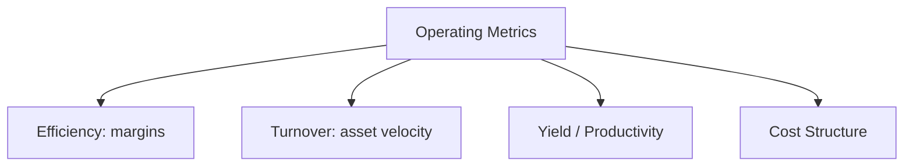
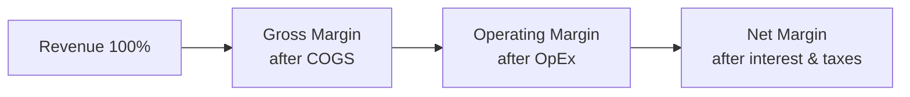
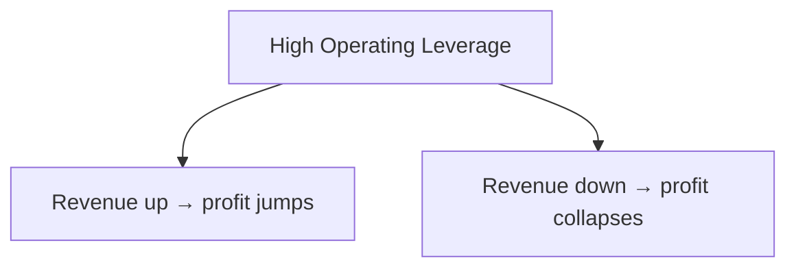

# Operating Metrics

## What They Are

**Operating metrics** measure how efficiently a company runs its day-to-day business — how well it converts inputs into outputs. They apply across industries, unlike SaaS-specific metrics.



---

## Margin Metrics

How much of each revenue dollar survives each stage.

| Metric | Formula | What It Shows |
|---|---|---|
| Gross Margin | Gross Profit ÷ Revenue | Production efficiency |
| Operating Margin | Operating Income ÷ Revenue | Full business efficiency |
| Net Margin | Net Income ÷ Revenue | Final profitability |
| EBITDA Margin | EBITDA ÷ Revenue | Cash profitability before non-cash/non-op |

```
Revenue:          $1,000
Gross Profit:     $600  → 60% gross margin
Operating Income: $200  → 20% operating margin
Net Income:       $120  → 12% net margin

Each stage strips more costs:
  Revenue → COGS → OpEx → Interest & Taxes
```

**Margin stack:**



---

## Turnover Metrics

How quickly assets cycle through the business.

| Metric | Formula | Interpretation |
|---|---|---|
| **Asset Turnover** | Revenue ÷ Total Assets | Revenue generated per $1 of assets |
| **Inventory Turnover** | COGS ÷ Average Inventory | Times inventory sold per year |
| **Receivables Turnover** | Revenue ÷ Avg Receivables | How fast customers pay |
| **Payables Turnover** | COGS ÷ Avg Payables | How fast the company pays suppliers |

### Days Calculations

```
Days Inventory Outstanding (DIO) = 365 ÷ Inventory Turnover
Days Sales Outstanding (DSO)     = 365 ÷ Receivables Turnover
Days Payable Outstanding (DPO)   = 365 ÷ Payables Turnover

Cash Conversion Cycle (CCC) = DIO + DSO − DPO
```

```
Example:
  DIO = 40 days, DSO = 45 days, DPO = 30 days
  CCC = 40 + 45 − 30 = 55 days
  → cash locked up for 55 days between paying suppliers
    and collecting from customers

Lower CCC = better (less capital tied up)
```

| Company | CCC | Meaning |
|---|---|---|
| Retail (inventory-heavy) | High positive | Cash tied in stock |
| SaaS | Negative | Collects upfront, pays later |
| Amazon | Negative | Pays suppliers after collecting |

---

## Yield / Productivity Metrics

Output per unit of input.

| Metric | Formula | Industry |
|---|---|---|
| Revenue per Employee | Revenue ÷ Headcount | Tech, services |
| Profit per Employee | Net Income ÷ Headcount | Services |
| Revenue per Sq. Foot | Revenue ÷ Store space | Retail |
| Occupancy Rate | Occupied units ÷ total units | Hotels, REITs |
| Load Factor | Seats sold ÷ total seats | Airlines |

**Revenue per Employee is a favorite efficiency proxy:**

```
SaaS: $250K+ per employee (software scales)
Services: $100–150K per employee (people-heavy)
Retail: $200–300K per employee (stores sell a lot)
```

---

## Cost Structure Ratios

How operating costs behave.

| Ratio | Formula | Meaning |
|---|---|---|
| OpEx Ratio | OpEx ÷ Revenue | Total overhead burden |
| R&D Ratio | R&D ÷ Revenue | Investment in future products |
| S&M Ratio | S&M ÷ Revenue | Cost of acquiring customers |
| Fixed vs Variable | Fixed costs ÷ total costs | Operating leverage |

**Operating leverage** — how profit responds to revenue changes.

```
High fixed costs + high volume = big profit swings
  (software, airlines, hotels — capital intensive, marginal cost ~0)

Low fixed costs = profit scales roughly linearly with volume
  (services, consulting)
```



---

## Programming Analogy

```
Operating Metrics = Efficiency & utilization metrics for infrastructure

Gross margin      = revenue − direct serving cost
Inventory turnover = how fast your assets cycle
  (like disk/queue throughput — stock sitting = capital idle)
Cash Conversion Cycle = working capital latency
  (DIO + DSO − DPO = time from paying suppliers to collecting)
  = like end-to-end latency of your cash pipeline
Asset turnover   = revenue per unit of infra (ROI on capex)
Revenue/employee = output per engineer (efficiency)
Operating leverage = fixed infra cost vs variable
  (idle servers = fixed costs; autoscale = variable)
```

---

## Common Mistakes

- **Ignoring the cash conversion cycle.** Two companies with the same margins can have very different cash needs (55 days vs 10 days).
- **Judging margins without context.** Gross margin means nothing without the industry benchmark (bank vs software).
- **Using revenue per employee across industries.** A capital-intensive factory and a consultancy aren't comparable.
- **Forgetting seasonality.** Turnover and margins swing by quarter (retail Q4 vs Q1).
- **Mixing one-off gains into margins.** Asset sale profits inflate operating margin for one period.

---

## Interview Notes

- **System Design: "Design an operational metrics platform"** — Ingest operational transactions → compute turnover, days (DIO/DSO/DPO), CCC → trend and benchmark against peers. Needs event-time + snapshot consistency.
- **Data Engineering: "CCC computation"** — Requires joining purchase, sale, and payment events across time. Days-based metrics are averages that hide distribution — compute deciles too.
- **Behavioral: "Why does Amazon run a negative CCC?"** — It collects from customers instantly, pays suppliers in 60+ days. Extreme working-capital efficiency is a competitive advantage (free financing).

---

## Revision Summary

| Family | Metrics | Core Question |
|---|---|---|
| Margins | Gross / Operating / Net | How much survives each stage? |
| Turnover | Asset, Inventory, Receivables | How fast do assets cycle? |
| Days | DIO, DSO, DPO, CCC | How long is cash locked up? |
| Yield | Rev/employee, occupancy, load | Output per unit input |
| Cost | OpEx, R&D, S&M ratios | How costs scale |

- CCC = DIO + DSO − DPO (cash latency)
- Margins need industry context
- Operating leverage explains profit volatility

---

← [01-unit-economics](01-unit-economics.md) • [↑ Phase 5](README.md) • [↑ Finance](../README.md) • [03-industry-kpis](03-industry-kpis.md) →
