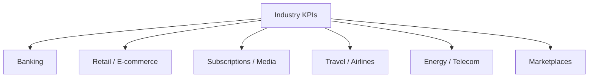
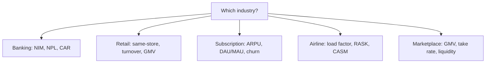

# Industry-Specific KPIs

## What They Are

Every industry has its own **KPIs** — the metrics that define performance in that business. A bank and an airline measure completely different things.



**Rule:** Use the industry's KPI, not generic ones. "What's a good gross margin for a bank?" is the wrong question.

---

## Banking

| KPI | Formula | What It Shows |
|---|---|---|
| **Net Interest Margin (NIM)** | (Interest earned − interest paid) ÷ Avg assets | Profitability of lending |
| **NPL Ratio** | Non-performing loans ÷ total loans | Credit quality |
| **Return on Assets (ROA)** | Net income ÷ total assets | Asset efficiency |
| **Capital Adequacy Ratio (CAR)** | Capital ÷ risk-weighted assets | Safety buffer |
| **Cost-to-Income Ratio** | Operating costs ÷ income | Efficiency |

**Banking insight:**
```
A bank borrows at 3%, lends at 7% → NIM = 4%
NIM is the bank's "gross margin" on money

NPL Ratio rising → loans not being repaid → danger signal
CAR below 8% → regulator steps in (Basel rules)
```

---

## Retail / E-commerce

| KPI | Formula | What It Shows |
|---|---|---|
| **Same-Store Sales** | Sales growth of existing stores only | Organic growth |
| **Inventory Turnover** | COGS ÷ average inventory | Stock movement speed |
| **GMV** | Gross Merchandise Value | Total transaction volume |
| **Take Rate** | Revenue ÷ GMV | % captured by the platform |
| **AOV** | Revenue ÷ # orders | Average order value |

**E-commerce insight:**
```
GMV = $1B but revenue (take rate 10%) = $100M
Analysts distinguish: GMV is volume, take rate is the real revenue

Same-store sales < total sales growth
  → growth is coming from new stores, not existing ones
```

---

## Subscriptions / Media

| KPI | Formula | What It Shows |
|---|---|---|
| **ARPU** | Revenue ÷ avg subscribers | Revenue per user |
| **Blended ARPU** | Total rev ÷ all users | Includes free users |
| **Paid Conversion** | Paying users ÷ total users | Funnel efficiency |
| **DAU / MAU** | Daily ÷ monthly actives | Engagement stickiness |
| **Engagement Ratio** | DAU ÷ MAU | How often users return |

```
DAU/MAU = 0.6 → users return 18 days/month (sticky)
DAU/MAU = 0.2 → users check in rarely (weak engagement)
```

---

## Airlines

| KPI | Formula | What It Shows |
|---|---|---|
| **Load Factor** | Seats sold ÷ total seats | Capacity utilization |
| **RASK** | Revenue ÷ available seat miles | Revenue efficiency |
| **CASM** | Cost ÷ available seat miles | Cost efficiency |
| **On-Time Performance** | On-time flights ÷ total | Operational quality |
| **RPM** | Revenue passenger miles | Total traffic |

**Airline insight:**
```
RASK vs CASM (yield vs cost per seat-mile):
  RASK > CASM → each seat-mile profitable

Load factor 85% is strong; below 70% → flying mostly empty
```

---

## Energy / Telecom

| KPI | Formula | What It Shows |
|---|---|---|
| **ARPU (Telecom)** | Revenue ÷ subscribers | Revenue per line |
| **Churn (Telecom)** | Lost subs ÷ total | Retention |
| **Capacity Factor (Energy)** | Actual output ÷ max possible | Plant utilization |
| **Average Realized Price** | Revenue ÷ units produced | Selling price per unit |

---

## Marketplaces

| KPI | Formula | What It Shows |
|---|---|---|
| **GMV** | Total transactions | Platform scale |
| **Take Rate** | Revenue ÷ GMV | Platform monetization |
| **Net Take Rate** | Gross profit ÷ GMV | Platform profitability |
| **Liquidity** | Buyers ÷ sellers | Matching efficiency |
| **Gross Booking Value** | Total bookings | Demand strength |

---

## Choosing the Right KPI



**The 3 questions to identify the KPI:**
1. What is the core transaction? (lending, selling, serving)
2. What does the company earn per unit? (NIM, take rate, ARPU)
3. What kills this business? (NPLs, churn, empty seats) → track that

---

## Programming Analogy

```
Industry KPIs = Domain-specific metrics (like software SLOs per product)

Bank NIM       = gross margin on lending (interest spread)
NPL ratio      = % of customers in default (like error rate on loans)
Take rate      = % revenue captured from platform volume
  (like your commission on marketplace transactions)
Load factor    = capacity utilization (like server utilization)
DAU/MAU        = retention/engagement (like weekly active users ratio)
ARPU           = revenue per user (like per-seat price)

The right KPI = the metric that would alert you FIRST if the
  core business breaks. Always track the "kill metric."

Same-store sales = like LFL (like-for-like) growth,
  excluding new stores — isolates organic growth
```

---

## Common Mistakes

- **Using the wrong industry's KPI.** Judging a bank by gross margin or a marketplace by net income alone misses the real drivers.
- **GMV ≠ revenue.** GMV is volume; take rate × GMV is revenue. Don't report GMV as revenue.
- **Ignoring the "kill metric."** For banks it's NPLs, for airlines load factor, for SaaS churn. Track the metric that signals death first.
- **Comparing KPIs across industries.** Load factor for an airline and ARPU for telecom are not comparable.
- **Trusting absolute KPIs without trend.** A 10% NPL ratio might be good for one bank and terrible for another — compare to peers and history.

---

## Interview Notes

- **System Design: "Design a KPI platform across industries"** — Store company fundamentals + industry classification (GICS) → serve the right KPI template per industry → compute, trend, benchmark.
- **Data Engineering: "Normalizing KPI definitions"** — GMV, ARPU, churn are defined differently by every company. Needs a canonical metric dictionary (like a metric store) to compare apples to apples.
- **Behavioral: "What KPI would you track for a marketplace?"** — GMV for scale, take rate for monetization, liquidity (buyer:seller ratio) for health — then NRR/churn for retention.

---

## Revision Summary

| Industry | Key KPIs |
|---|---|
| Banking | NIM, NPL ratio, ROA, CAR |
| Retail/E-com | Same-store sales, turnover, GMV, take rate, AOV |
| Subscription | ARPU, DAU/MAU, conversion, churn |
| Airlines | Load factor, RASK, CASM |
| Telecom/Energy | ARPU, churn, capacity factor |
| Marketplace | GMV, take rate, liquidity |

- Pick the KPI by the industry's core transaction
- Track the "kill metric" — what breaks first?
- GMV ≠ revenue (use take rate)

---

← [02-operating-metrics](02-operating-metrics.md) • [↑ Phase 5](README.md) • [↑ Finance](../README.md) • [04-business-model-terminology](04-business-model-terminology.md) →
