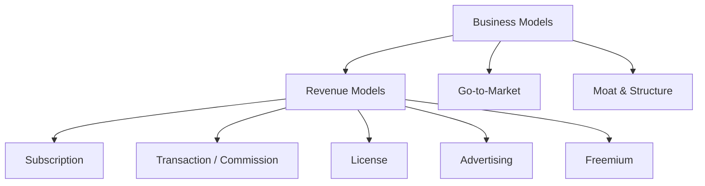

# Business Model Terminology

## What It Is

The vocabulary used to describe HOW a company makes money — its **business model** and **monetization**. Engineers hear these terms constantly in startup and investing conversations.



---

## Revenue Models

How revenue is generated.

| Model | How Money is Made | Example |
|---|---|---|
| **Subscription** | Recurring fee for continued access | Netflix, SaaS |
| **Transaction / Commission** | % of each transaction | Visa, Airbnb, Stripe |
| **License** | One-time or annual fee for rights | Microsoft (legacy), Oracle |
| **Advertising** | Selling attention | Google, Meta, YouTube |
| **Freemium** | Free base tier + paid premium | Dropbox, Spotify |
| **Marketplace** | Matching buyers/sellers, take rate | Amazon, Uber, eBay |
| **Hardware + Software** | Device sale + recurring service | Apple, Tesla |
| **Usage-based** | Pay for what you consume | AWS, Twilio, Snowflake |

### Subscription vs Transaction

```
Subscription: predictable, compounding (NRR from file 00)
  - Revenue known in advance
  - Needs retention to survive

Transaction: scales with volume, no retention needed
  - Revenue varies with usage
  - Needs scale to survive (take rate × GMV)
```

### Freemium Funnel


---

## B2B vs B2C

| Aspect | B2B (Business-to-Business) | B2C (Business-to-Consumer) |
|---|---|---|
| Buyer | Companies | Individuals |
| Deal size | Large ($10K–$1M+) | Small ($5–$100) |
| Sales cycle | Long (months, multiple stakeholders) | Short (minutes) |
| Churn | Low (contracts) | High (anytime) |
| Marketing | Sales-led, relationship | Brand-led, volume |
| Metric | NRR, ACV, CAC payback | DAU/MAU, conversion |

**SaaS monetization terms:**
- **ACV (Annual Contract Value)** — recurring value of a 1-year contract
- **ARR (Annual Recurring Revenue)** — total annualized subscriptions (file 00)
- **Expansion Revenue** — from existing customers (upsells)
- **Sales-led vs Product-led** — where growth comes from (sales teams vs self-serve)

---

## Go-to-Market Terms

| Term | Meaning |
|---|---|
| **TAM** | Total Addressable Market — all potential customers |
| **SAM** | Serviceable Addressable Market — reachable portion |
| **SOM** | Serviceable Obtainable Market — realistically winnable |
| **Top of Funnel** | Prospects (awareness) |
| **Conversion** | Prospect → paying customer |
| **Pipeline** | All open deals in progress |
| **Sales-led Growth** | Growth driven by sales teams |
| **Product-led Growth** | Growth driven by product virality/self-serve |

```
TAM > SAM > SOM
  All seafood      = TAM
  Seafood in Delhi = SAM
  Seafood I can actually sell = SOM
```

---

## Structure & Stage Terms

| Term | Meaning |
|---|---|
| **Burn Rate** | Monthly cash the company consumes |
| **Runway** | Months until cash runs out = Cash ÷ burn rate |
| **EBITDA** | Earnings before interest, taxes, D&A |
| **Free Cash Flow** | Operating CF − capex (Phase 2) |
| **Unit Economics** | Per-customer profit (file 01) |
| **Operating Leverage** | Fixed vs variable cost structure (file 02) |
| **Multiples** | Valuation as × revenue or × EBITDA (Phase 3) |

**Runway example:**
```
Cash: $10M, burn: $1M/month
Runway = 10 months to raise more capital or become profitable
```

---

## Public vs Private Market Terms

| Term | Meaning |
|---|---|
| **Pre-money** | Company value before new investment |
| **Post-money** | Pre-money + the new investment |
| **Dilution** | % of company given up to new investors |
| **Valuation** | What the company is worth |
| **Liquidity** | Ability to sell shares (file 05, Phase 1) |
| **Lockup** | Period insiders can't sell after IPO |
| **Secondary Sale** | Existing shareholders selling to new investors |
| **Down Round** | Fundraise at lower valuation than before |

```
Pre-money: $90M, invest $10M
Post-money: $100M → investor owns 10% (dilution)
```

---

## Programming Analogy

```
Business Models = Pricing & monetization patterns for a product

Subscription = monthly plan (recurring revenue)
Usage-based  = metered billing (pay per request/GB)
Freemium     = free tier → paid tier (conversion funnel)
Marketplace  = you charge a take rate on each transaction
             (like an app store's 15-30% commission)
Advertising  = monetizing attention (like ad networks)

TAM/SAM/SOM = market sizing for your product:
  All internet users → iOS users → your target segment

Burn rate / runway = your infra budget until funding
  (cash_left ÷ monthly_spend = months of runway)

Down round = raising at a lower valuation than before
  (like a down-round term sheet for a startup)
```

---

## Common Mistakes

- **Confusing revenue models with business models.** Subscription is a revenue model; "B2B SaaS" is a business model (that includes the revenue model).
- **TAM fantasy.** "We're addressing a $10B market" means nothing without SOM (what you can actually capture).
- **Ignoring burn/runway.** A growing startup with 3 months of runway is in crisis, no matter how good the metrics look.
- **Mixing pre-money and post-money.** Valuing a round at "$100M post" and "10% for $10M" is consistent; "$100M pre, 10% for $10M" is different (investor gets 9.09%).
- **Using subscription metrics on transaction businesses.** NRR applies to subscriptions; transaction businesses care about take rate and volume.

---

## Interview Notes

- **System Design: "Design a revenue-recognition system"** — Subscription revenue must be recognized monthly even if billed annually (Phase 2 accrual). Needs scheduling, proration, and revenue-schedule tables.
- **Data Engineering: "TAM/SAM/SOM modeling"** — Combine market data sources (population, industry size) with reachability assumptions. Often directional estimates, not precise values.
- **Behavioral: "Pick a business model for X"** — Walk through: who buys (B2B/B2C), how they buy (contract vs impulse), recurring or one-time (subscription vs transaction), and what the unit economics look like.

---

## Revision Summary

| Term | Definition |
|---|---|
| Business Model | How a company makes money |
| Revenue Model | Mechanism of revenue (subscription, transaction, ads) |
| TAM/SAM/SOM | Total → Serviceable → Obtainable market |
| ACV / ARR | Annual contract / annual recurring revenue |
| Burn Rate | Monthly cash consumption |
| Runway | Cash ÷ burn (months left) |
| Pre/Post-money | Valuation before/after investment |
| Freemium | Free tier + paid premium |
| Marketplace | Take rate on transactions |

- Know the core transaction → revenue model → KPIs
- Track runway and burn (cash is king)
- TAM is fantasy until you show SOM

---

← [03-industry-kpis](03-industry-kpis.md) • [↑ Phase 5](README.md) • [↑ Finance](../README.md) • [Next phase →](../phase-6-quantitative-finance/README.md)
