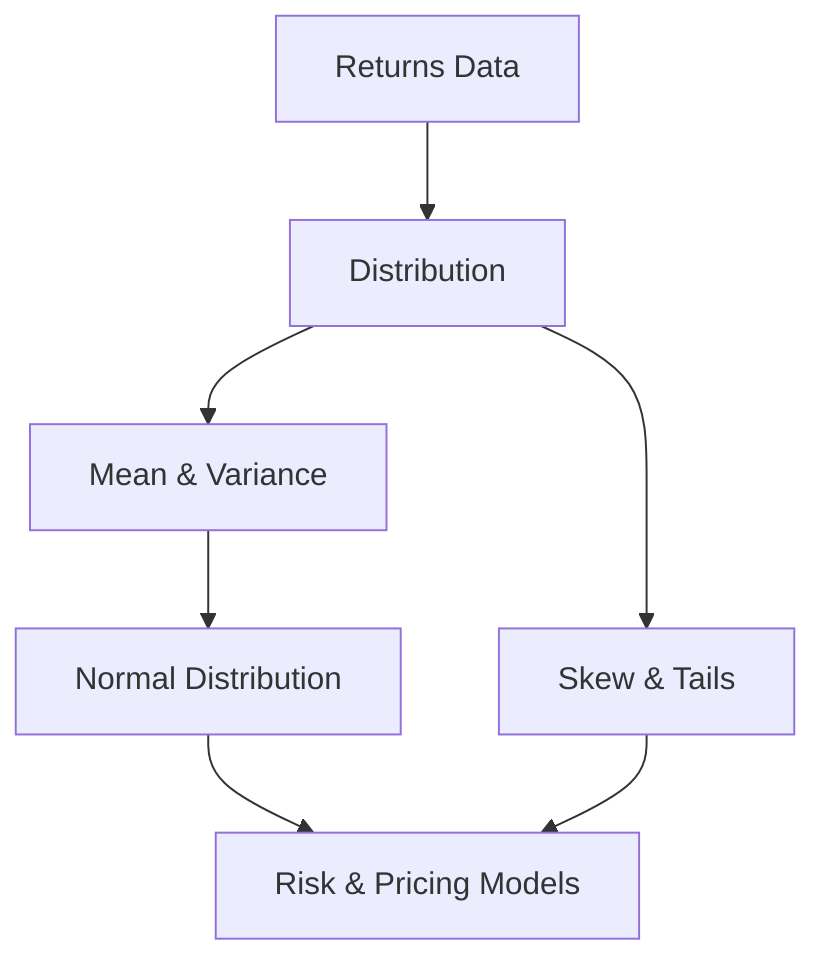
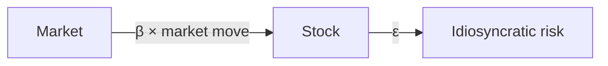

# Probability & Statistics for Finance

## What It Is

Markets are uncertain. **Probability** describes that uncertainty; **statistics** lets us infer patterns from data. Every quant model is built on these foundations.



---

## Returns

The change in price, expressed as a percentage.

```
Simple return = (P_t − P_prev) ÷ P_prev
Log return    = ln(P_t ÷ P_prev)

$100 → $110 → $99

Simple: +10%, then −10% → net −1%
Log:    +9.5%, then −10.5% → net 0% (correct compounding)
```

**Why log returns are preferred in quant:**
- Time-additive (log returns over days add up)
- Roughly normally distributed
- Never below −100% (logarithm of price can't be negative in the extreme)

---

## Key Statistics

| Statistic | Definition | Meaning |
|---|---|---|
| **Mean (μ)** | Average return | Expected return |
| **Variance (σ²)** | Avg squared deviation from mean | Spread of returns |
| **Standard Deviation (σ)** | √variance | Volatility — how wild the swings are |
| **Skewness** | Asymmetry of the distribution | Tail direction |
| **Kurtosis** | Tail thickness | Probability of extreme events |

```
Returns: +5%, −2%, +3%, −4%, +1%
Mean = (5 − 2 + 3 − 4 + 1)/5 = +0.6%
σ measures how far individual returns deviate from 0.6%
```

---

## The Normal Distribution

The bell curve — the default assumption in finance.

```
                    σ
              ┌─────────────┐
             ╱ │             │ ╲
           ╱   │             │   ╲
        ╱      │             │      ╲
    ────┴──────┴─────μ──────┴──────┴───
      μ−3σ    μ−2σ    μ     μ+2σ   μ+3σ

68% of returns fall within μ ± 1σ
95% within μ ± 2σ
99.7% within μ ± 3σ
```

**The 1-sigma rule in practice:**

```
Stock with daily σ = 1.5%
  Today's move beyond ±1.5% happens 32% of days
  A 3σ move (±4.5%) happens ~0.3% of days (1 in 300)
```

---

## Fat Tails — The Reality

Real market returns have **fat tails**: extreme events happen far more often than a normal distribution predicts.

| Distribution | Tail | Crash probability |
|---|---|---|
| Normal | Thin | 3σ crash: ~0.1% |
| Real markets | **Fat** | 3σ crash: ~2-5% (20-50× more often) |

```
Normal says: a 5σ market crash is essentially impossible
2008, 2020, 2022 happened anyway

→ The normal distribution UNDERESTIMATES tail risk
→ That's why "black swan" risk management exists
```

**Kurtosis captures this:** kurtosis > 3 (leptokurtic) = fat tails.

---

## Correlation and Beta

| Statistic | Definition | Meaning |
|---|---|---|
| **Correlation (ρ)** | −1 to +1, linear co-movement | Diversification power |
| **Covariance** | Avg product of deviations | Raw co-movement |
| **Beta (β)** | Covariance ÷ market variance | Stock's sensitivity to market |

```
β = 1 → moves with the market
β = 2 → moves 2× the market (high risk)
β = 0.5 → moves half the market (defensive)
β = −1 → moves opposite (hedge)
```

**Correlation breakdown:**
```
ρ = +1: stocks move together → no diversification
ρ = 0:  unrelated → diversification works
ρ = −1: move opposite → perfect hedge (rare in practice)
```



---

## Expected Value and Probability

```
Expected Value E[X] = Σ (outcome × probability)

Game: 60% chance of +$10, 40% chance of −$10
E[X] = 0.6 × 10 + 0.4 × (−10) = +$2  → positive expected value

Even though you might lose in any single trial,
  repeating this game many times makes +$2/trial the average.
```

**Law of large numbers:** with many trials, the average converges to the expected value. This is why quant funds run thousands of small bets.

---

## Programming Analogy

```
Probability & Stats = Core ML/data science toolkit

Returns      = time-series of percentage changes
Mean         = mean return (like model bias)
Variance/σ   = volatility (like model variance / uncertainty)
Normal dist  = assumption of Gaussian noise (like standard ML prior)
Fat tails    = heavy-tailed noise (like log-normal / outliers in data)
Correlation  = feature correlation matrix
Beta         = coefficient of regression on market factor
E[X]         = expected reward of a policy (RL framing)
LLN          = why averaging many samples reduces noise
```

---

## Common Mistakes

- **Assuming returns are normal.** Real returns have fat tails. Using normal-based VaR understates crash risk.
- **Adding percentages incorrectly.** Simple returns don't compound additively. Use log returns for multi-period math.
- **Confusing correlation with causation.** Two stocks moving together doesn't mean one causes the other.
- **Ignoring skew.** Negative skew means big down moves are more likely than big up moves.
- **Trusting small samples.** 20 days of data says almost nothing. Statistical significance requires many observations.

---

## Interview Notes

- **Quant: "Why do we use log returns?"** — Time-additivity, approximate normality, bounded below. The building block of all return models.
- **Risk: "Why did risk models fail in 2008?"** — Assumed normal distributions and stable correlations. Both broke in a crisis (fat tails + correlation spikes to 1).
- **ML: "How do you model fat tails?"** — Use heavy-tailed distributions (Student-t, GARCH), copulas for dependence, and scenario-based stress tests instead of pure Gaussian assumptions.

---

## Revision Summary

| Concept | Definition |
|---|---|
| Return | % price change (simple vs log) |
| Mean | Average return (expected return) |
| Volatility (σ) | Std dev of returns — risk measure |
| Normal Distribution | Bell curve, 68-95-99.7 rule |
| Fat Tails | Extreme events more likely than normal |
| Skewness | Asymmetry of returns |
| Kurtosis | Tail thickness |
| Beta | Sensitivity to market |
| Correlation | Co-movement, diversification power |
| E[X] | Probability-weighted average outcome |
| LLN | Average converges to expectation |

- Returns are fat-tailed, not normal
- Log returns compound correctly
- Diversification works through correlation < 1

---

← [↑ Phase 6](README.md) • [↑ Finance](../README.md) • [01-derivatives](01-derivatives.md) →
