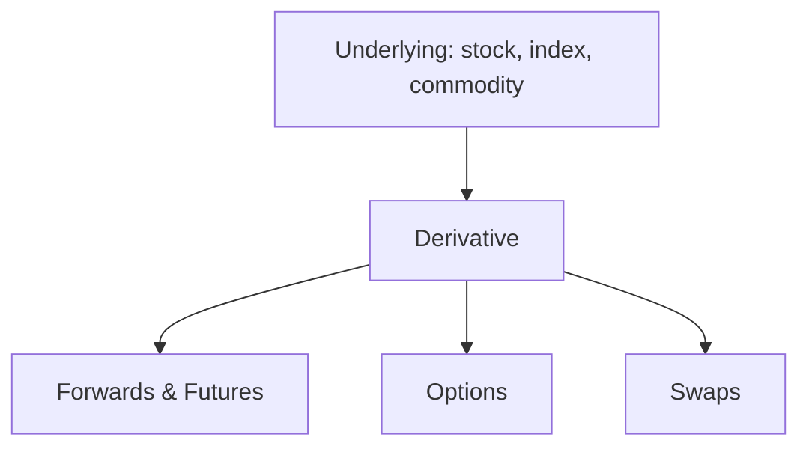

# Derivatives

## What They Are

A **derivative** is a financial contract whose value depends on ("is derived from") an underlying asset — a stock, index, commodity, currency, or interest rate.



| Derivative | Type | Key Feature |
|---|---|---|
| **Forward** | Agreement to trade later | Private, customized |
| **Future** | Standardized forward | Exchange-traded |
| **Option** | Right, not obligation | Optionality |
| **Swap** | Exchange of cash flows | Interest rate / currency |

---

## Forwards and Futures

An agreement to buy/sell an asset at a fixed price on a future date.

```
TODAY:  Agree to buy 100 barrels of oil at $80/barrel in 3 months
3 MONTHS LATER: Whatever the price is, you buy at $80

Oil rises to $90 → you profit (+$10/barrel)
Oil falls to $70 → you lose (−$10/barrel)
```

| | Forward | Future |
|---|---|---|
| Trading venue | Over-the-counter (private) | Exchange |
| Standardization | Customized | Standardized contracts |
| Counterparty risk | Yes (the other party may default) | No (clearinghouse guarantees) |
| Settlement | At maturity | Daily marked-to-market |
| Use case | Corporate hedging | Speculation, hedging |

**Forward vs Future settlement:**
```
Future = daily settlement (margin calls every day)
  Losses paid daily into margin account
  → default risk minimized via clearinghouse

Forward = single settlement at maturity
  → full counterparty risk for the duration
```

---

## Options

The **right but not obligation** to buy or sell an asset at a fixed price before/on a date.

| Option Type | Right | Bet |
|---|---|---|
| **Call** | Buy the asset at strike | Price will go UP |
| **Put** | Sell the asset at strike | Price will go DOWN |

| Term | Definition |
|---|---|
| **Strike Price** | Fixed price in the contract |
| **Expiry** | Last date the option is valid |
| **Premium** | Price paid to own the option |
| **In-the-money (ITM)** | Has intrinsic value |
| **Out-of-the-money (OTM)** | No intrinsic value |

### Payoff Diagrams

```
CALL (buy at strike $100)          PUT (sell at strike $100)

 Profit                            Profit
   │                                  │
   │╲                                 │          ╱
   │ ╲                                │        ╱
   │  ╲                               │      ╱
 ──┼───╲────────── price ──┼──────────╱───────── price
   │   ╲ premium            │   ╱
   │    ╲                   │  ╱
   │     ╲                  │ ╱
   │      ╲                 │╱
  −premium │               −premium

 Call profits when price > strike + premium
 Put profits when price < strike − premium
```

**Key asymmetric property:** buyer's loss is capped at the premium, upside is unlimited (call) or large (put).

---

## Options Terminology

| Term | Meaning |
|---|---|
| **Long** | Bought the option (have the right) |
| **Short** | Sold the option (obligation) |
| **Intrinsic value** | max(price − strike, 0) for calls |
| **Time value** | Premium − intrinsic (chance to become ITM) |
| **Moneyness** | ITM / ATM / OTM state |
| **Assignment** | Short side must fulfill the contract |

```
Call, strike $100, stock at $110:
  Intrinsic = 110 − 100 = $10
  If premium = $14 → time value = $4

As expiry nears, time value decays to 0 (theta).
```

---

## Swaps

Exchange of cash flows between two parties.

```
INTEREST RATE SWAP
Company A (fixed-rate borrower)  ⇄  Company B (floating-rate borrower)

A pays floating to B
B pays fixed to A
Net effect: each gets the payment stream they want
```

**Most common swap:** fixed ↔ floating interest rate. Used to convert a floating-rate loan into a fixed-rate one (or vice versa).

---

## Why Derivatives Exist

| Use | Purpose |
|---|---|
| **Hedging** | Lock in prices / reduce risk |
| **Speculation** | Bet on direction with leverage |
| **Arbitrage** | Exploit price differences |
| **Price discovery** | Futures/options reveal expected prices |

```
Hedging example:
  Airlines buy fuel futures to lock in jet fuel prices
  → immune to oil spikes, predictable costs

Speculation example:
  Buying a call option = leveraged bet with capped downside
```

---

## Programming Analogy

```
Derivatives = Contracts with conditionals (smart-contract logic)

Forward/Future = a scheduled deferred trade
  (like a transaction that settles at a future timestamp)

Option = a conditional trade
  if price > strike: execute buy (call)
  else: do nothing, lose the premium

Premium = option's price (like gas/option fee)
Swap = exchanging payment streams
  (like two services trading cash flows on a schedule)

Payoff functions = piecewise-linear functions
  call_payoff = max(spot − strike, 0) − premium

Long option = bounded loss, unlimited gain (like buying insurance)
Short option = collecting premium but unlimited risk (selling insurance)
```

---

## Common Mistakes

- **Thinking futures and options are the same.** Futures = obligation. Options = right. Huge difference in risk.
- **Ignoring the premium in payoff math.** A call can be ITM yet still lose money if the move is smaller than the premium paid.
- **Shorting options without understanding risk.** Selling a call has UNLIMITED loss potential (stock can rise forever).
- **Forgetting time decay.** Options lose time value daily — holding a long option against a flat stock bleeds value.
- **Overlooking counterparty risk in forwards.** Only exchange-traded futures eliminate it via clearinghouse + daily settlement.

---

## Interview Notes

- **System Design: "Design an options exchange"** — Match buy/sell orders, manage margin accounts, handle daily settlement and exercise/assignment. Needs an options chain (all strikes × expiries).
- **Risk: "Why do clearinghouses exist?"** — They act as counterparty to every trade, net positions, and require margin. This removes bilateral default risk (like a central settlement layer).
- **Quant: "How do you hedge with futures?"** — Compute the hedge ratio (β or delta from file 00/04): number of futures contracts = exposure ÷ contract size. Rebalance as the ratio changes.

---

## Revision Summary

| Derivative | Definition | Risk Profile |
|---|---|---|
| Forward | Customized future agreement | Counterparty risk |
| Future | Standardized, exchange-traded | Margin calls, no default risk |
| Call Option | Right to buy | Loss capped at premium |
| Put Option | Right to sell | Loss capped at premium |
| Swap | Exchange of cash flows | Ongoing, mutual |

| Term | Meaning |
|---|---|
| Strike | Fixed contract price |
| Premium | Cost of an option |
| ITM/ATM/OTM | Moneyness |
| Long/Short | Bought / sold |
| Intrinsic vs time value | Real value vs chance value |

- Futures = obligation; options = right
- Option loss capped, short option risk unlimited
- Derivatives are for hedging, speculating, arbitrage

---

← [00-probability-statistics](00-probability-statistics.md) • [↑ Phase 6](README.md) • [↑ Finance](../README.md) • [02-options-pricing](02-options-pricing.md) →
