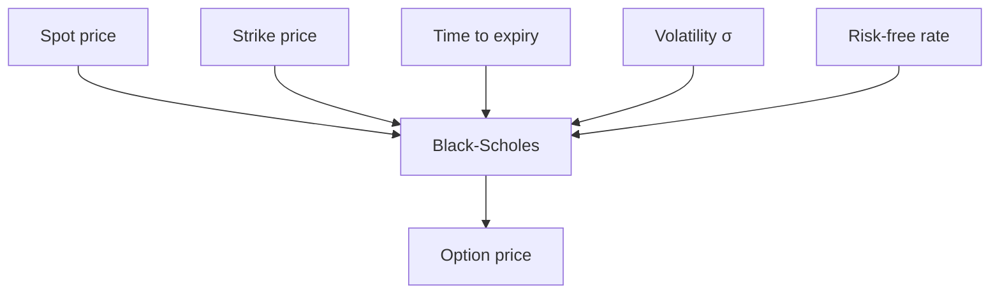
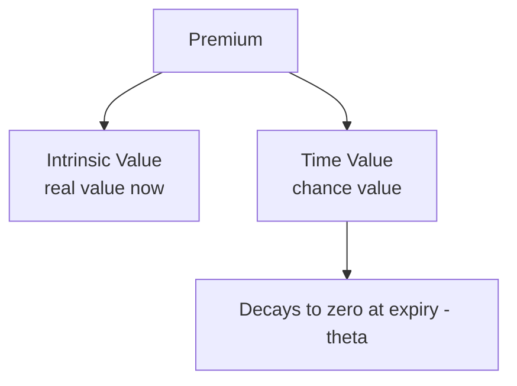
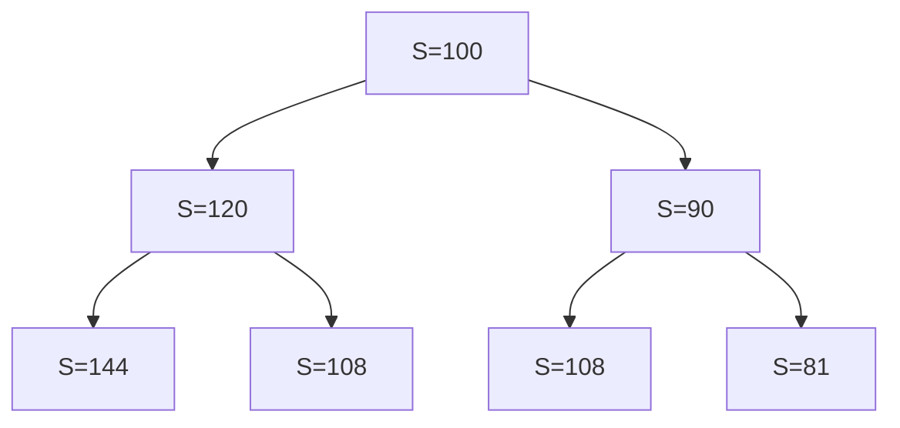

# Options Pricing Models

## What It Is

An **options pricing model** computes the fair value (premium) of an option. It answers: "What should this option cost, given the asset's price, volatility, time, and interest rates?"



---

## The Inputs

| Input | Symbol | What It Means |
|---|---|---|
| Spot price | S | Current asset price |
| Strike price | K | Fixed contract price |
| Time to expiry | T | Time remaining |
| Volatility | σ | Expected price fluctuation |
| Risk-free rate | r | Interest on safe assets |

**Volatility is the star input** — it's the only one that's unknown and driving. All others are observable.

```
Higher volatility → higher option price
  (more chance of big moves → the option is worth more)

Two options identical except σ:
  σ = 15% → premium $2.00
  σ = 40% → premium $5.50
```

---

## Intrinsic vs Time Value

```
Option price = Intrinsic value + Time value

Intrinsic = max(S − K, 0) for a call   (what you'd get if exercised now)
Time value = the rest (chance the option becomes more valuable)

Stock $110, call strike $100:
  Intrinsic = $10
  Premium = $14 → time value = $4

At expiry: time value = 0 → option = intrinsic only
```



---

## Black-Scholes Model

The classic closed-form model (1973). Computes an exact option price from the five inputs.

```
Call = S × N(d1) − K × e^(−rT) × N(d2)

d1 = [ln(S/K) + (r + σ²/2)T] / (σ√T)
d2 = d1 − σ√T
N(x) = standard normal cumulative distribution
```

**What it assumes (the catch):**
- Returns are log-normally distributed (from file 00)
- Constant volatility σ
- Constant risk-free rate
- No dividends
- Continuous trading, no transaction costs

```
The famous weakness: real volatility isn't constant.
  Market quotes "implied vol" per strike/expiry — the σ
  that makes the model output match the market price.

If the model were perfect, implied vol would be flat.
  In reality it's a "volatility smile" → the model is wrong,
  and traders price around that with volatility surfaces.
```

---

## The Greeks

How the option price responds to each input. Risk managers track these to hedge.

| Greek | Sensitivity to | Meaning |
|---|---|---|
| **Delta (Δ)** | Spot price | Price change per $1 asset move (0 to 1 calls) |
| **Gamma (Γ)** | Delta | How fast delta changes (acceleration) |
| **Theta (Θ)** | Time decay | Daily value loss (always negative for longs) |
| **Vega (ν)** | Volatility | Price change per 1% vol change |
| **Rho (ρ)** | Interest rate | Price change per 1% rate change |

```
Example — a call with:
  Delta 0.60, Gamma 0.05, Theta −0.02, Vega 0.10

Stock +$1 → option +$0.60
Vol +1%  → option +$0.10
1 day passes → option −$0.02

Delta-hedging: buy Δ shares to offset price moves
  (a market-maker stays neutral by holding Δ units of the stock)
```

---

## Binomial Model

A discrete-time alternative — models the asset stepping up or down over time.

```
        $120  (S × u)
       ╱
$100 ──
       ╲
        $90   (S × d)

Compute option value at each final node,
then work backwards discounting probabilities.
```



**Why it matters:** Handles early exercise (American options), dividends, and changing parameters naturally. More steps = closer to Black-Scholes.

---

## Implied Volatility

The market's view of future volatility, backed out of option prices.

```
Market price an option at $5.50
Black-Scholes with σ=40% → $5.50
Implied vol = 40%

A high implied vol → market expects big moves
  (often after a crash — fear raises option prices)
```

**Volatility smile / skew:**
```
Implied vol isn't flat across strikes — it forms a "smile"
  (OTM options often carry higher implied vol)

Equity markets: crash risk is priced in
  → OTM puts carry extra implied vol (downward skew)
```

---

## Programming Analogy

```
Black-Scholes = a closed-form pricing function
  price = f(S, K, T, σ, r)
  (like an exact analytical formula for a computation)

Binomial model = dynamic programming
  build a tree forward, compute payoffs,
  then backward-induct discounted values
  (like DP on a lattice — more flexible, more compute)

Greeks = partial derivatives / sensitivity analysis
  delta = ∂price/∂S, vega = ∂price/∂σ
  (autograd-style sensitivities of the pricing function)

Implied vol = inverse problem
  given price, solve for σ (root-finding / Newton's method)

Options pricing = a great benchmark for numerical methods:
  closed-form (BSM), lattice (binomial), MC simulation
```

---

## Common Mistakes

- **Thinking Black-Scholes is reality.** It's a model with assumptions. Real markets violate them (constant vol, no dividends, continuous trading).
- **Ignoring theta.** Long options bleed value daily. Holding to "wait for the move" costs real money.
- **Confusing implied and historical volatility.** Historical σ is what happened; implied σ is what the market prices for the future.
- **Forgetting dividends and early exercise.** American options can be exercised early (usually before dividends) — Black-Scholes doesn't handle this; binomial does.
- **Treating the Greeks as static.** Delta, gamma change constantly as the asset moves and time passes. Hedges need rebalancing.

---

## Interview Notes

- **Quant: "Derive/explain Black-Scholes"** — Walk the five inputs, the formula structure, the key assumptions, and the no-arbitrage logic behind it.
- **Risk: "How do you delta-hedge?"** — Hold Δ shares per option to offset instantaneous price moves; rebalance as Δ changes (gamma makes this imperfect).
- **System Design: "Design an options pricing & risk service"** — Price via BSM (fast, closed form) with a binomial/MC fallback; compute the Greeks for every contract; maintain an implied-vol surface.

---

## Revision Summary

| Concept | Definition |
|---|---|
| Option Price | Intrinsic + time value |
| Black-Scholes | Closed-form pricing model (5 inputs) |
| Binomial Model | Discrete tree, handles early exercise |
| Implied Volatility | σ that makes model price = market price |
| Delta | Price sensitivity to spot |
| Gamma | Delta sensitivity to spot |
| Theta | Daily time decay |
| Vega | Price sensitivity to volatility |
| Volatility Smile | Implied vol varies by strike |

- Higher vol → higher option price
- Time value decays to zero at expiry
- Greeks = sensitivities for hedging
- Models assume a lot; real markets violate it

---

← [01-derivatives](01-derivatives.md) • [↑ Phase 6](README.md) • [↑ Finance](../README.md) • [03-interest-rate-models](03-interest-rate-models.md) →
