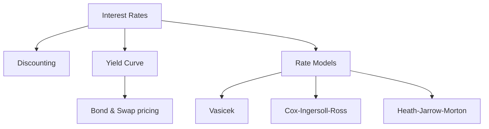

# Interest Rate Models

## What It Is

**Interest rate models** describe how interest rates evolve over time — the foundation for pricing bonds, swaps, and other rate-dependent instruments.



---

## Why Rates Matter

Rates are the "risk-free" benchmark — everything is discounted by them.

| Use | Role |
|---|---|
| Bond pricing | Discount future coupons |
| Option pricing | Black-Scholes r input (file 02) |
| Swap pricing | Fixed leg vs floating leg |
| DCF | WACC risk-free component (Phase 3) |
| Corporate value | Higher rates → lower valuations |

```
Rate ↑ → discount factor ↓ → present value of future cash ↓
  → bond prices fall, growth stocks fall, DCFs shrink
```

---

## The Yield Curve

Rates across different maturities — the graph of "borrow money for 1, 2, 5, 10 years."

```
Rate (%)

 4 ─                              ● (10y)
 3 ─               ● (5y)
 2 ─     ● (2y)
 1 ─ ● (1y)
 0 ─────────────────────────────
     1y     2y      5y      10y
```

| Curve Shape | Meaning |
|---|---|
| **Normal** (upward) | Long rates > short rates — healthy economy |
| **Inverted** (downward) | Short rates > long rates — recession warning |
| **Flat** | Markets expect little change |

**Why the curve inverts:** when markets fear a recession, they lock in long-term rates now → long yields fall below short yields.

**Term structure of rates:**
```
Spot rate: the yield on a zero-coupon bond maturing at time T
Forward rate: the rate locked in today for a loan starting in the future
  (derivable from the spot curve — no arbitrage)

Forward = implied by the curve, not quoted directly
```

---

## Short-Rate Models

Model the **short rate** r(t) — the rate on a very short maturity — and let all other rates derive from it.

### Vasicek Model

The classic mean-reverting model.

```
dr(t) = κ(θ − r(t)) dt + σ dW

κ (kappa): speed of reversion (how fast rates snap back)
θ (theta): long-term mean rate
σ: volatility of rates
dW: random shock (Brownian motion)
```

| Feature | Meaning |
|---|---|
| Mean reversion | Rates tend back to θ |
| κ high | Fast reversion (stable rates) |
| κ low | Slow reversion (wandering rates) |
| σ high | Wild rate swings |
| **Weakness** | Rates can go negative |

**Mean reversion intuition:**
```
θ = 4%, current r = 2%, κ = 0.5
  Drift = 0.5 × (4 − 2) = +1% per year toward 4%
  (plus random shocks)

Higher rates than θ → pulled DOWN toward θ
Lower rates than θ → pulled UP toward θ
```

### Cox-Ingersoll-Ross (CIR)

Vasicek plus a fix: volatility scales with the rate level → **rates stay positive**.

```
dr(t) = κ(θ − r(t)) dt + σ√r(t) dW

The √r term makes volatility smaller as rates approach zero
  → prevents negative rates
```

| | Vasicek | CIR |
|---|---|---|
| Volatility | Constant σ | σ√r (level-dependent) |
| Negative rates | Possible | Avoided |
| Use | Analytical tractability | Realistic short rates |

---

## Modern Approaches

### Heath-Jarrow-Morton (HJM)

Models the **entire forward-rate curve** at once, not just the short rate.

```
Rather than one rate, HJM evolves the whole curve of
forward rates simultaneously — consistent with market
observations (no arbitrage by construction)

More general, more complex, needs Monte Carlo simulation
```

### LIBOR / SOFR Transition

```
LIBOR (manipulated, discontinued) → SOFR (actual overnight rate)

2023: LIBOR fully phased out
  → modern rate models built on SOFR / risk-free rates
```

---

## Programming Analogy

```
Interest Rate Models = Stochastic processes for time-series

Vasicek = an Ornstein-Uhlenbeck process
  dX = κ(θ − X)dt + σ dW
  = mean-reverting random walk
  (like a service whose load reverts to a baseline)

Mean reversion = tendency to return to equilibrium
  (autoscaling pulling load back to target)
κ = how aggressively it reverts
σ = how noisy the shocks are

CIR = Vasicek with vol ∝ √level
  (heteroskedastic noise — bigger when level is high)

HJM = modeling the full curve, not one number
  (like tracking the whole time-series surface)

Simulation: Euler discretization of the SDE, then Monte Carlo
  for path-dependent pricing
```

---

## Common Mistakes

- **Assuming rates are constant.** The Black-Scholes constant-r assumption breaks for long-dated options and bonds. Rates move.
- **Ignoring mean reversion.** Rates don't wander forever — they revert. Models without reversion overestimate long-horizon rate risk.
- **Confusing spot and forward rates.** Forward rates are implied by the curve and differ from current spot rates.
- **Misreading an inverted curve.** It's a strong recession signal (historically), not a random blip.
- **Using pre-2023 LIBOR models.** LIBOR is gone; models must use SOFR/risk-free rates.

---

## Interview Notes

- **Quant: "Explain mean reversion"** — Rates pull toward a long-term mean θ with speed κ, plus random noise. This matches observed behavior and keeps models stable at long horizons.
- **Risk: "Why is the yield curve inverted a warning?"** — Long rates below short rates implies markets expect future short rates to fall (recession). Historically a reliable leading indicator.
- **System Design: "Design a bond pricing service"** — Build a spot curve from market yields, bootstrap forward rates, price bonds by discounting cash flows. Handle day-count conventions.

---

## Revision Summary

| Concept | Definition |
|---|---|
| Interest Rate | Price of borrowing money |
| Yield Curve | Rates by maturity |
| Normal / Inverted | Long > short / short > long |
| Spot Rate | Zero-coupon yield at T |
| Forward Rate | Future loan rate implied today |
| Vasicek | Mean-reverting, constant vol |
| CIR | Mean-reverting, vol ∝ √level (positive rates) |
| HJM | Models the full forward curve |
| Mean Reversion | Rates pull toward θ |

- Rates drive all discounting and pricing
- Vasicek = OU process; CIR fixes negative rates
- Inverted curve = recession warning

---

← [02-options-pricing](02-options-pricing.md) • [↑ Phase 6](README.md) • [↑ Finance](../README.md) • [04-risk-modeling](04-risk-modeling.md) →
