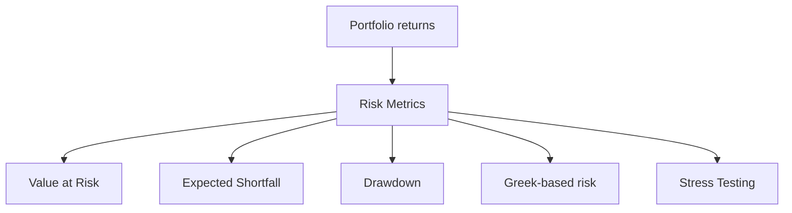
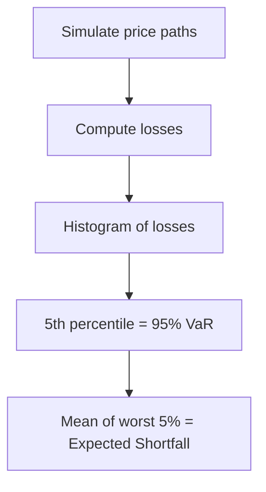

# Risk Modeling

## What It Is

**Risk modeling** quantifies how much money a portfolio can lose and under what conditions. It's how banks, funds, and regulators answer: "How bad can it get?"



---

## The Risk Metric Family

| Metric | Question Answered | Weakness |
|---|---|---|
| **VaR (Value at Risk)** | "Worst loss 95% of the time" | Ignores the tail beyond it |
| **Expected Shortfall (CVaR)** | "Average loss in the worst 5%" | Needs the tail distribution |
| **Max Drawdown** | "Biggest peak-to-trough fall" | Historical, not forward |
| **Volatility (σ)** | "How much does it swing?" | No direction, no tail info |
| **Beta** | "How sensitive to market?" | Only captures market risk |

---

## Value at Risk (VaR)

The maximum loss expected over a horizon with a given confidence level.

```
"95% VaR of $10M over 1 day"
  → 95% of days you lose at most $10M
  → 5% of days you lose MORE (could be much more)

VaR = the 5th percentile of the loss distribution
```

**Three methods to compute VaR:**

### 1. Historical VaR

Use actual past returns, read off the percentile.

```
Past 250 daily portfolio returns sorted:

  5th worst day = −$8M
  95% daily VaR = $8M (5% of days worse)

  No distribution assumption — just history
```

### 2. Parametric VaR (Variance-Covariance)

Assume returns are normal, use μ and σ.

```
VaR = Z × σ × √T − μ

95% VaR (Z = 1.65): 1.65 × σ × √T
99% VaR (Z = 2.33): 2.33 × σ × √T

Portfolio σ = $3M/day
95% 1-day VaR = 1.65 × 3M = $4.95M
10-day VaR = 4.95M × √10 = $15.7M
```

**Square root of time rule:** VaR scales with √T (not T).

### 3. Monte Carlo VaR

Simulate thousands of possible price paths, read the percentile.

```
1. Model returns (from file 00/06)
2. Simulate 10,000 price paths
3. Compute portfolio loss on each path
4. 5th percentile loss = 95% VaR

Handles complex portfolios, options, non-linearities
  → the most flexible, most expensive
```



---

## Expected Shortfall (CVaR)

The average loss **beyond** the VaR cutoff — the real tail risk.

```
95% VaR = $10M     (5% of days lose more than $10M)
95% ES  = $18M     (when you DO exceed VaR, you average $18M lost)

ES answers: "given the bad day happens, how bad is it?"
```

| | VaR | ES (CVaR) |
|---|---|---|
| Definition | Loss at 5% cutoff | Average loss in worst 5% |
| Tail risk | Ignores it | Captures it |
| Sub-additive | Can violate | Always sub-additive |
| Basel III | Old standard | Preferred for capital |

---

## Drawdown

The peak-to-trough decline of a portfolio.

```
Peak value: $100M  →  trough: $75M
Max drawdown = (75 − 100) / 100 = −25%

Takes +33% gain just to recover a −25% loss
  (recovery isn't symmetric)
```

**Loss recovery table:**

| Loss | Gain needed to recover |
|---|---|
| −10% | +11% |
| −25% | +33% |
| −50% | +100% |
| −90% | +900% |

**Key insight: drawdowns are asymmetric — losing half your money requires doubling to get back.**

---

## Stress Testing

Model specific crisis scenarios, not just statistical percentiles.

| Scenario | Shock |
|---|---|
| 2008-style | Housing crash, credit freeze |
| 2020-style | Global pandemic lockdown |
| Rate spike | +300 bps overnight |
| Commodity shock | Oil triples |

```
Regular VaR: "5% of days lose $10M"
Stress test: "What happens if rates jump 300bps AND stocks fall 20% AND
             credit spreads blow out simultaneously?"

Stress tests capture correlations breaking down
  (from file 00: correlations spike to 1 in a crisis)
```

---

## Programming Analogy

```
Risk Modeling = Reliability & capacity planning for your system

VaR       = p95 worst-case latency / budget overrun
ES (CVaR) = average cost when you DO breach the SLO
  (real tail: "how bad is the worst 5% of failures?")
Drawdown  = max historical degradation (peak to trough of service health)
σ scaling = risk grows with √time (like error accumulation over N days)
Monte Carlo = simulating failure scenarios to estimate tail risk
Stress test = chaos engineering (kill the datacenter, what happens?)
  vs VaR which assumes normal "traffic" conditions

Key principle: VaR hides the tail. You must model the
  worst 5% explicitly (ES + stress tests), not just the boundary.
```

---

## Common Mistakes

- **Trusting VaR as "maximum loss."** VaR is a cutoff, not a cap. The worst 5% can be catastrophically worse than the VaR number.
- **Assuming normality.** Parametric VaR with Gaussian assumptions misses fat tails (file 00) — exactly the events that matter.
- **Ignoring the square-root-of-time rule.** 10-day VaR isn't 10× daily VaR, it's ×√10.
- **Forgetting correlations break down.** Diversification works in normal times; in a crash everything falls together.
- **Using historical VaR on new regimes.** Past data may not represent the future (crypto in 2017 ≠ crypto in 2022).

---

## Interview Notes

- **Risk: "VaR vs Expected Shortfall?"** — VaR tells you the cutoff; ES tells you the average damage beyond it. Basel moved toward ES because VaR underestimates tail risk.
- **Quant: "How do you compute VaR for a portfolio with options?"** — Options are non-linear; use Monte Carlo or delta-gamma approximations, not simple parametric.
- **System Design: "Design a real-time risk system"** — Stream positions and prices → compute P&L → VaR/ES per desk and portfolio → breach alerts → stress-test scheduler.

---

## Revision Summary

| Metric | Formula Essence | Captures |
|---|---|---|
| VaR | Loss at (1−c) percentile | The cutoff |
| ES / CVaR | Mean of tail beyond VaR | The tail |
| Max Drawdown | Peak-to-trough % | Worst historical fall |
| Parametric VaR | Z × σ × √T | Gaussian risk |
| Historical VaR | Empirical percentile | Past reality |
| Monte Carlo VaR | Simulated percentile | Complexity |
| Stress Test | Scenario shocks | Correlation breakdown |

- VaR hides the tail — use ES too
- Risk scales with √time
- Drawdowns are asymmetric (recovery needs more)
- Correlations spike to 1 in crises

---

← [03-interest-rate-models](03-interest-rate-models.md) • [↑ Phase 6](README.md) • [↑ Finance](../README.md) • [05-backtesting](05-backtesting.md) →
