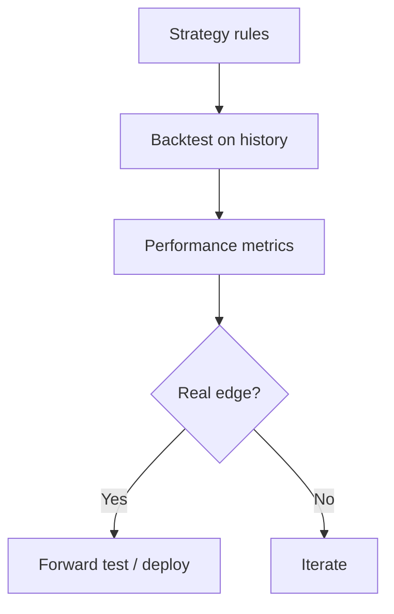
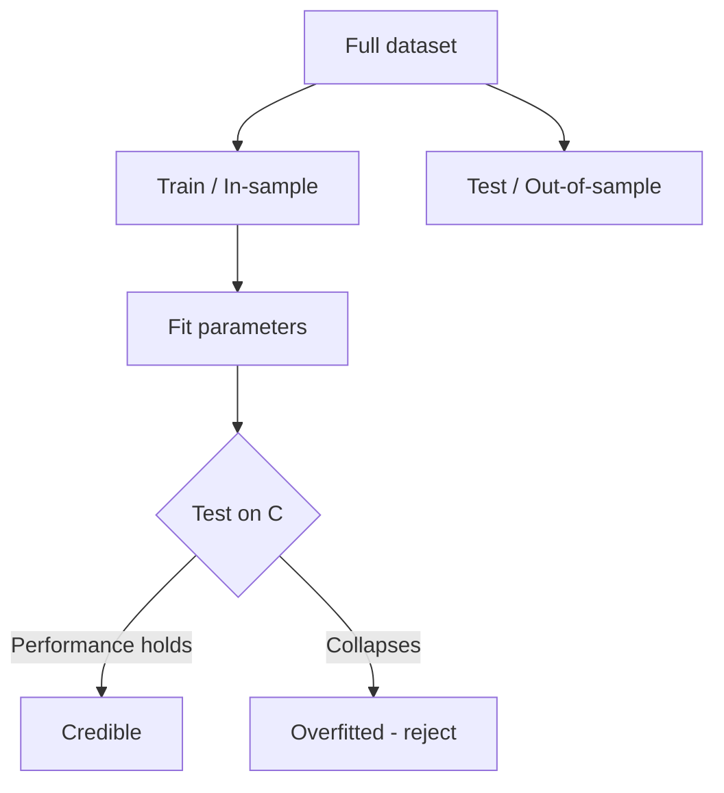

# Backtesting

## What It Is

**Backtesting** is testing a trading strategy on historical data to see how it would have performed. It's how you validate an idea before risking real money.



---

## The Pipeline

```
1. Define the strategy (entry, exit, position sizing, stops)
2. Load historical data (prices, volume, fundamentals)
3. Simulate trades following the rules
4. Compute performance metrics
5. Test robustness (out-of-sample, walk-forward)
6. Decide: deploy or reject
```

---

## Critical: Avoid Lookahead Bias

The #1 backtesting error — using information that wasn't available at the time of the trade.

```
WRONG (lookahead):
  Compute the 50-day moving average over the FULL dataset,
  then "trade" as if you knew it each day

RIGHT (point-in-time):
  At each day t, use ONLY data up to day t
  → MA(50) computed with data ≤ t
```

**Sources of lookahead bias:**
- Using future prices in indicators (center-of-range, future high/low)
- Using restated fundamental data (values revised later)
- Survivorship bias: only testing stocks that still exist (survivors)
- Using index membership that wasn't known then

---

## Other Backtest Pitfalls

| Pitfall | Description | Fix |
|---|---|---|
| **Overfitting** | Strategy tuned to noise, not signal | Out-of-sample testing |
| **Ignoring costs** | No commissions/spread/slippage | Model transaction costs |
| **Unrealistic fills** | Assuming fills at perfect prices | Use next-bar open, slippage |
| **Not modeling capacity** | Big strategy can't execute at scale | Cap size by liquidity |
| **Data errors** | Bad/split-unadjusted data | Clean & adjust (splits, dividends) |

**Overfitting example:**
```
Tune 20 parameters until the backtest shows 50% annual returns
→ The strategy is now fitted to random noise
→ It will likely FAIL on new data

Classic fix: hold out the last 20-30% of data as a test set.
If performance collapses out-of-sample, it was overfitted.
```

---

## Performance Metrics

| Metric | Formula Essence | Meaning |
|---|---|---|
| **CAGR** | Annualized return | Growth per year |
| **Volatility (σ)** | Std of returns | Risk |
| **Sharpe Ratio** | (Return − r_f) ÷ σ | Return per unit of risk |
| **Sortino Ratio** | (Return − r_f) ÷ downside σ | Return per unit of BAD risk |
| **Max Drawdown** | Peak-to-trough | Worst decline |
| **Win Rate** | Winning trades ÷ total | Hit frequency |
| **Profit Factor** | Gross profit ÷ gross loss | Reward vs cost |

### Sharpe Ratio — the headline metric

```
Sharpe = (Portfolio return − risk-free rate) ÷ Portfolio σ

Annualized return: 12%, risk-free: 4%, σ: 8%
Sharpe = (12 − 4) / 8 = 1.0

Sharpe > 1 → good, > 2 → very good, > 3 → exceptional (rarely real)
```

**Why it matters:** a 30% return with 40% volatility is worse than a 15% return with 8% volatility — Sharpe captures the risk-adjusted truth.

---

## Validation: Out-of-Sample & Walk-Forward



**Walk-forward analysis** — rolling train/test windows:

```
Window 1: train [1..200], test [201..250]
Window 2: train [51..250], test [251..300]
Window 3: train [101..300], test [301..350]
...
Average test performance = the honest estimate
```

**Rule of thumb:** if the strategy only works in-sample, it doesn't work.

---

## Paper Trading

Before deploying real money, run the strategy live but fictional.

```
Backtest = simulated on past data (fast, but assumptions)
Paper trade = simulated on live data (slow, but real-time conditions)
  → fills, slippage, latency actually observed
```

```
Validation ladder:
  Backtest → Walk-forward → Paper trading → Small live size → Scale up
```

---

## Programming Analogy

```
Backtesting = Evaluating a model/feature on historical logs

Lookahead bias = data leakage in ML
  (using future labels/info during training)
Overfitting = training until the metric is perfect on the
  training set, then failing on validation
Walk-forward = time-series cross-validation
  (rolling train/test, no leakage)
Sharpe ratio = return per unit of risk
  (like model accuracy per unit of complexity)
Transaction costs = real-world overhead (like model serving cost)
Max drawdown = worst-case degradation (like p99 outage impact)

The whole discipline = honest evaluation methodology:
  no leakage, realistic costs, out-of-sample validation
```

---

## Common Mistakes

- **Lookahead bias.** Using future data or restated numbers. The silent killer of backtests.
- **Overfitting.** Tuning parameters until the past looks perfect — then the future humbles you.
- **Ignoring transaction costs.** A strategy profiting $0.01/share after fees is a losing strategy with real costs.
- **Survivorship bias.** Backtesting only companies that survived overstates returns (dead companies would have hurt you).
- **Trusting one in-sample period.** A single bull-market backtest proves nothing. Test across regimes (bear, crash, sideways).

---

## Interview Notes

- **Quant: "How do you avoid overfitting in a strategy?"** — Out-of-sample + walk-forward testing, limited parameters, transaction costs modeled, robustness across regimes.
- **Data Engineering: "Point-in-time data for backtests"** — Critical: fundamentals must be as-of-date (not restated), prices split/dividend adjusted, and index membership time-aware. This is a hard data problem.
- **System Design: "Design a backtesting platform"** — Event-driven simulation: feed data bars as events, run strategy, track positions/P&L, compute metrics. Needs deterministic replay and fast iteration.

---

## Revision Summary

| Concept | Definition |
|---|---|
| Backtest | Simulate a strategy on history |
| Lookahead Bias | Using future/unavailable data |
| Survivorship Bias | Only testing surviving companies |
| Overfitting | Fitting noise instead of signal |
| Walk-Forward | Rolling train/test validation |
| Sharpe Ratio | Return per unit of risk |
| Max Drawdown | Worst peak-to-trough loss |
| Profit Factor | Gross profit ÷ gross loss |
| Paper Trading | Live simulation before real money |

- No lookahead: point-in-time data only
- Test out-of-sample — in-sample performance lies
- Model costs, slippage, and capacity
- Validation ladder: backtest → paper → small live

---

← [04-risk-modeling](04-risk-modeling.md) • [↑ Phase 6](README.md) • [↑ Finance](../README.md) • [Next phase →](../phase-7-ai-in-finance/README.md)
