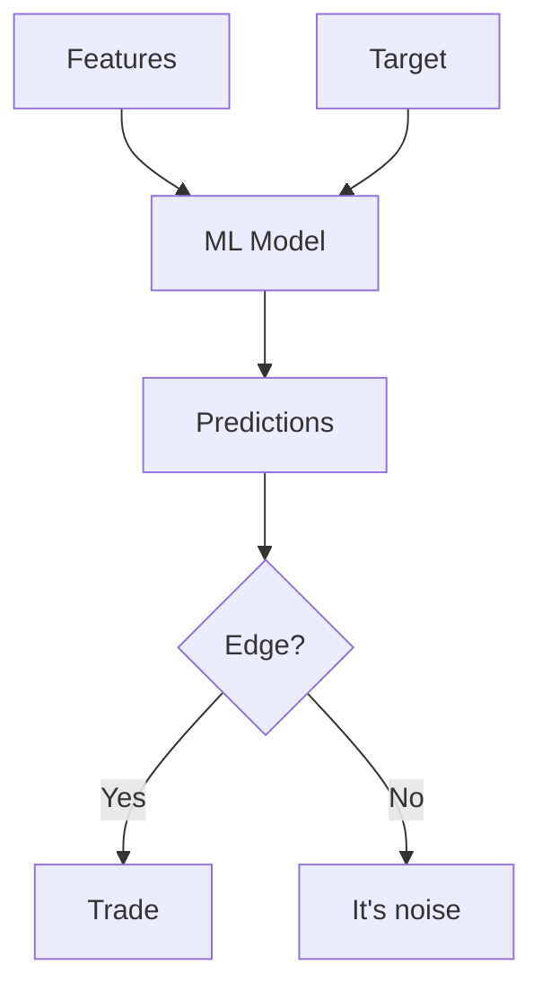
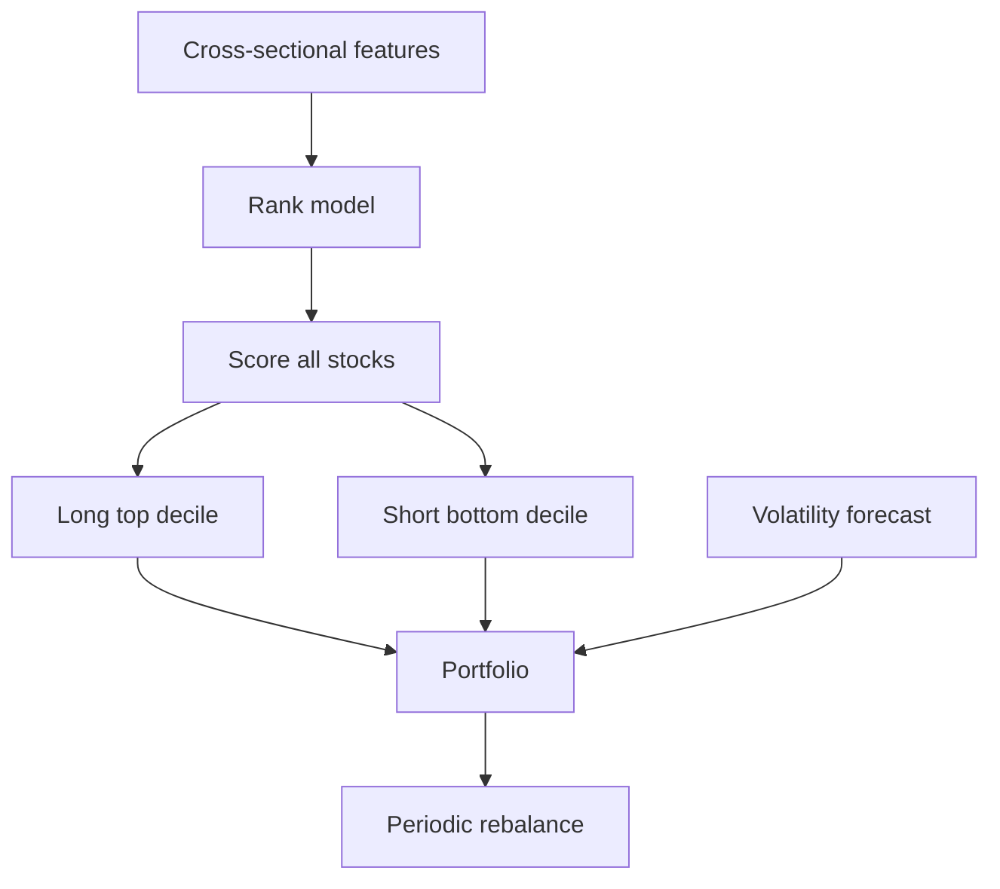

# ML for Price Prediction

## What It Is

Using machine learning to predict price movements. A seductive idea — and one of the hardest problems in finance.



**The core challenge:** financial returns are close to **efficient** — price already reflects public information. Prediction edges are tiny and decay fast.

---

## What Can ML Actually Do?

| Task | Feasibility | Why |
|---|---|---|
| Predict direction tomorrow | Very hard | Near-efficient, noisy |
| Predict volatility | Doable | Volatility clusters |
| Predict medium-term drift | Hard | Weak persistent signals |
| Rank stocks (relative) | Feasible | Cross-sectional edges exist |
| Identify risk regimes | Feasible | Regimes persist |
| Detect anomalies | Feasible | Outliers are detectable |

**Key insight:** predicting *relative* performance (which stocks will outperform) works better than predicting *absolute* direction.

---

## Feature Engineering

| Feature Family | Examples |
|---|---|
| **Price/volume** | Returns, volume, volatility (Phase 4 indicators) |
| **Fundamental** | Ratios, margins (Phase 2, 3) |
| **Alternative** | Sentiment, satellite, app usage (file 03) |
| **Macro** | Interest rates, inflation (Phase 6) |
| **Cross-sectional** | Rank vs sector peers, relative strength |

**The target problem:** what should the model predict?

```
Classification: up or down next day?  (hard, ~50% base rate)
Regression: expected return magnitude? (noisy)
Ranking: which of 500 stocks outperforms? (most tractable)

Future work: predicting the RETURN is harder than predicting RELATIVE rank.
```

---

## Models Commonly Used

| Model | Use | Why |
|---|---|---|
| **Linear/Logistic** | Baseline, interpretable | Signals are weak, linear is honest |
| **Random Forest / GBM** | Tabular features | Handles mixed features, non-linearity |
| **XGBoost / LightGBM** | Standard ML approach | Best on tabular data, fast |
| **LSTM/GRU** | Sequences | Fewer wins than hoped — noise dominates |
| **Transformers** | Long sequences, cross-sectional | Research stage, overfit risk high |

**Honest finding:** for tabular financial data, gradient boosting typically beats deep learning. Deep learning wins only with huge datasets and strong structure (e.g., order-flow at tick level).

---

## The Problem: Noise Dominates Signal

```
Signal-to-noise ratio in finance is tiny.

Daily return σ ≈ 1.5%
A good model might explain 1-3% of daily return variance
  → the rest is noise

This is why ML price prediction is hard:
  the label itself is mostly random
```

**Market efficiency reality:**
- Price already reflects public info (from file 00 Phase 1)
- You need a **non-public edge** to profit: better data, better speed, better execution
- If your model only uses public data, someone else has it too

---

## The Right Approach: Relative + Risk-Aware

A practical framing instead of "predict tomorrow's price":

```
1. Rank stocks by expected return (cross-sectional model)
2. Take long positions in the top-ranked
3. Short (or underweight) the bottom-ranked
4. Control risk: position size by predicted volatility
5. Rebalance periodically

This is a factor/alpha model — it trades relative signal,
  not absolute certainty
```



---

## Evaluation Traps

| Trap | Description | Fix |
|---|---|---|
| **Overfitting** | Model memorizes noise | Out-of-sample, walk-forward (file 05 Phase 6) |
| **Lookahead** | Future data leaks into features | Point-in-time data only |
| **Ignoring costs** | Edge vanishes after fees | Model slippage & commissions |
| **Backtest fantasy** | Perfect fills, no impact | Realistic execution assumptions |
| **Survivorship** | Only testing surviving stocks | Include delisted names |

**Shrinkage check:**
```
A model that makes 50% in backtest but the same model
with tiny cost, small slippage, and out-of-sample data
makes 2% → the 50% was artifact, not edge.
```

---

## Programming Analogy

```
ML Price Prediction = time-series ML, but with the worst
  signal-to-noise ratio you'll ever see

Features = engineered from market data (like tabular ML)
Target   = next-period return (≈ random + tiny signal)
Noise    = most of the variance (like predicting daily
  traffic with 99% randomness)

Ranking beats classification:
  predicting ORDER is easier than predicting VALUES
  (like ranking pages vs predicting exact CTR)

Every ML best practice applies HARDER here:
  point-in-time features (no leakage)
  walk-forward CV (no future info)
  realistic costs (edge is small)

If the backtest looks too good, it's broken —
  real financial edges are small, brief, and hard.
```

---

## Common Mistakes

- **Chasing absolute direction prediction.** Near-efficient markets make it a coin flip with costs. Rank instead.
- **Believing a perfect backtest.** 90% accuracy in-sample = overfit, guaranteed. Validate out-of-sample with costs.
- **Data leakage.** Using restated fundamentals or future-adjusted prices. This alone can fake any edge.
- **Ignoring capacity.** A strategy that works on $1M often fails at $100M (slippage, impact).
- **Neglecting regime shifts.** Models trained on a bull market break in a crash. Re-train and monitor.

---

## Interview Notes

- **ML: "Why is price prediction hard?"** — Near-efficient markets, tiny signal-to-noise, non-stationarity, and costs eroding small edges. Frame the answer around relative ranking and risk-aware portfolio construction instead.
- **Data: "How do you build point-in-time features?"** — Store fundamentals with as-of timestamps, never use restated values, use only data available at decision time. This is the #1 correctness issue.
- **System Design: "Design an alpha research platform"** — Feature store + backtesting engine (event-driven, deterministic) + walk-forward evaluator + cost model + position sizing.

---

## Revision Summary

| Concept | Key Point |
|---|---|
| Efficient Market | Price reflects public info → small edges |
| Signal-to-Noise | Returns mostly noise, edge is tiny |
| Rank vs Classify | Ranking stocks beats direction prediction |
| Point-in-time data | No lookahead — data as-of date only |
| Walk-forward CV | Train/test without future leakage |
| Costs matter | Edge minus costs is the real edge |
| Regime shifts | Models break when the market changes |
| Overfit = fake edge | Perfect backtest = broken backtest |

- Predict relative rank, not absolute direction
- Public data → public edge (everyone has it)
- If backtest looks too good, it's leaking

---

← [↑ Phase 7](README.md) • [↑ Finance](../README.md) • [01-nlp-financial-documents](01-nlp-financial-documents.md) →
