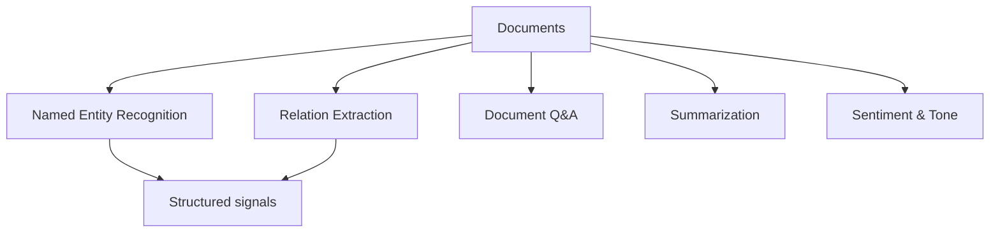

# NLP for Financial Documents

## What It Is

Applying NLP to **unstructured financial text** — earnings calls, SEC filings, press releases, analyst reports — to extract structured signals.



---

## The Documents

| Document | Frequency | What's Inside |
|---|---|---|
| **10-K (annual)** | Yearly | Full business, risk factors, financials |
| **10-Q (quarterly)** | Quarterly | Updated financials, MD&A |
| **8-K (event)** | As events occur | Material news, CEO changes, acquisitions |
| **Earnings calls** | Quarterly | Management commentary + Q&A |
| **Proxy / DEF 14A** | Annual | Executive compensation, governance |
| **Press releases** | Continual | Product, guidance, partnerships |

**Key sources** (from file 11, Phase 1): SEC EDGAR for US, NSE/BSE filings for India.

---

## Core NLP Tasks

### 1. Named Entity Recognition (NER)

Extract companies, people, products, and dates.

```
Text: "Apple acquired Xnor.ai in January 2020 for $200M"

Entities: Apple (ORG), Xnor.ai (ORG), January 2020 (DATE), $200M (MONEY)
```

**Financial NER** extends to domain entities: tickers, financial instruments, ratios.

### 2. Relation Extraction

Connect the entities.

```
"Apple (ORG) acquired (RELATION) Xnor.ai (ORG) for $200M (MONEY)"

Structured fact: { acquirer: Apple, target: Xnor.ai, amount: $200M, date: Jan 2020 }
→ feeds an M&A events database
```

### 3. Summarization

Condense long filings into readable briefs.

```
10-K (150 pages) → 2-page executive summary:
  - Revenue trend
  - Key risks
  - Capital structure changes
  - Management discussion highlights
```

### 4. Document Q&A (RAG)

Ask questions over documents.

```
Q: "What are Apple's stated risk factors around supply chain?"
A: (grounded in the 10-K risk section with citations)

Retrieval-Augmented Generation (RAG):
  embed document chunks → retrieve relevant chunks → LLM answers
```

---

## The Earnings Call Advantage

Earnings calls contain what financials **don't**: management tone, guidance, and answers to analyst questions.

| Signal | Where | Why Valuable |
|---|---|---|
| Guidance changes | Call transcript | Forward-looking, moves stocks |
| Tone / language shifts | Management speak | Word-choice changes reveal concerns |
| Evasiveness in Q&A | Analyst Q&A | Dodging questions = red flag |
| Forward-looking statements | CEO commentary | Contrarian/confirmation signal |

**A classic NLP signal:** comparing language between consecutive calls — a shift from confident to hedging vocabulary (e.g., "we will" → "we expect to") often precedes bad news.

---

## The ML Stack

| Layer | Task | Typical Model |
|---|---|---|
| Extraction | NER, relations | Fine-tuned BERT/RoBERTa |
| Classification | Tone, sentiment | FinBERT, LSTM |
| Generation | Summaries | LLM (GPT-class) |
| Retrieval | RAG lookup | Embeddings (sentence-BERT) |
| Aggregation | Facts to numbers | Rule + ML pipeline |

**Financial-specific considerations:**
- SEC filings use **legalese** — general models misparse
- Numbers and units matter: "$200M" ≠ "200M units"
- Timestamps: facts must be **point-in-time** (file 00)
- Domain fine-tuning helps a lot (FinBERT vs generic BERT)

---

## Programming Analogy

```
Financial NLP = document intelligence / knowledge extraction

NER      = entity extraction (like parsing fields from logs)
Relation = building a knowledge graph from documents
RAG Q&A  = retrieval-augmented question answering over docs
Summarize = producing executive briefs from raw filings

Pipeline = classic document processing:
  Ingest → chunk → embed → index → retrieve → answer

Key correctness concern = point-in-time facts
  (like CDC: use the data AS OF that date, not restated)

Domain data problem:
  general LLMs misread "material", "impairment", "contingency"
  → domain fine-tuning = like specializing a model on your schema
```

---

## Common Mistakes

- **Using general-purpose NER on filings.** It misses domain entities (tickers, financial terms) — fine-tune on financial data.
- **Ignoring point-in-time.** A 10-K restates prior years. Using restated numbers for the past date is lookahead bias.
- **Trusting LLM summaries blindly.** LLMs hallucinate. Ground answers with RAG citations, never raw generation.
- **Reading tone without context.** "We faced challenges" could mean a major crisis or a minor blip. Compare to history and peers.
- **Missing the numbers.** Financial text is number-heavy; a model that ignores numeric reasoning fails at extraction.

---

## Interview Notes

- **System Design: "Design a filings intelligence platform"** — Ingest SEC EDGAR → parse forms → chunk → embed → index → NER/relations → serve Q&A and signals APIs. Version documents for point-in-time lookups.
- **ML: "How do you detect tone shift in earnings calls?"** — Compute sentiment/tone scores per call, compare to trailing quarters (z-score), flag large negative shifts. Combine with forward-looking sentence detection.
- **Data: "RAG for financial documents"** — Embed chunks with metadata (company, period, section), retrieve with filters, answer with citations. Handling numbers and tables is the hard part.

---

## Revision Summary

| Task | What It Does |
|---|---|
| NER | Extract entities (orgs, money, dates) |
| Relation Extraction | Build structured facts |
| Summarization | Condense filings |
| Document Q&A (RAG) | Grounded answers with citations |
| Tone/Sentiment | Management language signals |
| Point-in-time | Facts as-of-date only |

- Earnings calls contain forward-looking signals
- RAG beats raw generation (citations, less hallucination)
- Fine-tune for financial domain (legalese, numbers)
- Compare tone to history, not in isolation

---

← [00-ml-price-prediction](00-ml-price-prediction.md) • [↑ Phase 7](README.md) • [↑ Finance](../README.md) • [02-llm-agents-finance](02-llm-agents-finance.md) →
