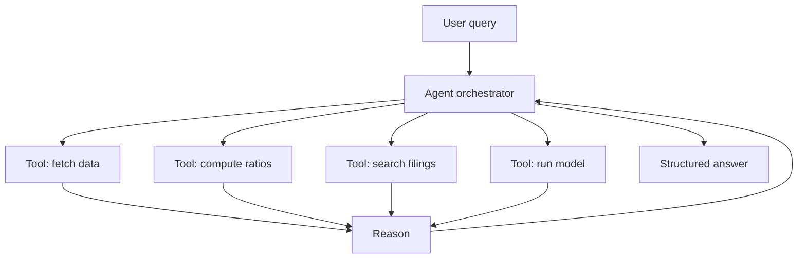
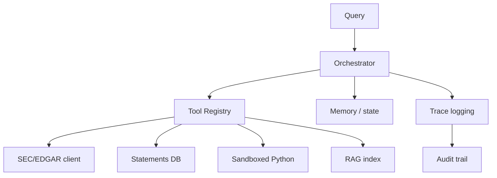

# LLM Agents for Financial Analysis

## What It Is

**LLM agents** are language models that can **use tools**, **plan**, and **act** — going beyond one-shot Q&A to perform multi-step financial analysis.



---

## From Chatbot to Agent

| | Basic LLM chatbot | LLM Agent |
|---|---|---|
| Data | Only training data | Live tools + retrieval |
| Actions | Generates text | Executes code, calls APIs |
| Planning | None | Multi-step reasoning |
| Memory | Conversation only | State across steps |
| Reliability | Can hallucinate freely | Grounded in tool outputs |

**The agent loop:**
```
while task not done:
  reason about the current state      (think)
  choose the next action/tool         (plan)
  execute the tool, observe output    (act)
  incorporate result into state       (update)
```

---

## Common Financial Agent Capabilities

| Capability | Tools Behind It |
|---|---|
| **Fundamental analysis** | Pull statements → compute ratios (Phase 2) → compare to peers (Phase 3) |
| **Document research** | RAG over filings (file 01) — grounded answers |
| **Financial calculation** | Python execution (compute EPS, DCF, CAGR) |
| **Screening** | Query a stock screener for filters |
| **Monitoring** | Watch price/news, alert on conditions |
| **Report generation** | Structure analysis into a note/report |

**Example workflow — "Analyze Apple's health":**

```
1. Agent: fetch Apple's 10-K from EDGAR (tool: SEC API)
2. Agent: extract financial statements (tool: parser)
3. Agent: compute ratios (tool: Python)
4. Agent: pull competitor data (tool: data API)
5. Agent: compare and judge (tool: reasoning)
6. Agent: write a structured report (tool: document generator)
```

---

## The Tool-Use Pattern

Tools extend the model with **live, verifiable, structured** capabilities.

```python
# Agent tool definition (pseudocode)
@tool("get_financial_ratio")
def get_financial_ratio(ticker: str, ratio: str) -> float:
    """Fetch a financial ratio for a ticker."""
    stmts = fetch_statements(ticker)
    return compute_ratio(stmts, ratio)
```

**Why tools matter for finance:**
- Prevent hallucination — numbers come from real sources
- Enable exact computation (LLMs are bad at precise arithmetic)
- Keep answers point-in-time (file 00)
- Let the model "show its work" (traceable chain)

---

## Agentic Risks in Finance

| Risk | Description | Mitigation |
|---|---|---|
| **Hallucination** | Fabricated numbers/facts | Ground in tools + citations |
| **Tool misuse** | Wrong ticker, wrong period | Validation + guardrails |
| **Compounding errors** | A bad step poisons later steps | Checkpoints, human review |
| **Non-determinism** | Same query, different answers | Temperature 0, pinned versions |
| **Opaque reasoning** | Can't see why it decided | Log the full tool trace |
| **Latency** | Multi-step loops are slow | Cache, parallel tools |

**Finance is high-stakes: a hallucinated EPS in an auto-generated report can mislead real decisions. Guardrails are mandatory, not optional.**

---

## System Design: A Financial Analysis Agent



**Design decisions:**
- **Sandboxed execution** — Python tools run isolated (no network to internal systems)
- **Rate limits** — SEC/APIs throttle; add caching and quotas
- **Human-in-the-loop** — flag high-stakes outputs for review
- **Deterministic cores** — computation via code, not the LLM's arithmetic

---

## Programming Analogy

```
LLM Agent = an autonomous pipeline with a reasoning controller

LLM          = the control loop / planner
Tools        = function calls (APIs) the agent can invoke
Tool results = ground truth inputs to the next step
Memory       = agent state across steps (like a workflow context)
Trace        = audit log of every action (observability)

Build it like any workflow system:
  orchestrator → tool calls → validation → next step
  with the LLM deciding the sequence at runtime

The dangerous difference: a normal pipeline is deterministic;
  an agent changes course based on outputs.
  → test like a state machine, log everything, cap retries.
```

---

## Common Mistakes

- **Letting the LLM do arithmetic.** Models are unreliable at exact math. Offload computation to code/tools.
- **No guardrails.** Unvalidated tool calls and ungrounded answers in finance = liability. Validate tickers, dates, and units.
- **Skipping the audit trail.** If you can't replay why the agent did something, you can't debug or prove compliance.
- **Ignoring point-in-time.** An agent querying today's restated data for a past period leaks future information.
- **Full autonomy without review.** High-stakes analysis needs human approval gates, at least initially.

---

## Interview Notes

- **System Design: "Design an LLM agent for equity research"** — Tool registry (data, docs, compute) + orchestrator loop + sandboxed Python + RAG grounding + full trace logging + human review for outputs.
- **Reliability: "How do you prevent hallucination in finance agents?"** — Every number comes from a tool call with a citation; computation happens in code; temperature 0; validation of tickers/periods.
- **ML: "Agent vs pipeline when?"** — Use deterministic pipelines when steps are fixed; use agents when the path is unknown (open-ended research). Prefer pipelines for anything regulated/repetitive.

---

## Revision Summary

| Concept | Key Point |
|---|---|
| Agent | LLM + tools + planning + memory |
| Tool Use | Grounds answers, does exact computation |
| Agent Loop | Reason → act → observe → repeat |
| Guardrails | Validate tools, citations, point-in-time |
| Sandbox | Isolate code execution |
| Trace | Full audit log of actions |
| Human-in-loop | Review gate for high-stakes outputs |

- Ground every number in a tool call
- Never let the LLM do the math
- Log everything, validate everything

---

← [01-nlp-financial-documents](01-nlp-financial-documents.md) • [↑ Phase 7](README.md) • [↑ Finance](../README.md) • [03-alternative-data](03-alternative-data.md) →
