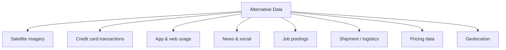
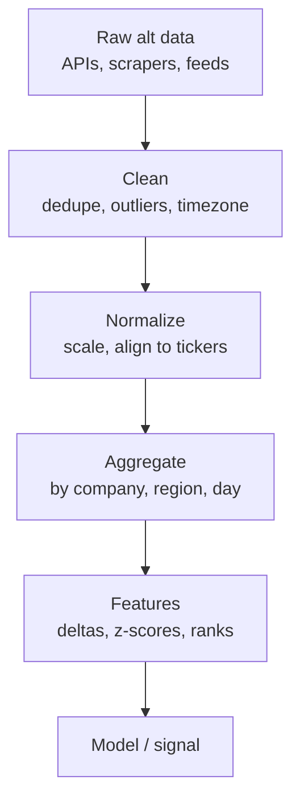

# Alternative Data

## What It Is

**Alternative data** is non-traditional information used to gain a market edge — anything beyond price, statements, and standard filings.



**Why it exists:** everyone has the same filings. Alternative data is the non-public edge that ML models (file 00) need.

---

## The Main Categories

| Category | Data | What It Predicts |
|---|---|---|
| **Satellite imagery** | Parking lots, crops, mines | Retail traffic, harvests, production |
| **Credit card** | Aggregated spend | Company revenue before reports |
| **App/web usage** | Downloads, MAU, session time | Consumer engagement, revenue |
| **News & social** | Articles, posts, mentions | Sentiment, awareness |
| **Job postings** | Hiring volume, roles | Growth, strategy shifts |
| **Shipments** | Port activity, trucking | Supply chain health |
| **Pricing data** | Web-scraped prices | Inflation, margins, demand |
| **Geolocation** | Foot traffic | Store visits, customer patterns |

---

## The Edge: Leading vs Lagging

| Source | When It's Available | What It Leads |
|---|---|---|
| App downloads | Daily | Quarterly revenue |
| Card spending | Weekly | Reported sales |
| Foot traffic | Real-time | Same-store sales |
| Job postings | Real-time | Hiring / growth |
| Satellite parking lots | Weekly | Retail traffic |
| Financial reports | Quarterly | Everything (lagging) |

```
Signal timing ladder:
  Real-time (traffic, app usage)
  → Weekly (card spend, shipments)
  → Monthly (industry data)
  → Quarterly (company filings) ← where everyone else looks
```

---

## The Build Pipeline

```
Raw data → Clean → Normalize → Enrich → Aggregate → Feature → Model
```



**The mapping problem:** raw data must map to a company. Card spend by merchant → match to ticker → map to segments.

---

## Challenges & Risks

| Challenge | Description |
|---|---|
| **Coverage bias** | Card data covers only some shoppers, not all |
| **Noise** | Foot traffic ≠ sales; huge variance |
| **Staleness** | Vendor delays make data less leading |
| **Licensing** | Data is expensive, exclusive, contractual |
| **Regulation** | Privacy (GDPR, CCPA) limits some sources |
| **Point-in-time** | Data must be time-stamped as-of-date |
| **Correlation traps** | Spurious patterns without causation |

**Coverage bias example:**
```
Card data shows a big company's spend drop 20%.
But the card panel only covers 2% of consumers.
→ Real drop could be anywhere from −5% to −40%.
  The signal needs adjustment, not blind trust.
```

---

## Evaluating Alternative Data

Ask before buying/building:

| Question | Why |
|---|---|
| Is it **leading** the filings? | If not, no edge |
| What's the **coverage**? | Panel size, representativeness |
| Is the history long enough? | Need enough data to backtest |
| Can it map to **tickers**? | Usability for portfolios |
| Is it **cost-effective**? | Does the edge exceed the price? |
| Any **privacy/regulatory** issues? | Legal risk |

---

## Programming Analogy

```
Alternative Data = Using non-traditional signals for ML

Analogy: like using CDN logs, support tickets, and
  app telemetry to predict a service's health
  instead of waiting for the monthly report

Card spend   = aggregated transaction logs (leading indicator)
Foot traffic = real-time telemetry
Satellite    = external sensor data (like infra probes)
Job posts    = hiring signals (like repo commit velocity)

Core engineering tasks:
  ingestion (many formats, vendors)
  entity mapping (merchant → ticker)
  point-in-time correctness
  feature store integration for models

The edge is the same as ML: better, earlier features
  than competitors → better predictions
```

---

## Common Mistakes

- **Trusting unadjusted alt data.** Coverage bias makes raw signals misleading. Normalize and adjust.
- **Ignoring point-in-time.** Alt data feeds models; leaking future values into features fakes the edge (file 00).
- **Overpaying without validation.** Buy data, backtest the edge, then commit — not before.
- **Treating correlation as causation.** "Foot traffic fell and sales fell" isn't proof of the mechanism.
- **Skipping entity mapping.** Raw data that can't map cleanly to companies is useless for portfolios.

---

## Interview Notes

- **System Design: "Design an alternative data pipeline"** — Multi-source ingestion (APIs, scrapers, feeds) → cleaning/normalization → entity mapping (merchant→ticker) → aggregation → feature store → model service. Point-in-time versioning throughout.
- **Data: "How do you handle coverage bias?"** — Weight panel data to known totals (e.g., benchmark against reported revenue), build confidence intervals around signals.
- **Behavioral: "Evaluate an alt-data source for us"** — Walk the 6 evaluation questions: leading, coverage, history, ticker mapping, cost, regulation.

---

## Revision Summary

| Category | Example | Leads |
|---|---|---|
| Satellite | Parking lots, crops | Retail, agriculture |
| Card spend | Aggregated transactions | Revenue |
| App usage | Downloads, MAU | Engagement |
| News/social | Mentions, sentiment | Awareness |
| Job postings | Hiring volume | Growth |
| Shipments | Ports, trucking | Supply chain |
| Geolocation | Foot traffic | Store visits |

- Alt data = the non-public edge
- Coverage bias is the #1 correctness issue
- Validate the edge before paying
- Point-in-time correctness, always

---

← [02-llm-agents-finance](02-llm-agents-finance.md) • [↑ Phase 7](README.md) • [↑ Finance](../README.md) • [04-sentiment-analysis](04-sentiment-analysis.md) →
