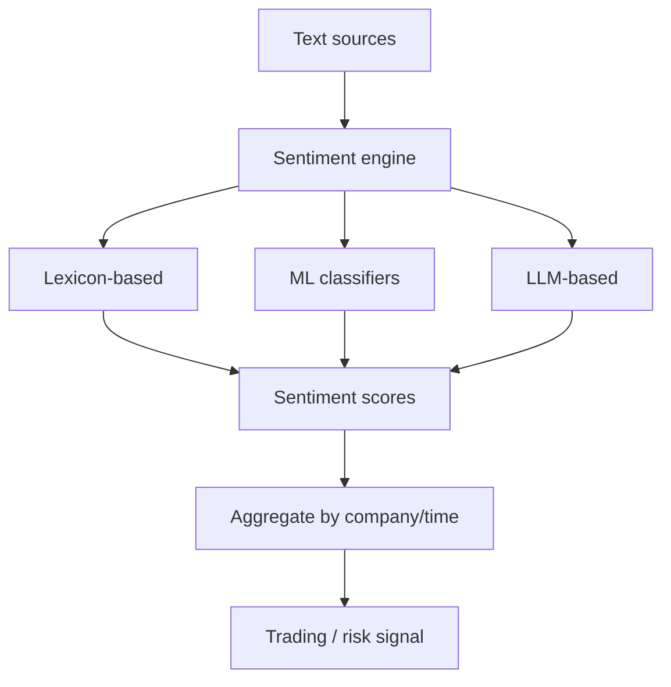
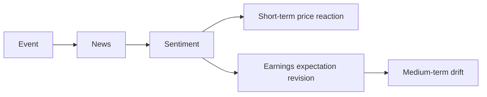

# Sentiment Analysis

## What It Is

**Sentiment analysis** measures the emotion/tone in text — news articles, social media, earnings calls, analyst reports — and converts it into a market signal.



---

## The Approaches

| Method | How It Works | Pros | Cons |
|---|---|---|---|
| **Lexicon-based** | Word lists with polarity scores | Fast, interpretable | Misses negation/context |
| **ML classifier** | Trained model (FinBERT) | Context-aware | Needs labeled data |
| **LLM-based** | Prompt/agent for judgment | Nuanced, aspect-aware | Cost, latency, variance |

**Lexicon example:**
```
"Record revenue growth exceeded expectations"
  record(+), growth(+), exceeded(+), expectations(neutral)
  → strongly positive score

"Revenue declined despite prior guidance"
  declined(−), despite(−) → negative
```

**The negation problem (why lexicons struggle):**
```
"Not bad"     → lexical: bad(−) → negative  ✗
               → correct meaning: positive ✓

"Below expectations" → lexical misses the negative entirely
```

---

## Sources and Their Character

| Source | Noise | Signal | Lag |
|---|---|---|---|
| Earnings call transcripts | Low | High (tone shifts) | Quarterly |
| News headlines | Medium | Medium | Hours |
| Social media (X/Twitter) | Very high | Low, noisy | Minutes |
| Analyst reports | Low | Medium | Days |
| Reddit/WallStreetBets | Very high | Contrarian signal | Hours |

**Key lesson: high-noise sources (social) need heavy aggregation — a single tweet means nothing; a sustained shift across thousands does.**

---

## The Aggregation Step

Individual texts are noisy. The signal emerges at scale.

```
Step 1: Score each article/post (per-item sentiment)
Step 2: Aggregate per company, per day
Step 3: Compute features:
  - Mean sentiment
  - Sentiment delta vs previous period (z-score)
  - Volume of extreme mentions
  - Dispersion (agreement among sources)
```

**Better features come from aggregation:**

| Feature | What It Captures |
|---|---|
| Sentiment level | Current mood |
| Sentiment **change** | Shift in tone (stronger signal) |
| Mention volume | Awareness/attention |
| Dispersion | Consensus vs disagreement |
| Extremity | Hype or panic |

---

## The Signal-to-Price Link



**Honest caveats:**
- Sentiment explains short-term price moves, weakly
- The market often prices news within minutes/hours
- Contrarian effects exist: extreme bullishness at tops, panic at bottoms
- Sentiment works best as **one feature** in a multi-signal model, not standalone

---

## Sentiment in Earnings Calls

A refined application (from file 01): tone shifts across calls.

```
Call Q1: "We are very confident in our growth trajectory"
Call Q2: "We believe there may be some near-term softness"

Q1→Q2 tone change = negative signal
  (management hedging language increased)

Method: compare standardized tone scores across quarters;
  a big z-score drop flags deterioration before filings confirm it
```

---

## Evaluation

How do you know the sentiment model works?

| Check | Method |
|---|---|
| Accuracy | Labeled test set (human-annotated) |
| Market relevance | Does it predict returns? (backtest, file 05 Phase 6) |
| Stability | Same text → same score (test with re-runs) |
| Decay | Does the edge persist out-of-sample? |
| Bias | Overweighting popular stocks / short text |

**Baseline check:** does a lexicon baseline beat random? If a simple model can't beat a coin flip, a complex one won't either.

---

## Programming Analogy

```
Sentiment Analysis = Text classification + time-series features

Lexicon     = keyword-based rule engine (like simple log matchers)
ML/LLM      = contextual text understanding
Aggregation = rolling time-series features over a signal stream
  mean, delta, z-score, volume (like metric aggregation)

The noisy single-item → clean aggregate is the same
  pattern as spam filtering + aggregation:
  one spam report is noise, a spike of reports is signal.

Cross-check sentiment with price/volume (Phase 4):
  sentiment + price divergence = a feature;
  sentiment alone = weak.

Build it like any signal pipeline:
  ingest → score → aggregate → features → model
  with point-in-time correctness and backtesting.
```

---

## Common Mistakes

- **Trusting a single source.** One viral tweet ≠ market sentiment. Aggregate and weigh sources.
- **Ignoring aggregation quality.** Mean sentiment hides volume, dispersion, and change. Feature-ize all of them.
- **Using raw lexicon scores on nuanced text.** Negation, sarcasm, and financial jargon break simple lexicons.
- **Overtrading short-term signals.** The market prices news fast; medium-term confirmation matters more.
- **No out-of-sample validation.** A sentiment strategy that worked in one year often dies on new data.

---

## Interview Notes

- **System Design: "Design a market sentiment platform"** — Ingest news/social APIs → score per item (lexicon + LLM hybrid) → aggregate per company/time → store as features → serve to models and dashboards. Handle rate limits and deduplication.
- **ML: "Lexicon vs LLM for sentiment?"** — Lexicon is cheap and interpretable; LLMs handle nuance and aspect (tone about revenue vs product). Production often uses lexicon as baseline + LLM for high-value text (earnings calls).
- **Behavioral: "Is sentiment predictive?"** — Short-term and weak; strongest as a feature combined with price/volume and tone-change detection. Always backtest and validate.

---

## Revision Summary

| Method | Strength | Weakness |
|---|---|---|
| Lexicon | Fast, interpretable | Misses negation/context |
| ML classifier | Context-aware | Needs labels |
| LLM | Nuanced, aspect-aware | Cost, latency |

| Feature | Captures |
|---|---|
| Sentiment level | Current mood |
| Delta / z-score | Tone shift |
| Mention volume | Attention |
| Dispersion | Consensus |
| Extremity | Hype/panic |

- Aggregate noisy items into clean features
- Tone change > tone level (earnings calls)
- Sentiment is one feature, not a standalone signal
- Backtest before believing

---

← [03-alternative-data](03-alternative-data.md) • [↑ Phase 7](README.md) • [↑ Finance](../README.md) • [05-ai-pipelines](05-ai-pipelines.md) →
