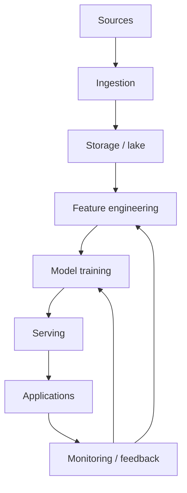
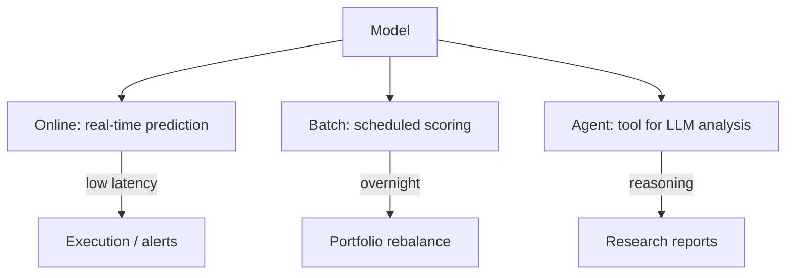

# Financial AI Pipelines

## What It Is

An **AI pipeline** for finance stitches together data, models, and serving into a production system. All the pieces from this phase come together here.



---

## The Full Stack

| Layer | Role | Examples |
|---|---|---|
| **Sources** | Raw data | Exchanges, SEC, news, alt data |
| **Ingestion** | Pull, validate, land | Streaming, batch, CDC |
| **Storage** | Durable data lake | S3, Iceberg, Parquet |
| **Features** | Point-in-time features | Feature store |
| **Models** | Train/evaluate | ML, LLM, agents |
| **Serving** | Online/inference | REST, batch, streaming |
| **Monitoring** | Detect drift/failure | Alerts, dashboards |
| **Governance** | Compliance, audit | Lineage, versioning |

---

## A Realistic Pipeline: Equity Research Agent

```
1. INGEST     → SEC EDGAR filings, market data (file 01)
2. PROCESS    → Parse statements, chunk documents
3. FEATURES   → Ratios, point-in-time fundamentals (Phase 2/3)
4. RETRIEVE   → RAG over filings (file 01)
5. REASON     → LLM agent analyzes (file 02)
6. COMPUTE    → DCF, comps in sandboxed Python
7. SERVE      → Report API + dashboard
8. MONITOR    → Drift, hallucination flags, latency
```

---

## Key Design Decisions

### Batch vs Streaming

| | Batch | Streaming |
|---|---|---|
| Use for | Filings, fundamentals, daily EOD data | Ticks, news, real-time signals |
| Latency | Hours/days | Seconds |
| Complexity | Low | High |
| Example | Nightly statement load | Live news sentiment |

```
Hybrid is standard:
  Streaming for market/news (time-sensitive)
  Batch for fundamentals (updated quarterly, not time-sensitive)
```

### Point-in-Time Correctness

The most important data engineering rule in finance (from file 00).

```
Store every fact with the date it became KNOWN:
  filing_effective_date, data_as_of_date

Queries must filter data_as_of ≤ decision_time
  → no lookahead, honest backtests, reproducible analysis

Never overwrite a fact — append a new version (bi-temporal)
```

### Feature Store

```
Train (batch) and serve (online) must use IDENTICAL features.

Feature store:
  - Computes features once
  - Serves same values to training & inference
  - Prevents train/serve skew (a classic production failure)

Example: "sentiment_7d_mean" computed the same way
  for a 2019 backtest and a live query today.
```

---

## The Serving Paths



---

## Monitoring & Governance

| Concern | What to Track | Why |
|---|---|---|
| **Data drift** | Feature distribution changes | Model silently degrades |
| **Model drift** | Prediction distribution | Market regime shifted |
| **Performance** | Live vs expected return | Edge decayed |
| **Hallucination** | Citation validity | LLM made things up |
| **Latency** | P99 serving time | Algo misses windows |
| **Compliance** | Lineage, audit trail | Regulated industry |

**The feedback loop:**
```
Production predictions → outcome labels (next-period returns)
→ monitor realized vs predicted
→ retrain / roll back when performance degrades
```

---

## MLOps Pain Points Specific to Finance

| Pain | Financial Twist |
|---|---|
| **Non-stationarity** | Market regime changes constantly — models decay |
| **Tiny samples** | Years of data, but few meaningful events |
| **Point-in-time** | Any leakage fakes results (file 00) |
| **Costs & capacity** | Real edge is small — must model execution |
| **Regulation** | Auditability, fairness, model risk rules |
| **Contrarian users** | Adversarial signals (crowded trades) |

**The honest truth:** many financial models look great in backtests and fail live because of regime shifts, cost, or leakage. Production monitoring is not optional.

---

## Programming Analogy

```
Financial AI Pipeline = Any production ML system, plus hard constraints:

Standard ML pipeline (features → train → serve → monitor)
  + point-in-time correctness (the strictest data rule)
  + bi-temporal data versioning (facts as-of-date)
  + train/serve feature consistency (feature store)
  + regime monitoring (concept drift, constantly)
  + audit trail (regulatory requirement)

Think of it as MLOps where the #1 requirement is:
  NEVER leak the future into the past.
  Everything else (monitoring, drift, retraining)
  is the same as your usual production ML.

The difference from generic ML is discipline, not architecture.
```

---

## Common Mistakes

- **Skipping point-in-time correctness.** The single most common cause of fake financial ML edges.
- **Train/serve skew.** Features computed differently in backtest vs live → silent model failure.
- **No drift monitoring.** Markets change; a model trained in a bull market dies in a crash, unnoticed.
- **Ignoring costs in the pipeline.** Real-world execution (slippage, fees) must be part of the evaluation.
- **Untracked experiments.** Finance results need full reproducibility (data version + code + params) for auditability.

---

## Interview Notes

- **System Design: "Design an end-to-end quant research platform"** — Ingestion → point-in-time feature store → backtesting engine (no leakage, cost model) → walk-forward evaluation → live serving → drift monitoring. This is the archetypal finance systems interview.
- **Data Engineering: "Bi-temporal data in finance"** — Distinguish *valid time* (when a fact is true) from *transaction time* (when it was recorded). Queries filter on both — critical for honest backtests and audits.
- **ML: "Why do financial models fail in production?"** — Regime shifts, leakage, train/serve skew, and unmodeled costs. Monitoring + retraining + disciplined evaluation are the countermeasures.

---

## Revision Summary

| Layer | Purpose | Key Discipline |
|---|---|---|
| Ingestion | Pull/validate data | Streaming vs batch split |
| Storage | Durable lake | Versioned, time-aware |
| Features | Point-in-time | No lookahead, feature store |
| Models | Train/evaluate | Walk-forward, costs |
| Serving | Online/batch/agent | Train/serve consistency |
| Monitoring | Drift/perf | Detect regime shifts |
| Governance | Audit/lineage | Reproducibility |

- Point-in-time correctness = #1 rule
- Feature store prevents train/serve skew
- Monitor drift — markets change, models decay
- Reproducibility is a regulatory requirement

---

← [04-sentiment-analysis](04-sentiment-analysis.md) • [↑ Phase 7](README.md) • [↑ Finance](../README.md) • [Next phase →](../phase-8-portfolio-risk-management/README.md)
