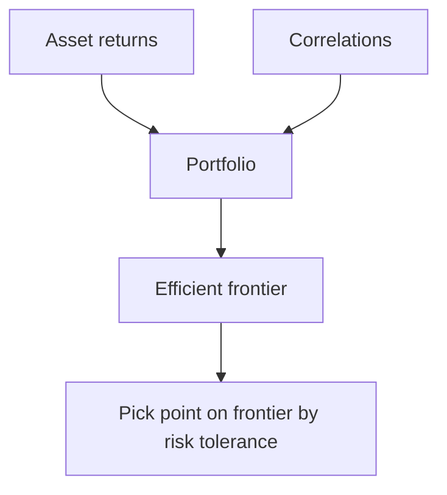

# Modern Portfolio Theory (MPT)

## What It Is

**Modern Portfolio Theory** (Markowitz, 1952) says investors should optimize for the **best return for a given level of risk** — by combining assets with low correlation, not by chasing the single best asset.



**Core idea:** the risk of a portfolio is LESS than the sum of its parts — if the assets don't move together.

---

## Expected Return & Risk of a Portfolio

```
Expected return = weighted average of asset returns
  E[R] = Σ wᵢ × E[Rᵢ]

Portfolio risk (σ²) depends on BOTH:
  - each asset's own variance
  - how assets co-move (covariance/correlation)

σ² = ΣΣ wᵢ wⱼ σᵢ σⱼ ρᵢⱼ
  (two-asset version: σ² = w₁²σ₁² + w₂²σ₂² + 2w₁w₂σ₁σ₂ρ)
```

**The key term is ρ (correlation)** — this is where diversification lives.

```
Asset A: σ = 20%, Asset B: σ = 20%

If ρ = +1: portfolio σ = 20% (no benefit, same risk)
If ρ = 0:  portfolio σ = 14% (risk reduced by combining)
If ρ = −1: portfolio σ = 0%  (perfect hedge, risk gone)
```

---

## Diversification Benefit

```
Two uncorrelated assets cut risk WITHOUT cutting return:

  Portfolio = 50% A + 50% B, ρ = 0
  Return = same as average
  Risk   = √(0.25×20² + 0.25×20²) = 14%  ← less than 20%!

The portfolio "diversification bonus" is the risk
  reduction you get for free by not putting all eggs
  in one basket.
```

**Why it works:** when one asset drops, the other often doesn't move with it — so swings cancel out.

---

## The Efficient Frontier

The set of portfolios with the **maximum return for each risk level**.

```
Return
   │               ●  ── best return at this risk
   │            ●──┘
   │         ●─┘     ●  ← inefficient (worse return,
   │      ●─┘              same risk)
   │   ●─┘
   │●─┘
   └────────────────────── Risk (σ)

   The frontier = the top edge of all achievable portfolios
   Anything below the frontier is suboptimal
```

| Portfolio | On frontier? | Meaning |
|---|---|---|
| Points on the frontier | Yes | Best return for the risk |
| Points below | No | Wasted risk — do better |

---

## Risk-Free Asset & the Capital Market Line

Adding a risk-free asset (cash/bonds) creates a better line.

```
Efficient frontier (risky assets only)
   + risk-free asset
   → Capital Market Line: blend risky frontier with cash

Return
   │          ● ← risky portfolio
   │        ╱    │
   │      ╱      │
   │    ╱        │  ← Capital Market Line
   │  ╱          
   │╱  ← risk-free rate (cash)
   └────────────────────── Risk

Investor chooses:
  More cash + less risky portfolio = lower risk
  Leverage (borrow + more risky) = higher risk
```

---

## Markowitz Optimization

Formally, find weights that minimize risk for a target return.

```
Minimize  σ² = wᵀ Σ w
Subject to  wᵀ r = target_return
            Σ wᵢ = 1
            (optionally wᵢ ≥ 0 for no shorting)

This is a quadratic optimization problem:
  minimize wᵀΣw subject to linear constraints
  → solved by convex optimization (QP)
```

**Inputs needed:**
- Expected returns of each asset
- Variance/covariance matrix Σ
- Constraints (weights sum to 1, no shorting, etc.)

---

## The Catch: Garbage In, Garbage Out

Markowitz needs **future** expected returns and correlations — which are unknowable.

| Input | Problem |
|---|---|
| Expected returns | Estimate errors dominate the solution |
| Covariance matrix | Correlations change (file 06/00) |
| Stability | Small input changes → big weight changes |

**Practical fixes:**
- Use historical estimates, then **shrink** them (toward a cap-weighted benchmark)
- Add weight constraints (no extreme bets)
- Use factor models (not raw asset correlations)
- Treat the optimizer's output as a starting point, not truth

---

## Programming Analogy

```
MPT = Portfolio construction as optimization

Portfolio return = weighted sum (linear algebra)
Portfolio risk   = quadratic form wᵀ Σ w  (covariance matrix)
Efficient frontier = Pareto frontier of (risk, return)
  — same concept as Pareto-optimal solutions in ML
    (no solution better in both objectives)
Optimization = convex QP solver (cvxpy, scipy)

Diversification = reducing variance via decorrelated features
  (like ensemble learning: combining weak uncorrelated
   models reduces variance — same math!)

The "garbage in" problem = noisy inputs to optimization:
  same as sensitive hyperparameters — small estimate
  errors produce wildly different optimal weights
```

---

## Common Mistakes

- **Chasing the single best asset.** MPT's whole point: the best portfolio isn't the best asset, it's the best COMBINATION.
- **Ignoring correlations.** Diversifying into 20 stocks all in tech is NOT diversified (ρ ≈ 1 among them).
- **Trusting Markowitz outputs blindly.** Estimates are noise; unconstrained optimizers make absurd bets (100% one stock).
- **Forgetting the risk-free option.** Cash/bonds change the achievable risk-return tradeoff.
- **Assuming correlations stay fixed.** They spike toward 1 in crashes (file 06) — the diversification you planned vanishes exactly when needed.

---

## Interview Notes

- **Quant: "Explain the efficient frontier"** — Set of max-return-per-risk portfolios; investors pick along it by risk tolerance; risk-free asset + frontier = Capital Market Line.
- **Math: "How is Markowitz solved?"** — Convex quadratic program: minimize wᵀΣw with return/weight constraints. Sensitive to input errors — needs shrinkage and constraints.
- **Behavioral: "Why does diversification work?"** — Variance decomposes; the covariance term is shared. Low correlation cancels idiosyncratic swings, leaving only systematic risk.

---

## Revision Summary

| Concept | Definition |
|---|---|
| MPT | Optimize risk-adjusted return via combination |
| Portfolio Return | Weighted average of asset returns |
| Portfolio Risk | Depends on correlations, not just σs |
| Correlation (ρ) | The key to diversification |
| Efficient Frontier | Max return for each risk level |
| Capital Market Line | Frontier + risk-free asset |
| Markowitz | Quadratic optimization of weights |
| Shrinkage | Regularize noisy estimates |

- Combine low-correlation assets, don't pick one
- Risk < sum of parts (if ρ < 1)
- Optimizer outputs need constraints and sanity checks

---

← [↑ Phase 8](README.md) • [↑ Finance](../README.md) • [01-asset-allocation](01-asset-allocation.md) →
