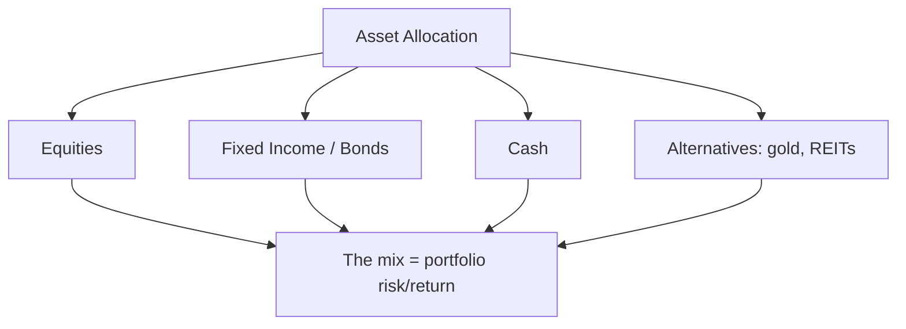
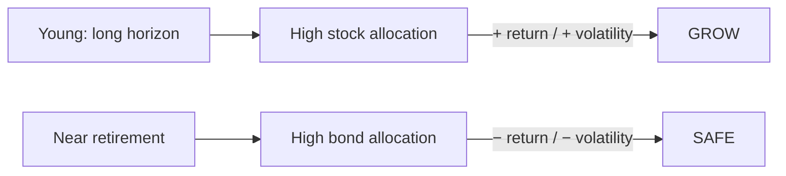
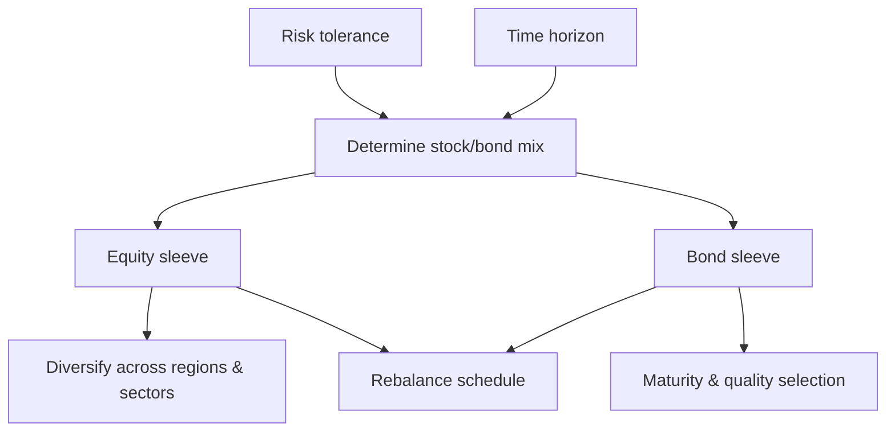

# Asset Allocation

## What It Is

**Asset allocation** is deciding how to split a portfolio across asset classes (stocks, bonds, cash, gold, real estate). It's the single biggest driver of long-term returns and risk.



**The famous finding:** asset allocation explains ~90% of a portfolio's return variability — far more than stock picking or timing.

---

## The Asset Classes

| Class | Role in Portfolio | Risk | Expected Return |
|---|---|---|---|
| **Equities (stocks)** | Growth engine | High | High |
| **Bonds (fixed income)** | Stability, income | Low-moderate | Moderate |
| **Cash** | Safety, dry powder | Lowest | Lowest (below inflation) |
| **Gold** | Inflation hedge, crisis ballast | Moderate | Unpredictable |
| **Real Estate / REITs** | Income + inflation | Moderate | Moderate |
| **Alternatives** | Diversification | Varies | Varies |

---

## The Stock-Bond Tradeoff

The classic allocation decision.

```
Stocks:  long-term growth, volatile, loses money in crashes
Bonds:   steady income, smooth, protects in recessions

More stocks  → higher expected return, bigger drawdowns
More bonds   → lower return, smoother ride

Why bonds protect: when the economy slows, central banks
  cut rates → bond prices RISE while stocks FALL
```

| Allocation | Character |
|---|---|
| 100% stocks | Maximum growth, brutal drawdowns |
| 60/40 (stocks/bonds) | Classic balanced portfolio |
| 40/60 | Conservative, income-oriented |
| 100% bonds | Very low growth, low risk |

---

## Age-Based Allocation

The simplest heuristic: stocks as a share of the portfolio falls with age.

```
Rule of thumb: stock allocation ≈ 100 − age (or 120 − age)

Age 30 → 70-90% stocks
Age 50 → 50-70% stocks
Age 70 → 30-50% stocks

Logic: young investors have decades to recover crashes;
  retirees need the money soon and can't wait out a bear market.
```



---

## Strategic vs Tactical Allocation

| | Strategic | Tactical |
|---|---|---|
| What | Long-term target mix | Short-term deviations |
| Horizon | Years | Weeks-months |
| Frequency | Set, rarely changed | Adjust within bands |
| Basis | Risk tolerance, goals | Market conditions |
| Example | "60/40 forever" | "Cut stocks to 50% in a crash" |

**The rule:** strategic sets the plan; tactical only makes small, bounded deviations (e.g., ±5-10%) — never a full market-timing bet.

---

## Target-Date and Glide Path

**Target-date funds** automate allocation: high stocks early, shifting to bonds as the target year approaches.

```
Stock allocation
  90% |███
  70% |████
  50% |█████   ← glide path
  30% |██████
  10% |███████
      └─────────────────────
        30yr   20yr   10yr  now   (years to target)
```

**The glide path** is the declining stock curve — hands-off age-based allocation.

---

## Building an Allocation



**The allocation checklist:**
1. How much risk can I tolerate (financially & emotionally)?
2. How long until I need the money?
3. What's my income need (dividends vs growth)?
4. Does the plan survive a 50% crash?

---

## Programming Analogy

```
Asset Allocation = Capacity / architecture planning

Allocation = the target mix of resources in a system
Stocks  = high-variance growth component (startup risk)
Bonds   = stable, low-return baseline (reliable infra)
Cash    = buffer / emergency capacity (idle resources)
Gold    = hedge against black-swan inflation
         (like disaster-recovery redundancy)

Strategic vs tactical = long-term architecture
  vs short-term autoscaling adjustments within bounds

Glide path = gradual reallocation with time
  (like a planned migration / depreciation schedule)

Core principle: don't bet the whole system on one
  component. A mix with uncorrelated parts survives
  more regimes than any single one.
```

---

## Common Mistakes

- **Ignoring allocation and chasing stock picks.** The mix matters more than the selection. Fix the mix first.
- **100% stocks without the stomach for it.** If you sell in a crash, you lose permanently. Allocate to what you can hold.
- **Market timing.** Swinging between "all stocks" and "all cash" based on headlines destroys returns. Tactical changes should be small.
- **Ignoring inflation.** All cash/bonds in high inflation quietly loses buying power. Some inflation-protecting assets help.
- **One-size allocation.** Risk tolerance and horizon are personal. Copying a friend's portfolio ignores your own constraints.

---

## Interview Notes

- **Behavioral: "How would you allocate for a 30-year-old vs retiree?"** — Young: high equity for growth, decades to recover. Retiree: high bonds/cash for income and stability. Explain the tradeoff.
- **Quant: "Why does allocation dominate stock picking?"** — ~90% of return variability comes from the mix; most individual picks average out. It's the decision with the most leverage.
- **System Design: "Design a portfolio allocation tool"** — Model target weights, run rebalancing logic, track drift against bands, generate trades with tax awareness (file 05).

---

## Revision Summary

| Concept | Definition |
|---|---|
| Asset Allocation | The mix across asset classes |
| Equities | Growth, high risk |
| Bonds | Stability, low-moderate risk |
| Cash | Safety, dry powder |
| 60/40 | Classic balanced portfolio |
| Age-based rule | Stocks ≈ 100 − age |
| Strategic | Long-term target mix |
| Tactical | Bounded short-term deviations |
| Glide path | Declining stock allocation over time |

- Allocation drives most of the outcome
- Match the mix to horizon and risk tolerance
- Tactical shifts stay small — no market timing

---

← [00-modern-portfolio-theory](00-modern-portfolio-theory.md) • [↑ Phase 8](README.md) • [↑ Finance](../README.md) • [02-risk-metrics](02-risk-metrics.md) →
