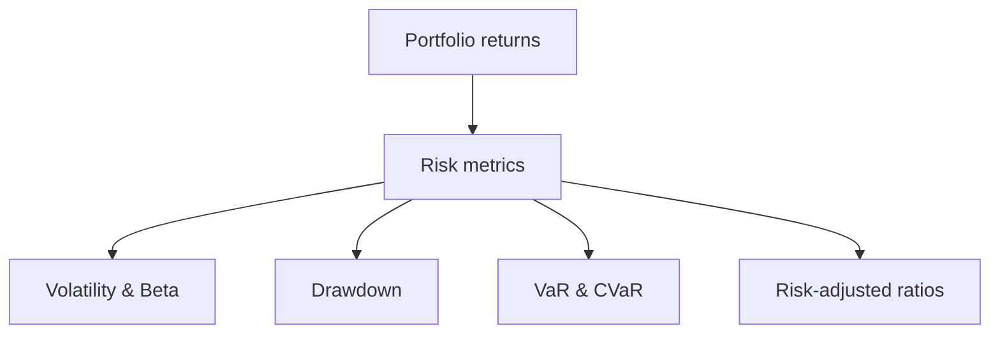
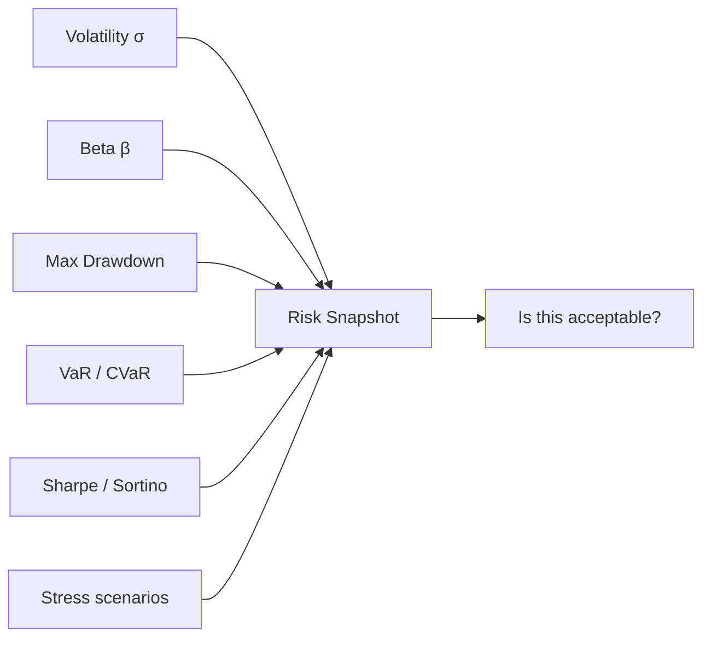

# Portfolio Risk Metrics

## What They Are

A portfolio's risk isn't its average return — it's how much the value swings and how bad the bad days are. These metrics quantify that.



---

## Volatility & Beta

| Metric | Formula | What It Measures |
|---|---|---|
| **Volatility (σ)** | Std dev of returns | How much the portfolio swings |
| **Beta (β)** | Covariance ÷ market variance | Sensitivity to the market |
| **Idiosyncratic Risk** | Total risk − β²×market risk | Risk not explained by market |

```
σ = 15%/yr portfolio: yearly returns typically ±15% around the mean
β = 1.2: if the market moves 10%, this portfolio tends to move 12%
```

**Annualized volatility:** scale daily σ by √252 (trading days).

```
Daily σ = 1%  → annual σ = 1% × √252 ≈ 15.9%
```

---

## Maximum Drawdown

The worst peak-to-trough decline ever experienced.

```
Portfolio peaked at $100K → bottomed at $70K
Max drawdown = −30%

A −30% drawdown needs +43% to recover
  (drawdowns are asymmetric — from file 04 Phase 6)
```

| Drawdown | Recovery needed |
|---|---|
| −10% | +11% |
| −25% | +33% |
| −50% | +100% |

**Why it matters most to real investors:** drawdowns test whether you'll panic-sell — the #1 way investors actually lose money.

---

## VaR & CVaR (from Phase 6)

| Metric | Meaning | Use |
|---|---|---|
| **VaR (Value at Risk)** | Worst loss at a confidence level | Regulators, limits |
| **CVaR (Expected Shortfall)** | Average loss in the worst tail | Better tail measure |

```
95% 1-day VaR = $5M
  → 5% of days lose more than $5M

95% 1-day CVaR = $9M
  → when a bad day happens, you average −$9M
```

---

## Risk-Adjusted Return Ratios

The real question: "Is the return worth the risk?"

| Ratio | Formula | Tells You |
|---|---|---|
| **Sharpe Ratio** | (Return − risk-free) ÷ σ | Return per unit of total risk |
| **Sortino Ratio** | (Return − risk-free) ÷ downside σ | Return per unit of BAD risk |
| **Calmar Ratio** | CAGR ÷ max drawdown | Return per unit of drawdown |
| **Treynor Ratio** | (Return − risk-free) ÷ β | Return per unit of market risk |
| **Information Ratio** | Excess return ÷ tracking error | Active manager skill |

### Sharpe vs Sortino

```
Sharpe penalizes ALL volatility (up and down)
Sortino penalizes only DOWNWARD volatility
  → better for strategies that climb steadily

Sharpe = 1.0, Sortino = 2.0 → the downside is well controlled
```

**Interpretation benchmarks:**
```
Sharpe > 1  → decent
Sharpe > 2  → very good
Sharpe > 3  → exceptional (be suspicious, likely overfit)

Calmar > 1  → good return relative to drawdown
```

---

## Stress Scenarios (file 04 Phase 6)

Beyond statistics — test specific crisis events.

| Scenario | Typical shock |
|---|---|
| 2008 financial crisis | Global equities −50%+ |
| 2020 COVID | Fast −30% crash |
| Rate shock | Bonds down, cash up |
| Inflation spike | Gold up, bonds down |

```
Stress test answers: "Can the portfolio survive the
worst historical regimes, and what would it be worth?"
```

---

## The Risk Dashboard



**A complete risk picture = all metrics together:**
- σ tells the average swing
- Drawdown tells the worst real experience
- VaR/CVaR tell the tail
- Sharpe tells if it's worth it

---

## Programming Analogy

```
Risk Metrics = SLOs for a portfolio's value

Volatility = standard deviation of returns
  (like p50-p99 latency spread)
Max Drawdown = worst peak-to-trough degradation
  (like your worst outage / p99 downtime stretch)
VaR = p95 "worst budget overrun" estimate
CVaR = average cost when you breach (real tail)
Sharpe = return ÷ risk
  (like feature value ÷ complexity — efficiency of the bet)
Sortino = ignoring upside variance
  (like only measuring error when it hurts users)

Annualization: daily → yearly via √252
  (like scaling per-day metrics to a year)

Drawdown recovery asymmetry = loss compounding hurts more
  than gains help (losses need bigger gains to recover)
```

---

## Common Mistakes

- **Reporting return without risk.** A 30% return with 50% volatility is a coin flip, not a great strategy.
- **Trusting VaR as a cap.** VaR hides the tail — always pair with CVaR and stress tests (from Phase 6).
- **Ignoring drawdown's psychological cost.** If you can't hold through a −40% drawdown, the strategy is wrong for you even if profitable.
- **Using annualized σ from too little data.** 6 months of returns ≠ a year of risk. Longer history, multiple regimes.
- **Comparing Sharpe across strategies with different return sources.** A market-beta Sharpe and a low-vol Sharpe aren't the same animal.

---

## Interview Notes

- **Risk: "Sharpe vs Sortino vs Calmar?"** — Sharpe = total risk; Sortino = downside only; Calmar = return per drawdown. Choose by what the strategy's risk actually is.
- **Quant: "Why is drawdown asymmetric?"** — Losses compound from a smaller base: −50% then +50% ≠ break-even. Recovery requires a disproportionately larger gain.
- **System Design: "Design a portfolio risk service"** — Mark-to-market positions → compute P&L series → daily σ, drawdown, VaR/CVaR, ratios → scenario stress tests → alert on limit breaches.

---

## Revision Summary

| Metric | Formula Essence | Meaning |
|---|---|---|
| Volatility | σ of returns × √252 | Annualized swing |
| Beta | cov/mkt variance | Market sensitivity |
| Max Drawdown | Peak-to-trough | Worst decline |
| VaR | Tail cutoff loss | "Worst at confidence" |
| CVaR | Mean of tail | True tail loss |
| Sharpe | Excess return ÷ σ | Return per risk |
| Sortino | Excess return ÷ downside σ | Return per bad risk |
| Calmar | CAGR ÷ max drawdown | Return per drawdown |

- Return is meaningless without risk
- Use CVaR + stress tests, not VaR alone
- Drawdowns are asymmetric — recovery needs more

---

← [01-asset-allocation](01-asset-allocation.md) • [↑ Phase 8](README.md) • [↑ Finance](../README.md) • [03-diversification](03-diversification.md) →
