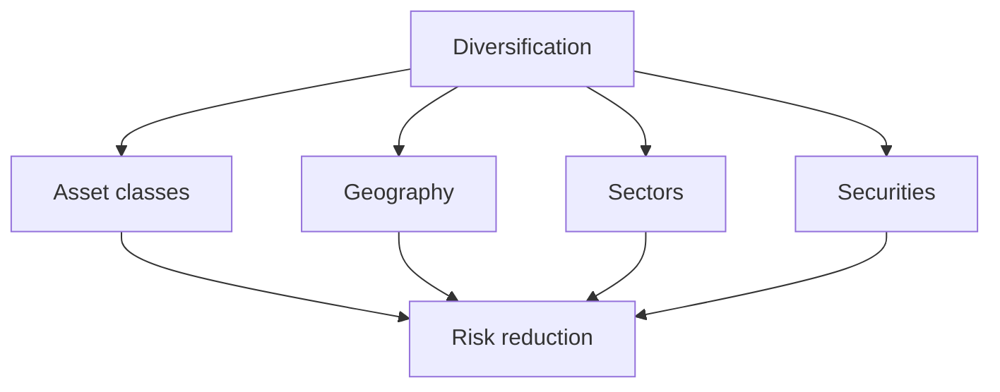
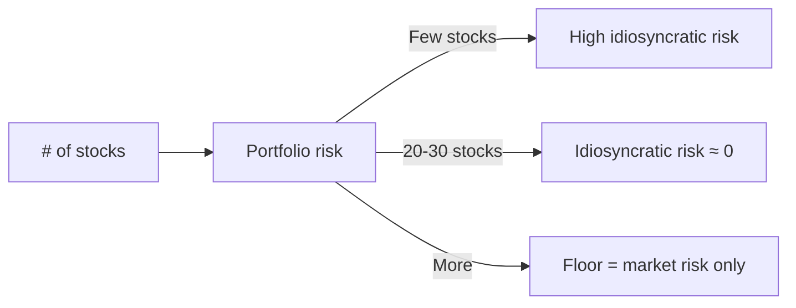

# Diversification

## What It Is

**Diversification** is spreading investments across assets that DON'T move together, so no single event can wreck the portfolio.



**The core math (from MPT, file 00):** combining low-correlation assets reduces portfolio risk below the average of the parts.

---

## Levels of Diversification

| Level | What It Spreads | Example |
|---|---|---|
| **Asset class** | Stocks vs bonds vs gold | 60% stocks, 30% bonds, 10% gold |
| **Geography** | US vs Europe vs India vs EM | Global equity funds |
| **Sector** | Tech vs healthcare vs energy | S&P 500 (500 companies, 11 sectors) |
| **Security** | Many companies per sector | Index fund instead of single stock |

```
Worst:  one stock in one sector in one country
Best:   many securities, many sectors, many countries, several asset classes
```

---

## Why Diversification Works

```
Two stocks, each σ = 25%:

Correlation +0.9 (same sector) → portfolio σ ≈ 24%  (barely helps)
Correlation 0.0  (different)    → portfolio σ ≈ 18%  (real help)
Correlation −0.3 (hedge)        → portfolio σ ≈ 14%  (strong help)

The lower the correlation, the bigger the risk cut.
```

**Systematic vs idiosyncratic risk:**
```
Total risk = Systematic (market) + Idiosyncratic (company-specific)

Diversification removes IDIOSYNCRATIC risk only
  (a single company going bankrupt)

It CANNOT remove SYSTEMATIC risk
  (the whole market crashing — every stock falls)

→ After ~20-30 well-chosen stocks, idiosyncratic risk is
  nearly gone; you're left with market risk.
```



---

## The Diversification Fallacy

**Holding many similar assets is NOT diversification.**

```
"20 tech stocks" = 20 copies of the SAME bet
  (they all move together, ρ ≈ 0.9)
  → no diversification, just 20 ways to hold tech risk

True diversification needs LOW CORRELATION:
  different sectors, regions, currencies, asset classes
```

**The correlation illusion:** correlations feel low in bull markets and spike toward 1 in crashes (from file 06) — the diversification you counted on vanishes exactly when you need it. This is why asset-class diversification (stocks + bonds + gold) matters more than many-stocks diversification.

---

## Common Approaches

| Approach | What It Holds | Correlation |
|---|---|---|
| **Index fund** | Whole market (S&P 500, NIFTY 50) | Instant diversification |
| **Global index** | Multiple countries | Lower |
| **Target-date fund** | Stocks + bonds, auto-shift | Low |
| **Core-satellite** | Index core + small active bets | Moderate |
| **Factor funds** | Value/size/momentum tilt | Spreads risk sources |

**Index funds are the simplest diversification tool:** 500 companies in one purchase, automatically rebalanced, low cost.

---

## Correlated Risk Sources to Watch

| Risk | Affects | Diversifier |
|---|---|---|
| Inflation | Cash, bonds | Gold, real assets, equities (long term) |
| Interest rates | Bonds, growth stocks | Short-duration bonds, cash |
| Recession | Equities, credit | Long-term bonds, defensive sectors |
| Currency | Foreign holdings | Home bias, FX hedging |
| Concentration | Single company/country | Broad indices |

---

## Programming Analogy

```
Diversification = Redundancy / fault isolation in a system

One stock   = single point of failure
20 tech stocks = replicas in the same AZ
               (diversified in NUMBER, not in FAILURE DOMAIN)

True diversification = spreading across independent
  failure domains (AZs, regions, providers)
  = uncorrelated fault modes

Idiosyncratic risk = component-specific failures (removable
  with redundancy)
Systematic risk    = whole-system failure (everyone falls;
  only different asset classes hedge it)

Correlations spiking in crises = correlated failures
  across supposedly independent components —
  exactly why you ALSO hold bonds/gold (different
  failure modes), not just more stocks.
```

---

## Common Mistakes

- **Confusing count with diversification.** 50 stocks in one sector is one bet. Diversify across sectors, regions, and asset classes.
- **Believing diversification removes all risk.** Market risk remains — a crash hits everything. Diversification cuts the tail, not the market.
- **Over-diversifying to mediocrity.** Hundreds of holdings can dilute returns to average. Enough to kill idiosyncratic risk is enough.
- **Ignoring correlation shifts.** Diversifiers stop working in crises. Hold assets with genuinely different failure modes (bonds, gold).
- **Buying "diversified" products that aren't.** Some funds are concentrated in reality (top-10 holdings dominate). Read the actual holdings.

---

## Interview Notes

- **Behavioral: "Why not just buy one stock?"** — Idiosyncratic risk is uncompensated; you can remove it free with a diversified portfolio. Holding one stock is a lottery ticket, not an investment.
- **Quant: "Why does diversification fail in crashes?"** — Correlations spike toward 1; hedges become correlated with what they hedge. Asset-class diversification (bonds/gold) provides the only real crisis ballast.
- **System Design: "Design a diversification checker"** — Compute portfolio correlations (rolling), sector/region exposure, effective number of independent bets (N) — flag concentration and correlated risk.

---

## Revision Summary

| Concept | Definition |
|---|---|
| Diversification | Spread across low-correlation assets |
| Idiosyncratic Risk | Company-specific (removable) |
| Systematic Risk | Market risk (not removable by stock count) |
| Correlation | The key driver of benefit |
| Index Fund | Instant broad diversification |
| Diversification Fallacy | Many similar assets ≠ diversified |
| Correlation Spike | Diversifiers fail in crises |

- Diversify across asset classes, sectors, regions
- 20-30 stocks kill idiosyncratic risk; market risk remains
- Count of holdings ≠ diversification (correlation matters)
- Hold genuinely different failure modes (bonds, gold)

---

← [02-risk-metrics](02-risk-metrics.md) • [↑ Phase 8](README.md) • [↑ Finance](../README.md) • [04-rebalancing](04-rebalancing.md) →
