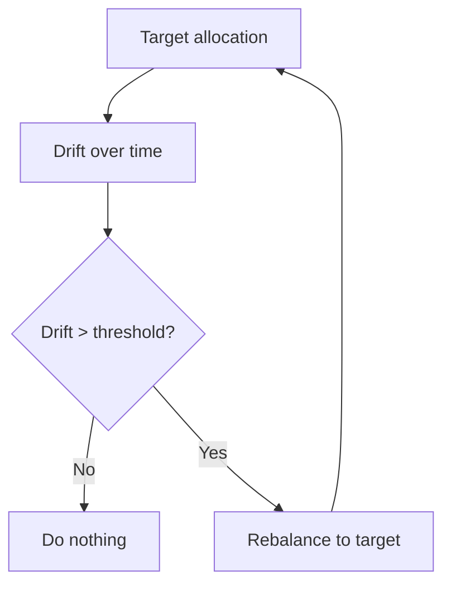

# Rebalancing

## What It Is

**Rebalancing** is periodically restoring a portfolio to its target allocation by selling what grew and buying what shrank.

```
Target: 60% stocks, 40% bonds

Stocks rally → portfolio drifts to 70/30
Rebalance → sell stocks, buy bonds → back to 60/40
```



---

## Why Rebalance?

| Reason | Explanation |
|---|---|
| **Control risk** | Prevents accidental over-concentration in a hot asset |
| **Enforce discipline** | Buys low, sells high automatically |
| **Preserve the plan** | Keeps risk at the intended level |
| **Forced profits** | Trims winners, adds to losers |

**The math of drift:**
```
Start: 60/40 (stocks/bonds)
Stocks double, bonds flat → portfolio ≈ 75/25

You now have 75% in stocks — the risk profile you chose
  (60/40) has silently changed. Rebalancing fixes this.
```

---

## Rebalancing Methods

| Method | When | Pros | Cons |
|---|---|---|---|
| **Calendar** | Fixed schedule (quarterly/yearly) | Simple, predictable | Ignores market state |
| **Threshold-based** | When drift > band (±5%) | Acts when needed | More trades, monitoring |
| **Hybrid** | Check band on a schedule | Best of both | Slightly complex |

**Threshold example:**
```
Target stocks 60%, tolerance band ±5%
  Rebalance only if stocks drift below 55% or above 65%
  → minimal trading, risk stays bounded
```

---

## The "Buy Low, Sell High" Mechanics

Rebalancing is systematic contrarianism.

```
Scenario: stocks crash −30%, bonds rise.

Before:  60% stocks / 40% bonds
After:   50% stocks / 50% bonds  (drift below band)

Rebalance: sell bonds (high), buy stocks (low)
  → 60/40 again

You bought the dip and trimmed the bond rally —
  without making any "prediction."
```

```
The rebalancing bonus:
  in choppy markets (assets oscillate), selling high
  and buying low repeatedly adds small profits
  → a "volatility harvest"
```

---

## When NOT to Rebalance

| Situation | Reason |
|---|---|
| Taxable account, big gains | Realizing gains creates tax (file 05) |
| Near the tolerance band | Avoid churn from tiny drifts |
| Extreme, rapid moves | Wait for stability; trading panic is costly |
| Illiquid assets | Can't cheaply/quickly rebalance REITs, private |

**Tax-aware rebalancing:** in taxable accounts, rebalance using new contributions and dividends first — only trade when necessary.

---

## Target-Date Funds (file 01)

Target-date funds **rebalance automatically** — they continuously shift toward the glide path, so you never think about it.

---

## Programming Analogy

```
Rebalancing = Reconciliation / drift correction

Target allocation = desired config / SLO targets
Drift = config drift over time (unmanaged changes)
Rebalance = periodic correction back to the target state
Threshold band = dead zone / hysteresis
  (like autoscaling only above/below thresholds — avoids churn)
Calendar = cron-scheduled reconciliation
Buy-low-sell-high = corrective action that naturally
  trims what's over-weighted and adds to what's under

Rebalancing bonus = harvesting volatility, like
  rebalancing replicas/queues to optimal utilization
  in a fluctuating workload

Key principle: it's a CONTROLLER — measure drift,
  compare to target, correct. Same loop as any
  feedback controller.
```

---

## Common Mistakes

- **Never rebalancing.** The portfolio silently becomes whatever the market made it — not what you planned.
- **Rebalancing too often.** Weekly trading adds costs and taxes for no benefit. Quarterly to yearly is plenty.
- **Using no tolerance band.** Every 1% drift triggers trading = churn. Use ±5% bands.
- **Ignoring taxes.** Selling winners in a taxable account realizes gains. Prefer contribution-based rebalancing first.
- **Panic-selling the dip as "rebalancing."** Rebalancing into stocks during a crash is the plan — but only within the band, not a bet.

---

## Interview Notes

- **Behavioral: "Why rebalance if it might reduce returns?"** — It's about controlling risk, not maximizing returns. It keeps the portfolio at the risk level you chose, and incidentally buys low/sells high.
- **Quant: "What's the optimal rebalance frequency?"** — Empirical: quarterly-to-annual captures most of the benefit; more frequent adds costs. Threshold-based bands (5%) beat pure calendar.
- **System Design: "Design a rebalancing engine"** — Track holdings vs target weights, detect drift vs bands, generate trades, consider taxes and liquidity, execute with minimal cost.

---

## Revision Summary

| Concept | Definition |
|---|---|
| Rebalancing | Restore target allocation |
| Drift | Actual weights diverge from target |
| Calendar Method | Rebalance on a fixed schedule |
| Threshold Method | Rebalance when drift > band |
| Buy low, sell high | Automatic contrarian correction |
| Rebalancing Bonus | Extra returns in choppy markets |
| Tax-aware | Use contributions/dividends first |

- Control risk: prevent accidental concentration
- Use threshold bands (±5%), not every move
- Rebalance rarely (quarterly-yearly), tax-aware
- It's a feedback controller, not a prediction

---

← [03-diversification](03-diversification.md) • [↑ Phase 8](README.md) • [↑ Finance](../README.md) • [05-tax-efficient-investing](05-tax-efficient-investing.md) →
