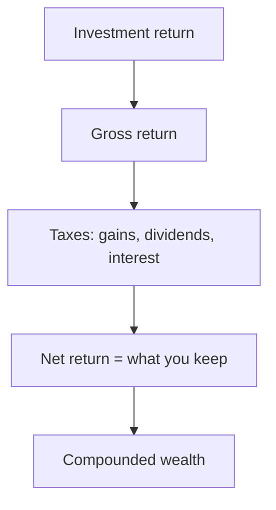
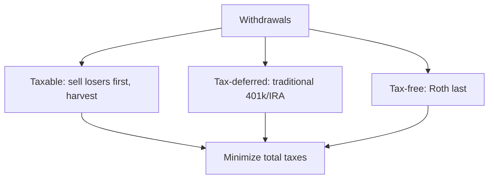

# Tax-Efficient Investing

## What It Is

**Tax-efficient investing** minimizes the taxes you pay on investment gains, so more of the return stays with you. Taxes are a real cost — like fees, they eat the edge.

```
Gross return:    10%
Tax drag:        2-3% (capital gains, dividends, interest)
Net return:      7-8%

Over 30 years, a 2% annual tax drag compounds
  into a LARGE difference in final wealth.
```



---

## The Three Taxable Events

| Event | What's Taxed | How to Minimize |
|---|---|---|
| **Capital gains** | Profit on sale | Hold long-term, harvest losses |
| **Dividends** | Income paid out | Prefer growth, tax-advantaged accounts |
| **Interest** | Bond/cash income | Tax-advantaged accounts |

### Capital Gains: Short vs Long-Term

| Holding period | Tax rate (US) | Incentive |
|---|---|---|
| < 1 year (short-term) | Ordinary income rate (higher) | Avoid |
| > 1 year (long-term) | Preferential rate (lower) | Favor |

**India (STT/LTCG on equity):** similar logic — holding longer reduces the tax rate on equity gains.

```
Rule: hold winners long (≥1 year) to unlock the
  lower long-term rate. Don't churn.
```

---

## Tax-Advantaged Accounts

The most powerful tool: hold investments in accounts where growth isn't taxed.

| Account | How It Helps |
|---|---|
| **401(k) / NPS** | Pre-tax contributions, tax-deferred growth |
| **IRA / PPF** | Tax-deferred or tax-free growth |
| **Roth / NPS Tier-II** | After-tax contributions, tax-free withdrawals |
| **Taxable account** | Everything taxed — the last place for active trading |

**The account placement principle:**
```
Place tax-UNFRIENDLY assets in tax-advantaged accounts:
  Bonds (interest taxed as ordinary income)
  REITs (dividends taxed)
  Actively traded funds (frequent gains)

Place tax-FRIENDLY assets in taxable accounts:
  Broad index funds (low turnover, long-term gains)
  Long-held stocks (deferred gains)
```

---

## Tax-Loss Harvesting

Selling losers to offset gains (and reduce taxable income).

```
Realized gains:     +$10,000
Realized losses:    −$4,000  (from selling losers)
Net taxable gains:   $6,000  ← only this is taxed

Carry forward unused losses to future years.
```

**Wash-sale rule (US):** you can't buy back the SAME security within 30 days to claim the loss. Use a similar (not identical) substitute.

```
Harvesting example:
  Sell Stock A at a loss (realize −$3,000)
  Immediately buy Stock B (similar but not identical)
  Keep market exposure while banking the tax loss
  → the loss offsets future gains
```

---

## Order of Withdrawals

In retirement, the order you draw from accounts affects taxes.



---

## The Efficiency Rules

| Rule | Why |
|---|---|
| **Hold long-term** | Lower capital gains rate |
| **Minimize turnover** | Fewer taxable events |
| **Use tax-advantaged accounts** | Defer or avoid taxes |
| **Harvest losses** | Offset gains |
| **Buy-and-hold over trading** | Returns compound without tax drag |
| **Place assets correctly** | Tax-heavy in sheltered accounts |

---

## Programming Analogy

```
Tax-Efficient Investing = Cost optimization for returns

Tax drag = a recurring cost eating your profits
  (like cloud egress fees eroding margin)

Capital gains = realized profit (taxable on realization)
  → defer realization = defer cost
  (like deferring a cost until you actually need it)

Tax-loss harvesting = writing off failed experiments
  to offset taxable profits
  (like offsetting losses against gains in a P&L)

Tax-advantaged accounts = tax-free "sandboxes"
  (like environments where costs don't apply)

Placement principle = putting expensive-to-tax assets
  where taxes don't reach (like colocating cost-heavy
  workloads in the cheapest region)

Goal: maximize net return = gross − costs (tax is a cost)
```

---

## Common Mistakes

- **Ignoring tax drag.** A 2% annual tax cost compounds into a massive difference over decades.
- **Churning winners.** Selling after 6 months pays the higher short-term rate. Hold to long-term.
- **Forgetting the wash-sale rule.** Selling a loser and rebuying it within 30 days voids the deduction.
- **Using taxable accounts for bond interest/REIT dividends.** Ordinary-income taxes destroy the edge. Shelter them.
- **Letting taxes drive selling.** Avoid realizing a gain just to rebalance a tiny drift; use contributions first.

---

## Interview Notes

- **Behavioral: "How do taxes change your investing?"** — After-tax return is what matters. Long-term holding, account placement, and loss harvesting dominate; don't let small tax savings force bad investments.
- **Data: "Modeling after-tax returns"** — Simulate tax events (gains, dividends, harvests) on a portfolio to compare strategies. Needs cost-basis tracking (lots), holding periods, and tax regimes.
- **System Design: "Design a tax-aware rebalancing engine"** — Given target weights, generate minimal-tax trades: use contributions, harvest losses, avoid short-term gains, respect wash-sale rules.

---

## Revision Summary

| Concept | Definition |
|---|---|
| Tax Drag | Annual tax cost on returns |
| Short-term gain | < 1 yr holding, higher tax |
| Long-term gain | > 1 yr holding, lower tax |
| Tax-advantaged account | Deferred/free growth (401k, IRA, PPF) |
| Tax-loss harvesting | Sell losers to offset gains |
| Wash-sale rule | Can't rebuy same security in 30 days |
| Placement | Tax-heavy assets in sheltered accounts |

- Maximize AFTER-TAX return — tax is a real cost
- Hold long-term, minimize turnover
- Harvest losses, defer gains
- Place assets correctly across accounts

---

← [04-rebalancing](04-rebalancing.md) • [↑ Phase 8](README.md) • [↑ Finance](../README.md) • [06-hedging](06-hedging.md) →
