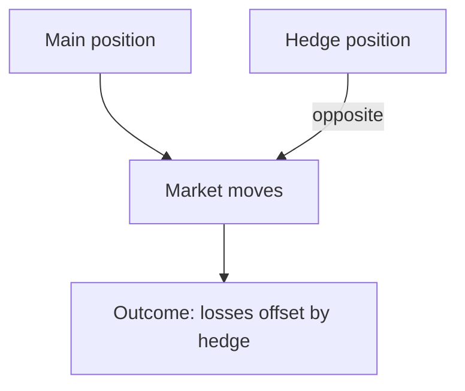
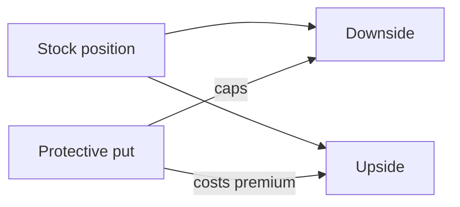

# Hedging

## What It Is

**Hedging** is reducing risk by taking an offsetting position that profits when your main position loses money. It's insurance — you pay a cost to cap the downside.



```
Insurance analogy:
  You own a house (exposure) and buy fire insurance (hedge).
  If fire hits, the insurance pays — your net loss is limited.
  Hedging works the same way with investments.
```

---

## The Hedging Tradeoff

| | Unhedged | Hedged |
|---|---|---|
| Upside | Full | Capped (hedge costs money) |
| Downside | Full loss | Limited |
| Cost | None | Premium / opportunity cost |
| Certainty | None | Smoother |

**Key insight: hedging costs money.** It reduces both risk AND expected return. You hedge because the downside would hurt more than the cost of insurance.

---

## Common Hedges

| Hedge | What It Protects Against | How |
|---|---|---|
| **Put options** | Stock price falling | Right to sell at a floor (file 01 Phase 6) |
| **Short selling** | Market decline | Borrow + sell, profit if it drops |
| **Futures** | Price moves | Lock in a future price (file 01 Phase 6) |
| **Inverse ETFs** | Market crash | ETF that moves opposite the index |
| **Bonds/Gold** | Stock market crash | Low correlation, crisis ballast (file 03) |
| **Currency hedges** | FX moves | Forward contracts on currency |

---

## Hedging with Options

**Protective put:** own stock + buy a put at a floor.

```
Own 100 shares of Apple at $180
Buy a put with strike $150 (cost: premium $5/share)

If Apple crashes to $120:
  Stock loss: −$60/share
  Put gain:   +$30/share (150 − 120)
  Net loss:   capped near −$30 − premium

If Apple rallies to $220:
  Stock gain: +$40/share
  Put expires worthless (lost premium $5)
  Net:        +$35/share

→ Downside capped, upside intact (minus premium cost)
```



---

## Hedging with Futures

Lock in a price for a future transaction.

```
An airline expects to buy 1M gallons of fuel in 6 months.
It buys fuel FUTURES at today's price.

If fuel rises: physical purchase costs more,
  but the futures contract profits → net cost locked
If fuel falls: physical costs less,
  but the futures contract loses → net cost still locked

Result: fuel cost is predictable (hedged)
```

---

## Dynamic Hedging (Delta Hedging)

From file 02 Phase 6: continuously adjusting a position to stay neutral.

```
Hold: 1 call option + Δ shares of the underlying
  → price moves offset each other instantly

As Δ changes with price, rebalance:
  stock rises → buy more shares
  stock falls → sell shares

Cost: frequent trading (transaction costs)
Benefit: near-riskless (used by market makers)
```

---

## Hedging vs Diversification

| | Diversification | Hedging |
|---|---|---|
| Goal | Spread risk | Offset risk |
| Tool | Low-correlation assets | Opposite/delta positions |
| Upside | Kept | Capped (costs) |
| Complexity | Simple | More complex |
| Use | Everyone | Insurance needs |

```
Diversification = don't put all eggs in one basket
Hedging        = buy an insurance policy on the basket
```

---

## When Hedging Makes Sense

| Situation | Hedge? | Why |
|---|---|---|
| Near retirement, big stock exposure | Yes | Can't afford a crash |
| Concentrated position (company stock) | Yes | Single-stock risk |
| Long horizon, diversified | Rarely | Diversification is enough |
| Speculative positions | Sometimes | Cap the tail |

---

## Programming Analogy

```
Hedging = Insurance / Redundancy with a cost

Hedge = paying a premium (cost) to cap downside
  (like paying for DR replication: you spend on
   redundancy to survive a regional failure)

Protective put = "stop-loss" via a floor guarantee
  (like an outage SLA: downside is bounded)

Delta hedging = continuous rebalancing to stay neutral
  (like autoscaling: keep load balanced in real time
   as conditions change)

Hedging cost = insurance premium
  (reduces expected return the way DR costs reduce margin)

Rule: hedge when the tail loss is unacceptable,
  not always. Diversification is free insurance;
  hedging is paid insurance.
```

---

## Common Mistakes

- **Thinking hedging is free.** Hedges cost premiums or cap upside. Only use them when the downside is worth insuring.
- **Over-hedging.** Fully hedging a diversified long-term portfolio kills its returns for little benefit.
- **Hedging with the wrong correlation.** A "hedge" that's actually correlated with your position fails in a crash (file 03).
- **Ignoring hedge costs in P&L.** Premiums, spreads, and roll costs add up — model them before hedging.
- **Panic-hedging at the bottom.** Buying expensive puts after a crash is the worst time. Hedge before, or use diversification.

---

## Interview Notes

- **Risk: "Protective put vs diversification?"** — Diversification removes idiosyncratic risk for free; the put removes market risk at a premium. Use puts when the tail is unacceptable (concentration, short horizon).
- **Quant: "How do you size a hedge?"** — Match the hedge notional to the exposure, adjusted by correlation/beta (hedge ratio). Rebalance as exposure and β change.
- **System Design: "Design a hedging engine"** — Monitor positions, compute exposures and hedge ratios, generate option/futures trades, track hedge cost and effectiveness (did it actually reduce drawdown?).

---

## Revision Summary

| Concept | Definition |
|---|---|
| Hedge | Offsetting position to cap risk |
| Protective Put | Own stock + put at a floor |
| Hedging Cost | Premium / capped upside |
| Futures Hedge | Lock in future price |
| Delta Hedging | Continuous neutral rebalancing |
| Hedge vs Diversify | Offset risk vs spread risk |
| Hedge Ratio | Size hedge to exposure × β |

- Hedging is paid insurance — it costs
- Hedge when the tail is unacceptable
- Diversification is the cheap default
- Hedge before the crash, not after

---

← [05-tax-efficient-investing](05-tax-efficient-investing.md) • [↑ Phase 8](README.md) • [↑ Finance](../README.md) • [↑ All Notes](../README.md)
